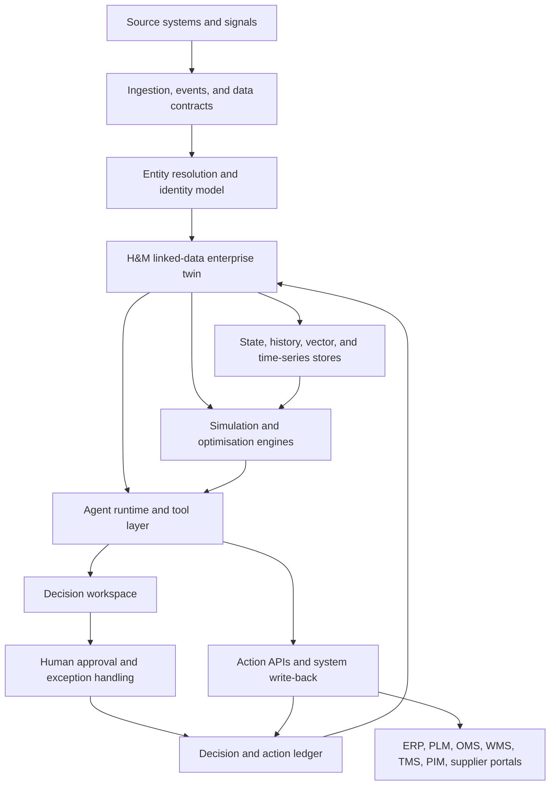
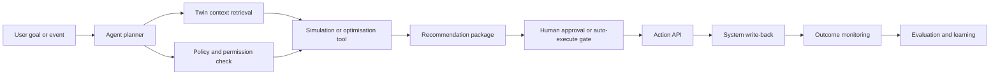

# Reference Architecture: Linked-Data Enterprise Digital Twin for H&M

## Architecture Thesis

The digital twin should be a linked-data operational model with agents and
simulations on top. It should not be a dashboard layer over a warehouse, and it
should not be framed as a choice of generic graph database vendor.

Recommended pattern:

1. Event and source integration.
2. Entity resolution and H&M-owned enterprise semantic model.
3. Live state, history, and time-series layer.
4. Simulation and optimisation services.
5. Agent runtime and tool layer.
6. Decision and action ledger.
7. Human workflows and system write-back.

## Conceptual Stack

## Source Systems and Signals

Likely source domains:

- Product lifecycle management.
- Product information management.
- Merchandising and planning.
- ERP and finance.
- Order management.
- Warehouse management.
- Transport management.
- Point of sale.
- Ecommerce clickstream, search, basket, conversion, returns.
- RFID and store inventory signals.
- Supplier portals and production updates.
- Quality, compliance, sustainability, and audit systems.
- Market, weather, social, search, event, port, tariff, and logistics signals.

The twin should tolerate imperfect sources. It should record source, confidence,
freshness, and lineage instead of pretending all data is clean.

## Canonical Enterprise Model

Core entity groups:

### Product

- Brand.
- Collection.
- Product family.
- Style.
- Option.
- SKU.
- Size.
- Colour.
- Material.
- Bill of materials.
- Product lifecycle state.
- Product image and copy references.
- Sustainability attributes.
- Compliance attributes.

### Demand

- Market.
- Region.
- Store.
- Ecommerce locale.
- Customer segment.
- Trend signal.
- Search term.
- Campaign.
- Event.
- Forecast.
- Sell-through.
- Return reason.

### Supply

- Supplier.
- Factory.
- Production office.
- Production line.
- Capacity.
- Lead time.
- Order.
- Purchase order.
- Cost.
- Quality event.
- Compliance event.
- Material availability.

### Inventory

- Stock on hand.
- Available-to-promise.
- Reserved stock.
- In-transit stock.
- Returned stock.
- Blocked stock.
- Aged stock.
- Markdown candidate.
- Stock transfer.

### Logistics

- Warehouse.
- Distribution centre.
- Route.
- Carrier.
- Container.
- Shipment.
- Port.
- Customs event.
- Delay event.
- Delivery promise.

### Decision

- Forecast run.
- Scenario.
- Recommendation.
- Action.
- Approval.
- Override.
- Policy.
- Constraint.
- Outcome.
- Learning signal.

## Relationship Examples

The value of the linked-data model is in the relationships:

- SKU belongs to option, style, product family, and collection.
- SKU is stocked at store, warehouse, and ecommerce fulfilment node.
- SKU is included in purchase order.
- Purchase order is produced by supplier/factory.
- Factory has capacity, lead time, compliance, quality, and risk attributes.
- Shipment moves purchase order from origin to destination through route.
- Store demand is affected by market, weather, event, campaign, and local trend.
- Trend signal maps to product family and product attributes.
- Recommendation is generated from scenario.
- Action executes recommendation through target system.
- Outcome updates the twin and evaluation record.

## Live State and Time

The twin needs multiple temporal views:

- Current state: what is true now.
- Historical state: what was true at a previous point.
- Planned state: what is expected from orders and plans.
- Simulated state: what could happen under a scenario.
- Committed state: what has been approved but not fully executed.

This requires:

- Event sourcing for important state changes.
- Time-series storage for demand, inventory, shipment, and operational signals.
- Versioned twin snapshots for scenario comparison.
- Audit trail for actions and approvals.

## Simulation and Optimisation Services

The twin should call specialised engines rather than force all reasoning into
large language models.

Candidate services:

- Demand forecasting.
- Stockout and lost-sales estimation.
- Allocation optimisation.
- Replenishment optimisation.
- Transfer optimisation.
- Markdown and price scenario modelling.
- Supplier capacity simulation.
- Logistics routing and delay simulation.
- Carbon and sustainability impact estimation.
- Product lifecycle and return-flow modelling.

Agents orchestrate these services. They do not replace them.

## Agent Architecture

Agent capabilities:

- Query the twin.
- Retrieve supporting evidence.
- Run simulations.
- Compare options.
- Explain assumptions.
- Prepare action packages.
- Trigger approved tools.
- Monitor outcomes.
- Learn from overrides and results.

Agent constraints:

- No action without permission.
- No recommendation without source evidence.
- No material write-back without action policy.
- No hidden reasoning for material decisions; produce an inspectable
  recommendation package.
- No untracked action. Every action writes to the decision ledger.

## Agent Types

| Agent | Primary Role | Example Output |
|---|---|---|
| Trend sensing agent | Detect demand and cultural signals | "Denim barrel-leg demand rising in Market X" |
| Product response agent | Map trends to products and feasible response | Re-cut, colour add, capsule, substitute |
| Allocation agent | Optimise stock by channel/location | Transfer, reserve, or ecommerce-pool action |
| Replenishment agent | Monitor sell-through and supply feasibility | In-season buy recommendation |
| Supplier agent | Track capacity, risk, compliance, quality | Supplier mitigation or split recommendation |
| Logistics agent | Simulate route and fulfilment options | Reroute, consolidate, expedite, delay warning |
| Markdown agent | Estimate markdown risk and alternatives | Transfer before markdown, targeted promotion |
| Lifecycle agent | Manage end-of-life and circularity | Resale, recycle, repair, retire, learnings |
| Finance agent | Calculate margin, cash, and risk effect | Decision impact summary |
| Governance agent | Check policy, data quality, and approvals | Block, warn, or escalate |

## Decision and Action Ledger

The ledger records:

- Trigger.
- User or event.
- Agent.
- Data used.
- Confidence.
- Scenario options.
- Recommendation.
- Approval path.
- Action taken.
- System write-back.
- Outcome.
- Variance from expected result.
- Learning signal.

This is essential for trust, audit, safety, and improvement.

## Build vs Buy

H&M should build the enterprise twin and operating model. It can buy or use
components.

Build:

- H&M linked-data enterprise model and custom graph capability.
- Decision ontology and action model.
- Agent workflows specific to H&M.
- Entity resolution rules for H&M products, stores, suppliers, and channels.
- Business-specific simulations where differentiation matters.

Buy or reuse:

- Commodity infrastructure where it does not define H&M's semantics or action
  model.
- Streaming infrastructure.
- Vector search.
- Optimisation solvers.
- LLM providers.
- Observability.
- Cloud infrastructure.
- Selected planning engines where they fit.

Avoid:

- Buying a black-box "digital twin" that cannot become H&M's own operating
  model.
- Locking semantics, decision rights, or action governance into an external
  platform where H&M loses strategic control.

## Security and Control

Required controls:

- Role-based and attribute-based access.
- Row/entity/relationship-level permissions.
- Action permissions separate from read permissions.
- Environment separation for simulation versus production write-back.
- Prompt, tool, and data exfiltration controls.
- Agent evaluation and incident monitoring.
- Human approval for material actions.
- Immutable audit logs.
- Data classification and policy checks.

## Initial Vertical Slice

Recommended first vertical slice:

In-season allocation and stock rebalancing.

Why:

- Clear revenue and margin link.
- Connects stores, ecommerce, inventory, logistics, product, and finance.
- Can begin with a manageable linked-data slice.
- Produces recommendations before requiring full autonomous execution.
- Lets H&M measure decision latency, adoption, and P&L impact.

Minimum viable linked-data slice:

- Product/SKU.
- Store/ecommerce/market.
- Stock on hand and in transit.
- Sales and sell-through.
- Returns.
- Forecast.
- Transfer cost and feasibility.
- Markdown risk.
- Decision and action record.

Minimum viable agents:

- Inventory imbalance agent.
- Allocation recommendation agent.
- Finance impact agent.
- Governance/approval agent.
