# Ontology Website Logical Information Model

This document is the specification artefact for [ADR-0002](../adr/ADR-ADR-0002-ontology-website-information-model.md). It visualises and formalises the unified concept-centric information model that the ADR decided upon, in a form that can be handed to a developer or reviewed by a stakeholder. The ADR is the "why"; this document is the "what, precisely".

---

## 1. Entity-Relationship Diagram

Mermaid Source

```mermaid
erDiagram
    accTitle: Ontology Website Entity-Relationship Model
    accDescr: Shows the thirteen core entities and their relationships in the ontology website information model

    Concept {
        string name
        string context "SDS, PF, or Common"
        string uri
        string summary "rdfs:comment"
        string definition "skos:definition"
        string usageNotes "skos:scopeNote"
        string editorialNotes "skos:editorialNote"
        boolean abstract "dash:abstract"
        string labelProperty "dash:labelProperty"
    }

    Property {
        string name "sh:name from SHACL"
        string technicalName "sh:path URI"
        string description "sh:description"
        string domainInformative "rdfs:domain"
        string rangeInformative "rdfs:range"
        string constraints "sh:pattern, sh:maxLength, etc."
        string severity "sh:Violation or sh:Warning"
        string validationMessage "sh:message"
        boolean required "sh:minCount >= 1"
        boolean derived "populated by SHACL Rule"
        string editorWidget "dash:editor"
        string viewerWidget "dash:viewer"
    }

    Enumeration {
        string name "skos:prefLabel"
        string description "rdfs:comment"
    }

    EnumerationValue {
        string label "skos:prefLabel"
        string abbreviation "skos:notation or skos:altLabel"
        string definition "skos:definition"
    }

    SubjectArea {
        string name "skos:prefLabel"
        string definition "skos:definition"
    }

    ClassificationFacet {
        string name "scheme prefLabel"
        string facetType "one of seven facet types"
    }

    CrossDomainMapping {
        string matchType "exact or close or broad"
        string note
    }

    StatusBadge {
        string badgeType "Deprecated Uncertain New ToDefine"
    }

    PropertyGroup {
        string name "sh:PropertyGroup label"
        int order "sh:order"
    }

    SuggestionGenerator {
        string name "rdfs:label"
        string category "temporal or cleanup or status"
        string sparqlUpdate "dash:update"
    }

    ActionDescription {
        string name "rdfs:label"
        string actionGroup "Data Quality or Governance"
    }

    Rule {
        string name "rdfs:label"
        string ruleType "TripleRule or SPARQLRule"
        string derivedProperty "property materialized"
    }

    InstanceExample {
        string label "rdfs:label"
        string sourceTable "dbo table"
    }

    Concept ||--o| Concept : "has-parent"
    Concept ||--o{ Concept : "has-children"
    Concept }|--|| SubjectArea : "belongs-to"
    Concept }o--o{ ClassificationFacet : "has-classification"
    Concept ||--o{ Property : "has-properties via SHACL"
    Concept ||--o| Enumeration : "has-enumeration"
    Concept ||--o{ StatusBadge : "has-status"
    Concept ||--o{ CrossDomainMapping : "has-mapping"
    Concept ||--o| Concept : "roleOf"
    Concept ||--o| Concept : "phaseOf"
    Concept ||--o{ Concept : "disjoint-with"
    Concept ||--o{ ActionDescription : "has-action"
    Concept ||--o{ Rule : "has-rule"
    Concept ||--o{ InstanceExample : "has-example"
    Property }|--|{ Concept : "used-by"
    Property }o--o| PropertyGroup : "grouped-by"
    Property ||--o{ SuggestionGenerator : "has-suggestion"
    Enumeration ||--|{ EnumerationValue : "contains"
    SubjectArea ||--o{ SubjectArea : "has-subdivision"
    CrossDomainMapping }o--|| Concept : "source"
    CrossDomainMapping }o--|| Concept : "target"
```

This diagram captures the logical information model for the ontology website, now comprising 13 entities (expanded from the original 8). Each `Concept` corresponds to an OWL class drawn from one of three bounded contexts -- SDS, PF, or Common -- carrying documentation annotations (`rdfs:comment`, `skos:definition`, `skos:scopeNote`, `skos:editorialNote`) that map directly to the four-tier FIBO-aligned documentation strategy defined in ODR-0011. Properties are bound to concepts through SHACL shapes rather than OWL domain/range (which serve only as informative documentation), while enumerations are modelled as SKOS ConceptSchemes containing individual values. The seven classification facets -- Subject Area, Data Classification, Lifecycle, Governance, Volatility, Regulatory Relevance, and Value Chain Position -- attach to every concept as annotation properties, enabling multi-dimensional filtering and navigation across all three bounded contexts.

The DASH vocabulary layer (ODR-0035) introduces three new entities: `PropertyGroup` for organising properties into named form sections with explicit ordering, `SuggestionGenerator` for data correction proposals that applications can offer to users, and `ActionDescription` for bulk operations exposed as UI actions. `Rule` entities (ODR-0036) represent SHACL Rules that automatically materialise derived property values at data load time. `InstanceExample` entities provide concrete data instances sourced from the PostgreSQL `dbo` schema, illustrating how concepts are populated with real values. Disjointness relationships (ODR-0028b) declare that certain classes cannot share instances, enforced via `owl:AllDisjointClasses` and `sh:xone`. Cross-domain mappings between SDS and PF now total 9 (up from 8).

---

## 2. Page Composition Diagrams

Each diagram below shows the section structure and key fields for one page type. Sections appear as subgraphs; fields appear as nodes within them. Links between nodes indicate navigation targets.

### Page 1: Home (Dashboard)

Mermaid Source

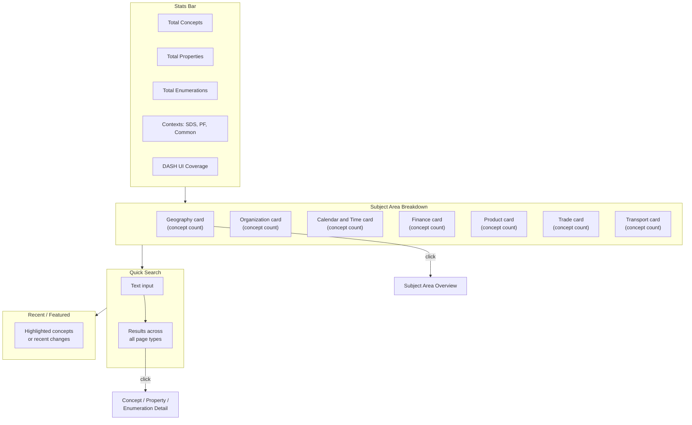

The Home page gives users an at-a-glance summary of the ontology. Each subject area card shows its concept count and links to the Subject Area Overview page; the search box provides cross-cutting discovery.

### Page 2: Concept List

Mermaid Source

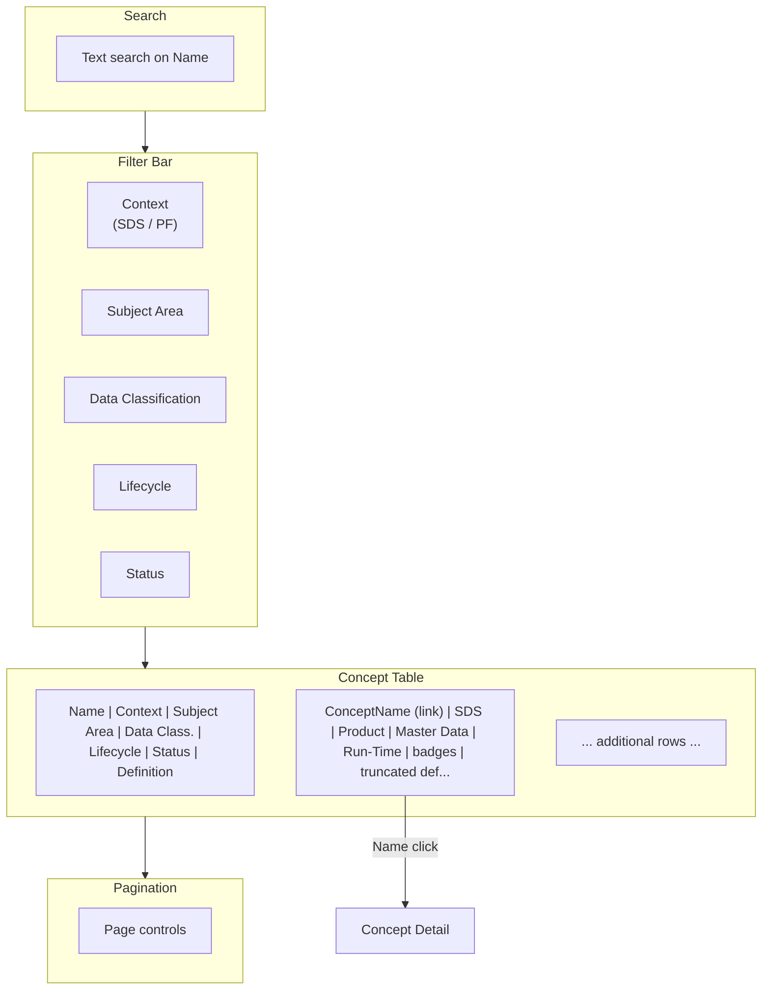

The Concept List is the primary browsing entry point. All five filter dimensions correspond to classification facets from the ontology, letting users narrow by context, subject area, data classification, lifecycle, or status.

### Page 3: Concept Detail

Mermaid Source

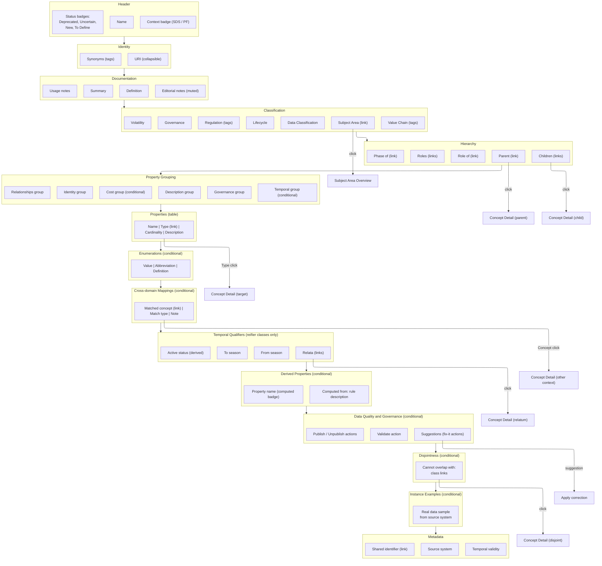

The Concept Detail page is the richest page in the model. It unifies data from OWL (hierarchy, labels, classification), SKOS (definitions, synonyms, enumerations), SHACL (properties table), and cross-domain mappings into a single coherent view. Property Groups organize properties into form sections (Identity, Description, Relationships, Governance, Temporal, Cost), providing a structured layout that mirrors the DASH property group definitions. Temporal Qualifiers appear only for RDF 1.2 Reifier classes (17 classes in SDS), showing season ranges and relata links. Derived Properties show computed values with their SHACL Rule source. Data Quality/Governance Actions show available suggestions and workflow operations from DASH. Instance Examples show real data from the PostgreSQL dbo schema, illustrating how concepts are populated with actual values. Disjointness shows non-overlapping class groups from ODR-0028b. Sections appear conditionally: Enumerations only when a matching scheme exists, Cross-domain Mappings only when mappings are defined, Temporal Qualifiers only for reifier classes, and so on.

### Page 4: Property List

Mermaid Source

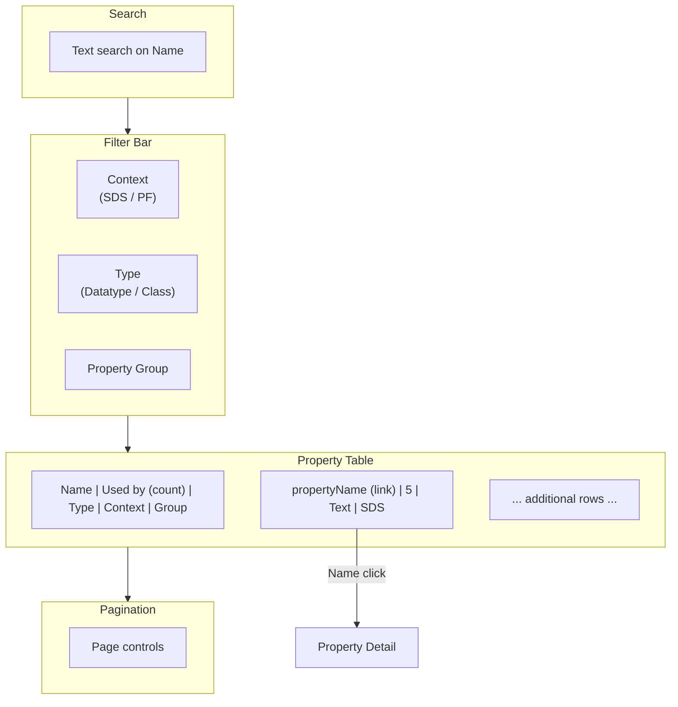

The Property List provides a flat inventory of all properties across both contexts. The "Used by" count gives users a quick sense of how widely shared each property is.

### Page 5: Property Detail

Mermaid Source

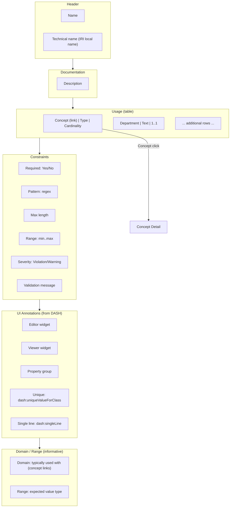

The Property Detail page shows every concept that uses a given property, with per-concept cardinality and type. The Domain/Range section is explicitly labelled "informative" to reflect the ontology's design decision that these are documentary, not constraining.

### Page 6: Enumeration Detail

Mermaid Source

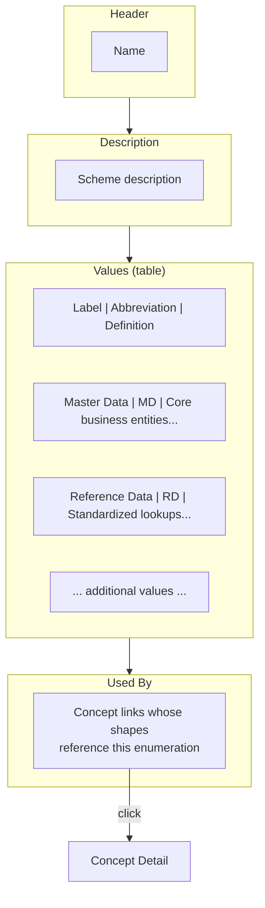

The Enumeration Detail page presents a single value set with all its members. The "Used By" section at the bottom closes the navigation loop back to the concepts that constrain their properties against this enumeration.

### Page 7: Subject Area Overview

Mermaid Source

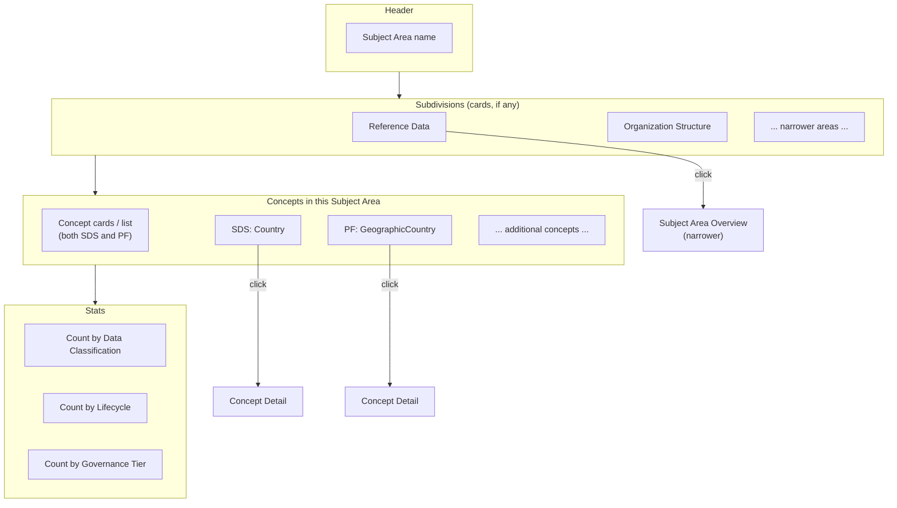

The Subject Area Overview aggregates all concepts classified under a given subject area across both bounded contexts. Subdivision cards enable drill-down into narrower areas (e.g., Geography to Reference Data). The stats section provides a structural profile of the subject area.

### Page 8: Mappings

Mermaid Source

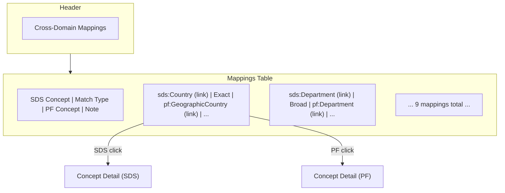

The Mappings page is a compact table showing all 9 cross-domain semantic links between SDS and PF concepts. Match type badges (Exact, Close, Broad) communicate the strength of each correspondence. Both concept columns are clickable, enabling bidirectional navigation between bounded contexts.

### Page 9: Module Overview

Mermaid Source

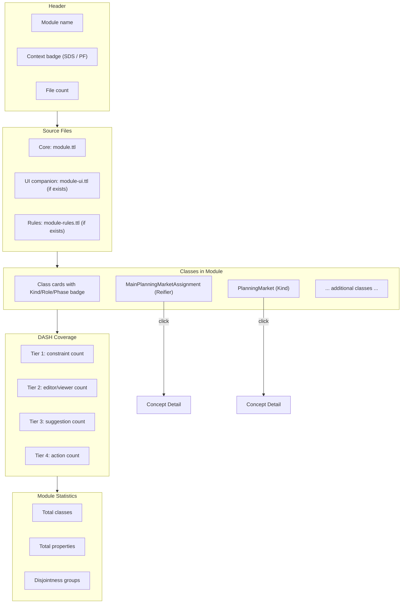

The Module Overview page provides a per-module landing page that mirrors the source file organization. Each module shows its constituent files (the 3-file pattern: core `.ttl`, optional `-ui.ttl`, optional `-rules.ttl`), all classes with their ontological nature badges (Kind, Role, Phase, SubKind, Reifier), DASH coverage statistics, and basic module metrics. This page type was introduced to reflect the modular file organization adopted in ODR-0027 and the 3-file-per-module pattern from ODR-0035/ODR-0036.

---

## 3. Navigation Graph

Mermaid Source

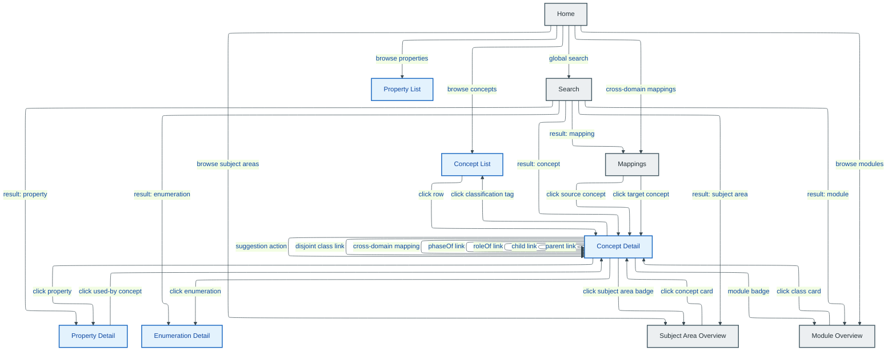

**Legend:** Blue (infra) = pages showing context-specific data (SDS/PF). Grey (external) = pages spanning both contexts or shared infrastructure.

The navigation graph shows every link path a user can follow between the nine page types plus global search. Concept Detail is the hub of the site: it links outward to Property Detail, Enumeration Detail, Subject Area Overview, Module Overview, and filtered Concept Lists, while also supporting self-referential navigation through parent/child, roleOf, phaseOf, cross-domain mapping, disjointness, and suggestion action links. Module Overview provides a per-module landing page reachable from both the Home page and the module badge on Concept Detail, with class cards linking back into Concept Detail. Search acts as a universal entry point that can land the user on any page type including Module Overview, and the Mappings page provides a dedicated view of the cross-context correspondences between SDS and PF concepts.

---

## 4. Data Flow Diagram

Mermaid Source

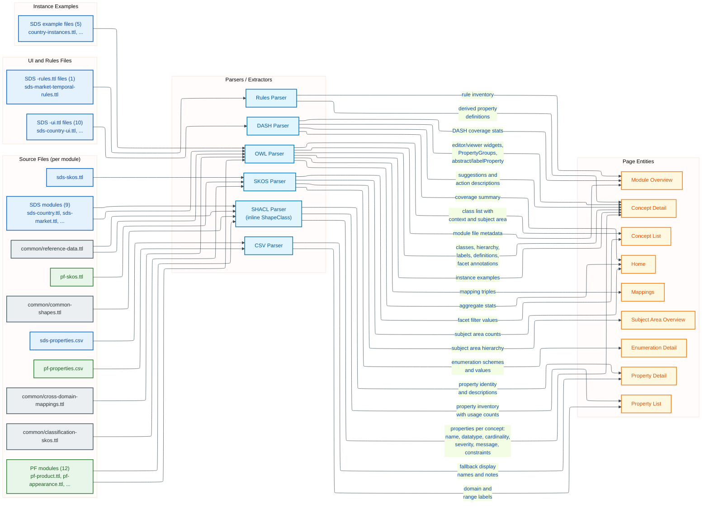

**Legend:** Blue = SDS sources. Green = PF sources. Grey = shared/common sources. Light blue/teal = UI and Rules sources. Light blue = parsers. Amber = page entities.

This diagram traces how each source file feeds through a formalism-specific parser into the page entities that the website renders. Source files are now modular (9 SDS modules, 12 PF modules, plus common files including `reference-data.ttl` and `common-shapes.ttl`) rather than the original monolithic `*-ontology.ttl` and `*-shapes.ttl` files. The OWL parser extracts class identity, hierarchy, documentation annotations, and the seven classification facet values from all module files, while also reading the cross-domain mapping triples from the shared mappings file and parsing instance examples into their concept types. The SHACL parser now processes inline ShapeClass validation directly from the module files (the standalone `sds-shapes.ttl` and `pf-shapes.ttl` were deleted in Session 39), converting property constraint blocks -- including severity, validation messages, and advanced constraints like `sh:pattern` and `sh:maxLength` -- into the per-concept property tables shown on Concept Detail and the global Property List. The DASH parser is new: it extracts UI/UX metadata from `-ui.ttl` companion files, including PropertyGroups for organising properties into named form sections, editor/viewer widget assignments, suggestion generators for data correction proposals, and action descriptions for bulk operations. The Rules parser is also new: it extracts SHACL Rules from `-rules.ttl` files, identifying derived property definitions that are materialised at data load time. The SKOS parser handles both domain enumerations and the shared classification vocabularies that power faceted filtering and the Subject Area Overview page. The CSV parser serves as a fallback source for human-friendly property display names and domain/range labels where the SHACL shapes lack `sh:name` or `sh:description`. Cross-domain mappings total 9 (up from 8). Common module files (`reference-data.ttl`, `common-shapes.ttl`) are parsed alongside the bounded context modules by the OWL and SHACL parsers respectively.

---

## 5. Classification Facet Diagram

<!-- accTitle: Seven-Facet Classification Framework -->
<!-- accDescr: All seven classification facets from ODR-0010 with their value sets -->

Mermaid Source

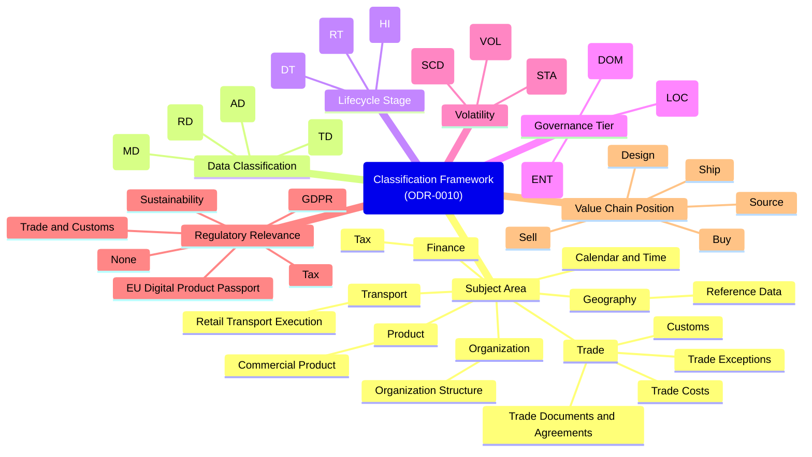

The seven classification facets defined in ODR-0010 form the backbone of the website's filtering and navigation capabilities. Each facet is a SKOS ConceptScheme in `classification-skos.ttl`; every OWL class in both bounded contexts carries an annotation property pointing to one or more values from these schemes.

### Facet-to-UI Mapping

| Facet | Annotation Property | UI Element | Cardinality | Filterable | Values |
|-------|-------------------|-----------|-------------|-----------|--------|
| Subject Area | `hm:subjectArea` | Link badge on Concept Detail; filter on Concept List; dedicated Subject Area Overview page | 1 per concept | Yes | 7 top + 9 subdivisions |
| Data Classification | `hm:dataClassification` | Badge on Concept Detail; filter on Concept List | 1 per concept | Yes | 4 (MD, RD, TD, AD) |
| Lifecycle Stage | `hm:lifecycleStage` | Badge on Concept Detail; filter on Concept List | 1 per concept | Yes | 3 (DT, RT, HI) |
| Governance Tier | `hm:governanceTier` | Badge on Concept Detail | 1 per concept | No | 3 (ENT, DOM, LOC) |
| Volatility | `hm:volatility` | Badge on Concept Detail | 1 per concept | No | 3 (STA, SCD, VOL) |
| Regulatory Relevance | `hm:regulatoryRelevance` | Tags on Concept Detail | 0..* per concept | No | 6 (GDPR, DPP, Trade and Customs, Tax, Sustainability, None) |
| Value Chain Position | `hm:valueChainPosition` | Tags on Concept Detail (optional) | 0..* per concept | No | 5 (Design, Source, Buy, Ship, Sell) |

---

## 6. Glossary of Terms

| Term | Definition | Source | UI Representation | Cardinality |
|------|-----------|--------|-------------------|-------------|
| **Concept** | A business entity or thing in the ontology. Represents a named class from either bounded context. | `owl:Class` from `*-ontology.ttl` | Concept Detail page; row in Concept List | ~218 total (92 SDS + 104 PF + 2 Common) |
| **Property** | An attribute or relationship of a concept. Describes what data a concept carries and how it relates to other concepts or literal values. | `sh:path` from SHACL `*-shapes.ttl`; fallback to `*-properties.csv` | Property Detail page; row in Properties table on Concept Detail | ~300 total (~150 SDS + ~140 PF + ~10 Common annotation) |
| **Enumeration** | A fixed set of allowed values for a property. Represents a controlled vocabulary or code list. | `skos:ConceptScheme` from `*-skos.ttl` | Enumeration Detail page; inline table on Concept Detail | Varies per context |
| **Subject Area** | A topical classification grouping concepts by the part of the business they describe. | `hm:subjectArea` annotation → `skos:Concept` in `SubjectAreaScheme` (`classification-skos.ttl`) | Link badge on Concept Detail; filter on Concept List; dedicated Subject Area Overview page | 1 per concept; 7 top-level + 8 subdivisions |
| **Classification Facet** | One of seven metadata dimensions applied to every concept under the ODR-0010 framework. | Annotation properties (`hm:subjectArea`, `hm:dataClassification`, etc.) in `classification-skos.ttl` | Filter dimensions on Concept List; badge/tag groups on Concept Detail | 7 facet types |
| **Bounded Context** | An independent domain model with its own namespace, classes, properties, and enumerations. SDS, PF, and Common are the three bounded contexts; Common holds shared classification vocabularies, annotation properties, and cross-domain infrastructure. | Namespace prefix (`sds:`, `pf:`, or `hm:`) | Context badge on Concept/Property pages; filter on list pages | 3 (SDS, PF, Common) |
| **Cross-Domain Mapping** | A semantic link between concepts in different bounded contexts, expressing that they represent the same or similar real-world things. | `skos:exactMatch`, `skos:closeMatch`, `skos:broadMatch` in `cross-domain-mappings.ttl` | Section on Concept Detail; dedicated Mappings page | 9 total |
| **Status Badge** | A visual indicator of a concept's editorial status, normalised from context-specific annotation properties. | `sds:deprecated`, `sds:uncertain`, `sds:newConcept`, `pf:diagramStatus`, `pf:uncertain`, `pf:toDefine` → normalised | Coloured badges in Concept Detail header; filter on Concept List | 0..* per concept; 4 types (Deprecated, Uncertain, New, To Define) |
| **Data Classification** | DAMA DMBOK data management type category. Indicates whether a concept represents master data, reference data, transactional data, or analytical data. | `hm:dataClassification` → value from `DataClassificationScheme` | Badge on Concept Detail; filter on Concept List | 1 per concept; 4 values (MD, RD, TD, AD) |
| **Lifecycle Stage** | When in the product/data lifecycle a concept is primarily active. | `hm:lifecycleStage` → value from `LifecycleStageScheme` | Badge on Concept Detail; filter on Concept List | 1 per concept; 3 values (Design-Time, Run-Time, Historical) |
| **Governance Tier** | Level of cross-domain coordination required to change a concept's schema. | `hm:governanceTier` → value from `GovernanceTierScheme` | Badge on Concept Detail | 1 per concept; 3 values (Enterprise, Domain, Local) |
| **Volatility** | How frequently instance data for this concept changes. Drives CDC strategy and pipeline design. | `hm:volatility` → value from `VolatilityScheme` | Badge on Concept Detail | 1 per concept; 3 values (Static, Slowly Changing, Volatile) |
| **Regulatory Relevance** | Which regulatory regimes apply to this concept. Multi-valued. | `hm:regulatoryRelevance` → values from `RegulatoryRelevanceScheme` | Tags on Concept Detail | 0..* per concept; 6 possible values |
| **Value Chain Position** | Position in the fashion retail value chain. Multi-valued, optional. | `hm:valueChainPosition` → values from `ValueChainScheme` | Tags on Concept Detail | 0..* per concept; 5 possible values (Design, Source, Buy, Ship, Sell) |
| **Property Group** | A named grouping of related properties within a concept, used to organize form sections and UI layout. | `sh:PropertyGroup` from SHACL; defined in `-ui.ttl` companion files | Section headers on Concept Detail; form tab groups | 6 standard types (Identity, Description, Relationships, Governance, Temporal, Cost) |
| **Suggestion Generator** | A DASH-defined data correction proposal that an application can offer to a user. Suggestions propose asserted data changes (e.g., complete a missing temporal pair, clean whitespace from a code field). | `dash:SPARQLUpdateSuggestionGenerator` from `-ui.ttl` files | "Fix this" actions on Concept Detail property rows | 11 generators across 3 categories (temporal completion, single-line cleanup, publish status correction) |
| **Action Description** | A DASH-defined operation that an application can expose to users. Actions describe bulk operations like validation, publishing, and unpublishing of data. | `dash:ResourceAction` with `dash:applicableToClass` in `-ui.ttl` files | Action buttons/menus on Concept Detail or Concept List | 15 actions across 3 groups (Data Quality, Governance, Navigation) |
| **Rule** | A SHACL Rule that automatically materializes derived property values. Rules fire at data load time, not interactively. Distinguished from suggestions (which are user-approved) by ODR-0036. | `sh:TripleRule` or `sh:SPARQLRule` from `-rules.ttl` files | "Computed" badge on derived properties in Properties table | 2 rules in SDS (isActive, hasLatestFiscalCountry); more as needed |
| **Instance Example** | A concrete data instance from a real source system, illustrating how concepts are populated with actual values. | Named individuals in `examples/sds/*.ttl`, sourced from PostgreSQL `dbo` schema | Example data panel on Concept Detail (conditional) | ~489 triples across 5 SDS example files |
| **Temporal Reification** | A time-qualified relationship modelled as a named class (RDF 1.2 Reifier) rather than a direct property. Captures assignments, memberships, and periods that vary over season ranges. | `rdf:Reifier`-typed classes in `sds-market-temporal.ttl`, `sds-currency.ttl`, `sds-customs.ttl` | Dedicated "Temporal Qualifiers" section on reifier Concept Detail pages | 17 reifier classes across 4 SDS modules |
| **Disjointness** | A declaration that two or more classes cannot share instances. Enforced via `owl:AllDisjointClasses` (OWL) and `sh:xone` (SHACL). | `owl:AllDisjointClasses` in module files; `sh:xone` in `common-shapes.ttl` | "Cannot overlap with" list on Concept Detail | 4 disjointness groups in SDS |

---

## 7. Bounded Context Handling

### Independence

SDS (Support Data System), PF (Product Framework), and Common are the three contexts in the ontology. SDS and PF are autonomous bounded contexts as defined by ODR-0015, each with its own namespace. Common (`https://hm.com/ns/common/`) is a shared tier containing enterprise-level classes (Channel, Currency) promoted from domain contexts via ODR-0024/ODR-0028. Each bounded context has its own namespace (`https://hm.com/ns/sds/` and `https://hm.com/ns/pf/`), its own set of OWL classes, object/datatype properties, SKOS enumeration schemes, and SHACL validation shapes. A concept in SDS (e.g. `sds:Department`) and a concept in PF (e.g. `pf:Department`) are **distinct entities** even when they share a human-readable name. They may have different properties, different definitions, different editorial statuses, and different classification values.

### Shared Infrastructure

Despite their autonomy, both contexts share common infrastructure from `src/ontology/common/`:

- **Classification facets** (`classification-skos.ttl`): The seven ConceptSchemes (Subject Area, Data Classification, Lifecycle, Governance, Volatility, Regulatory Relevance, Value Chain Position) are shared. Both SDS and PF classes point to the same facet values, which enables cross-context filtering.
- **Subject area vocabulary**: The 7 top-level subject areas and 9 subdivisions are shared. A concept in SDS and a concept in PF can both belong to "Product" or "Geography".
- **Common reference data** (`reference-data.ttl`): Enterprise-governed classes promoted from domain contexts. Channel (3 instances: store, wholesale, online) and Currency (ISO 4217, promoted from sds:Currency per ODR-0028). These are full OWL classes with ShapeClass validation, 7-facet classification, and SKOS enumeration schemes -- not just shared vocabulary.
- **Cross-domain mappings** (`cross-domain-mappings.ttl`): 9 explicit SKOS mapping relationships connect concepts across contexts, expressing exact, close, or broad semantic equivalence.

### UI Implications

Mermaid Source

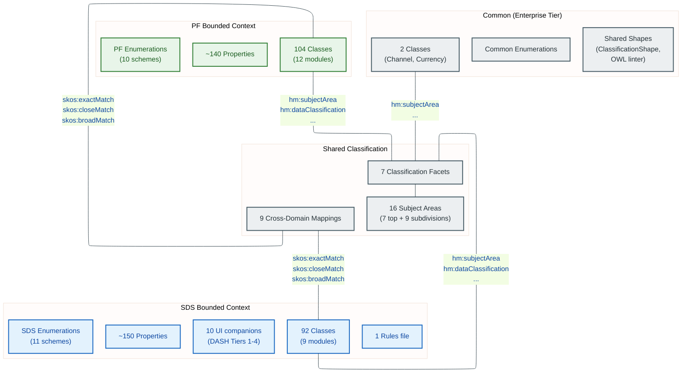

**Legend:** Blue = SDS bounded context. Green = PF bounded context. Grey = Common (enterprise) tier and shared infrastructure.

The website reflects this architecture in several ways:

- **Context filter on every list page.** Concept List, Property List, and any search results include a Context filter with options: All, SDS, PF, Common. The default is All.
- **Context badge in headers.** Every Concept Detail and Property Detail page shows the bounded context prominently (e.g. a blue "SDS", green "PF", or amber "Common" badge) so users always know which context they are viewing.
- **Subject Area Overview spans both contexts.** A Subject Area Overview page (e.g. `/subject/Product`) shows all concepts classified under that subject area from **both** SDS and PF, grouped by context. This is one of the key cross-context discovery mechanisms.
- **Cross-domain mappings as bridges.** When a mapping exists (e.g. `sds:RetailSalesChannel exactMatch pf:Channel`), both concept pages display a "Cross-domain Mappings" section with a link to the counterpart in the other context. The Mappings page provides a consolidated table of all 9 mappings.
- **Shared classification facets enable cross-context filtering.** Because both contexts reference the same facet values, a user can filter the Concept List by "Data Classification = Master Data" and see master data concepts from both SDS and PF together.
- **DASH coverage summary on Module Overview.** Each Module Overview page shows DASH tier coverage statistics, making it easy to see which modules have full UI metadata, suggestion generators, and action descriptions.
- **Instance examples as teaching aids.** When real data examples exist (currently 5 SDS files from PostgreSQL dbo), the Concept Detail page shows sample instances with actual values, grounding abstract definitions in concrete reality.

### Data Loading Strategy

The pipeline loads each context independently: parse SDS files into SDS concepts, parse PF files into PF concepts. Each concept carries its namespace prefix as the `context` field. Shared classification data from `classification-skos.ttl` is loaded once and referenced by both contexts. Cross-domain mappings from `cross-domain-mappings.ttl` are applied as a post-processing step, linking concept records across contexts by their full IRIs. UI metadata from `-ui.ttl` companion files is loaded as an optional overlay -- dropping these files degrades presentation but does not break core functionality. SHACL Rules from `-rules.ttl` files are loaded into the materialization pipeline; the website shows derived properties flagged as "computed". Instance examples from `examples/sds/*.ttl` are parsed and linked to their concept types for display on Concept Detail pages.
