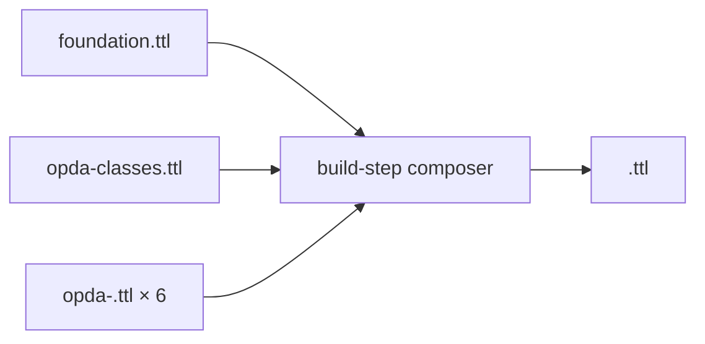

# IA spec — Physical-tier presentation (deployment / database)

This document specifies how the **Physical-tier (deployment / database) presentation** of OPDA's ontology is laid out. It is a *blueprint*: the actual Physical-DB-tier docs that follow this spec are a separate deliverable.

## What "physical database" means for OPDA

OPDA's "database" is the **deployed form of the ontology** — the published graph at `https://opda.org.uk/pdtf/`, the named-graph layout that a triplestore consumer loads, the derived consumer profiles assembled by the build-step composer, and the HTTP content-negotiation that delivers each consumer profile in the right format.

The Physical-Ontology tier documents the *source* TTLs as they live in the repository; the Physical-Database tier documents the *deployed* form those TTLs take when a downstream consumer loads them into a triplestore, queries them via SPARQL, or fetches them as JSON-LD over HTTP.

Inputs to this tier:

- The 24 source TTLs at `source/03-standards/ontology/` (the Physical-Ontology tier owns these; the Physical-DB tier documents their deployment)
- `source/03-standards/ontology/derived/*.ttl` — consumer profiles (`opda-validation.ttl`, `opda-ui.ttl`, `opda-inference.ttl`) assembled by the build-step composer per [ADR-0007 §"Module pluralism"](../adr/ADR-0007-ontology-generator-specification.md)
- The w3id.org redirect record (per [ADR-0006](../adr/ADR-0006-w3id-opda-ontology-namespace.md))
- The Astro site routing at `src/pages/` that serves content-negotiated responses
- BASPI5 overlay composer output per [ADR-0013](../adr/ADR-0013-overlay-profile-emission.md)

## Audience

Triplestore operators, SPARQL endpoint consumers, downstream ontology integrators, devops engineers running the deployment, JSON-LD client developers. Reader is comfortable with named-graph semantics, content negotiation, and consumer-profile composition; reader is not implementing or extending the ontology itself.

## Purpose

Show **how the ontology is shaped for consumption**: which named graphs hold which TTLs, what load order produces a coherent graph, how the three derived consumer profiles compose, how HTTP requests to `https://opda.org.uk/pdtf/<resource>` resolve to TTL / JSON-LD / RDF/XML representations, how BASPI5 profile composition lands a deployable validation graph.

## File layout

```
docs/manual/physical-database/
├── README.md                       Tier overview + reading order + deployment topology + named-graph catalogue
├── named-graphs.md                 Per-named-graph layout + load order
├── derived-profiles/
│   ├── README.md                   Consumer-profile catalogue + composition rules
│   ├── opda-validation.md          Classes ⊕ shapes; for SHACL validation
│   ├── opda-ui.md                  Classes ⊕ shapes ⊕ annotations; for form rendering
│   └── opda-inference.md           Classes alone; for OWL reasoning
├── content-negotiation/
│   ├── README.md                   Accept-header routing + format catalogue
│   ├── jsonld-context.md           Shared JSON-LD @context spec
│   └── format-matrix.md            Per-resource format availability
├── overlay-deployment/
│   ├── README.md                   Per-overlay deployment notes
│   └── baspi5.md                   BASPI5 composer output + deployable shapes graph
└── operations/
    ├── byte-identity-ci.md         The regenerate-and-diff CI gate
    ├── three-graph-ci.md           The 5-part separation CI gate
    └── round-trip-ci.md            The BASPI5 round-trip MVP CI gate
```

- Tier organised by **consumption concern** (named graphs / derived profiles / content negotiation / overlay deployment / CI operations), not by entity. The entity-by-entity view is the Physical-Ontology tier's job.

## Per-named-graph section shape (mandatory)

Used in `named-graphs.md`. One section per named graph the deployment exposes.

1. **`### <graph-iri>`** — H3 with the named graph IRI as title (e.g. `### https://opda.org.uk/pdtf/harness/release/0.4.0/`).
2. **`#### Source TTL(s)`** — which repository TTLs this graph aggregates (e.g. `foundation.ttl` + `opda-classes.ttl`).
3. **`#### Purpose`** — what consumers load this graph for (validation / inference / UI / round-trip).
4. **`#### Load order`** — list of `owl:imports` resolution: which other named graphs must be loaded first.
5. **`#### Triple count`** — measured count; updated per release.
6. **`#### Version IRI`** — the `owl:versionIRI` this graph carries and the bump history.

## Per-consumer-profile section shape (mandatory)

Used in `derived-profiles/<profile>.md`. One file per derived profile in `source/03-standards/ontology/derived/`.

1. **`# <profile-name>`** — H1.
2. **`## Summary`** — one paragraph naming the consumer scenario this profile serves.
3. **`## Composition recipe`** — how the build-step composer assembles this profile from the per-module source TTLs. Mermaid `flowchart LR` showing inputs → composer → output.
4. **`## Included graphs`** — table of source named graphs that contribute to this profile + the projection rule (everything / classes-only / shapes-only / annotations-only).
5. **`## Excluded`** — explicit list of source named graphs that are deliberately NOT in this profile, with one-line rationale per exclusion.
6. **`## Deployment artefact`** — the deployed file path / URL the consumer fetches; content-type; size; checksum.
7. **`## Source ADR`** — typically [ADR-0007 §"Module pluralism"](../adr/ADR-0007-ontology-generator-specification.md) + [ADR-0012](../adr/ADR-0012-shacl-and-dpv-annotation-emission.md).

## Per-overlay deployment section shape (mandatory)

Used in `overlay-deployment/<overlay>.md`. One file per overlay profile that has landed (currently BASPI5; TA6 / NTS / LPE1 etc. follow as Phase-2/3 adds).

1. **`# <OverlayName>`** — H1.
2. **`## Summary`** — overlay authority + form version + production status.
3. **`## Source profile TTL`** — `profiles/<overlay>.ttl` reference.
4. **`## Deployable composition`** — how the composer assembles `<overlay>.ttl` + foundation + vocabularies + module shapes into a single validatable graph; output artefact path.
5. **`## Round-trip status`** — current state per [ADR-0014](../adr/ADR-0014-baspi5-round-trip-mvp-harness.md) round-trip harness: pyshacl validation outcome on the 15 exemplars; round-trip equivalence on the synthetic BASPI5 sample.
6. **`## Three-rule interface contract`** — CI status: `sh:in` semantics PASS; `sh:Violation` floor PASS; no-identity-override PASS. Links to `opda-gen ci-profile-contract`.
7. **`## Source ADR`** — typically [ADR-0013](../adr/ADR-0013-overlay-profile-emission.md) + [ADR-0014](../adr/ADR-0014-baspi5-round-trip-mvp-harness.md).

## Content-negotiation section shape (mandatory)

Used in `content-negotiation/format-matrix.md`. Table:

| Resource path | TTL | JSON-LD | RDF/XML | HTML | Notes |
|---|---|---|---|---|---|
| `https://opda.org.uk/pdtf/` | ✅ | ✅ | ✅ | redirect to docs | Foundation namespace |
| `https://opda.org.uk/pdtf/harness/release/0.4.0/` | ✅ | ✅ | ✅ | ✅ | Version-IRI; immutable |
| `https://opda.org.uk/pdtf/shape/profiles/baspi5` | ✅ | ✅ | ✅ | docs | Overlay profile |
| `https://opda.org.uk/pdtf/<EntityLocalName>` | ✅ | ✅ | ✅ | Concept-tier page | Per-entity dereference |

The JSON-LD `@context` is canonical: one shared context across all JSON-LD responses, documented in `content-negotiation/jsonld-context.md`.

## Operations section shape (mandatory)

`operations/` documents the three CI gates that the deployment depends on:

- `byte-identity-ci.md` — `opda-gen ci-byte-identity` + how the GitHub Actions workflow at `.github/workflows/ontology-byte-identity.yml` enforces regenerate-and-diff
- `three-graph-ci.md` — `opda-gen ci-three-graph` + the 5-part SHACL-AF separation test per [ODR-0004 §3a](../ontology/odr/ODR-0004-pdtf-ontology-foundation.md)
- `round-trip-ci.md` — `opda-gen ci-profile-contract` + `tests/baspi5_round_trip/` + the matrix CI job at `.github/workflows/baspi5-round-trip.yml`

Each file: what the gate enforces, the command, the expected output, what a failure looks like, how to remediate.

## Diagram conventions

- Deployment topology: Mermaid `flowchart LR` showing source TTLs → composer → derived profiles → deployment artefacts.
- Named-graph dependency: Mermaid `flowchart` with `owl:imports` arrows between named graph IRIs.
- Content-negotiation flow: simple sequence diagram showing client `Accept:` header → server response.
- No ER diagrams (those live in the Logical tier). No class hierarchies (those live in the Physical-Ontology tier).

## Voice and style

- Operational. Reader is configuring a deployment or building against an endpoint; not deliberating about modelling.
- Tables for catalogues; Mermaid for flow; minimal narrative.
- Every named graph IRI is a fully-qualified URL (no prefixes; reader is doing HTTP).
- Every CLI command shown verbatim; copy-paste-runnable.

## Cross-tier traceability

- Per-named-graph mapping: every named graph cites the source TTLs from the Physical-Ontology tier (`[Source TTL →](../physical-ontology/...)`) so the reader can chase from "what's deployed" to "what's in the source".
- Per-derived-profile mapping: each profile lists the per-module shapes / classes / annotations files it composes (Physical-Ontology tier links).
- Per-overlay mapping: each overlay deployment cites the overlay profile file in the Physical-Ontology tier.
- Concept and Logical tiers don't appear at this tier — they're modelling-side concerns and the Physical-DB reader doesn't need them.

## Out of scope for this tier

- Business-language narrative — see [`concept-model-ia.md`](./concept-model-ia.md).
- Platform-independent typed attributes — see [`logical-model-ia.md`](./logical-model-ia.md).
- OWL / SHACL / SKOS / Turtle syntax of the source files — see [`physical-ontology-ia.md`](./physical-ontology-ia.md).
- The PDTF JSON Schemas (`source/03-standards/schemas/`) — they are upstream Council programme input, not deployment output. They have their own documentation in the schemas nested repo.

## Worked-template excerpt (one consumer profile, schematic)

```markdown
# <profile-name>

## Summary

<One paragraph: what consumer scenario this profile serves.>

## Composition recipe



## Included graphs

| Source graph | Projection rule |
|---|---|
| `foundation.ttl` | all triples |
| `opda-classes.ttl` | `owl:Class` + `owl:DatatypeProperty` + `owl:ObjectProperty` only |
| `opda-vocabularies.ttl` | <…> |

## Excluded

- `opda-<module>-annotations.ttl` × 6 — DPV co-annotations don't apply at this profile

## Deployment artefact

- Path: `source/03-standards/ontology/derived/<profile-name>.ttl`
- Content-type: `text/turtle`
- Size: <…>
- Checksum: <sha256>

## Source ADR

- [ADR-0007 — Ontology generator specification](../../../docs/adr/ADR-0007-ontology-generator-specification.md), §"Module pluralism"
```

## Generation discipline

Physical-DB-tier files generate mechanically from:

- The 24 source TTLs at `source/03-standards/ontology/` (read named-graph IRIs from each TTL's `owl:Ontology` header)
- `source/03-standards/ontology/derived/*.ttl` once the composer runs (read each derived profile's actual content + computed checksum)
- `profiles/baspi5.ttl` (read `opda:ValidationContext` for overlay deployment context)
- `.github/workflows/*.yml` (read CI gate definitions for the operations section)
- ADR text only for governance backlinks — **no** ODR reads, **no** PDTF JSON reads

The composer + CI workflows are already in place; this tier documents their output as deployed artefacts.
