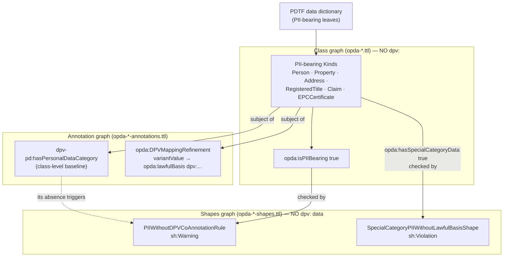
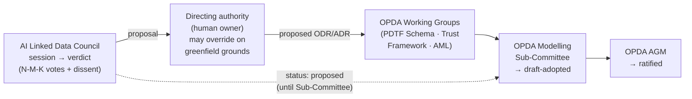

# Governance & Privacy Modelling

> Part of the OPDA Linked-Data Initiative knowledgebase. Legend: ✅ built · 🟡 partial · 🔵 planned.

"Governance" in this initiative means two distinct things, and both are modelled:

- **(A) Data-governance / privacy in the graph** — the DPV (Data Privacy Vocabulary)
  layer that types *which* classes carry personal data, of *what* category, under
  *which* lawful regime. This is a property *of the ontology* (a TBox fact), enforced by
  a SHACL sensitivity gate.
- **(B) Project/decision governance, the meta layer** — the ODR/ADR/Council apparatus is
  *itself* the governance model for how the standard evolves: an AI Council proposes, a
  human directing authority disposes, and real-world OPDA bodies (Working Group →
  Modelling Sub-Committee → AGM) ratify.

This document covers both, grounds every claim in the emitted Turtle, and then connects
them to the initiative's forward requirement — that the linked-data model will *drive*
governance and standards development (cross-ref [doc 11](./11-standards-development-releases-and-extensibility.md)).

## TL;DR

- ✅ **DPV typing is built and emitted.** Six PII-bearing Kinds (`Person`, `Property`,
  `Address`, `RegisteredTitle`, `Claim`, `EPCCertificate`) carry a class-level
  `dpv-pd:hasPersonalDataCategory` baseline; `Organisation` is deliberately *unmarked*
  (not a data subject). DPV is **referenced, never `owl:imports`-ed** (ODR-0012, ODR-0018).
- ✅ **The OPDA-authored mapping mechanism is real.** `opda:DPVMappingRecord` records (in
  `opda-governance.ttl`) declare `opda:baselineCategory → dpv-pd:` and `opda:targetsKind →`
  an OWL class; `opda:DPVMappingRefinement` records carry **variant-keyed lawful-basis
  references** (e.g. an `address` of variant `title` → `dpv:PublicTask`).
- ✅ **A SHACL sensitivity gate exists** — actually *two* shapes: a cross-cutting
  SHACL-AF rule that flags any `opda:isPIIBearing true` class lacking its DPV
  co-annotation (`sh:Warning`), and a Violation-tier shape requiring special-category PII
  to carry a lawful basis.
- 🟡 **Special-category / Article-10 handling is scaffolded, not populated.**
  `opda:SpecialCategoryScheme` is a *class declaration only*; the enforcement predicate is
  a local placeholder `opda:hasSpecialCategoryData`, and the named hazards
  (`cautionOrConviction`, AML results) live in the data dictionary and ODR prose, **not yet
  as emitted special-category leaves**.
- 🔵 **Lawful-basis / consent / policy *instances* are deferred to Phase 2.** A lawful
  basis is irreducibly an assertion about a processing *act*, which needs instance data;
  ODRL is adopted in the catalogue but **zero `odrl:` triples** are emitted (cross-ref
  [doc 05](./05-authorisation-roles-and-rbac.md)).
- ✅ **Decision governance is itself a modelled, audited apparatus** — ~28 ODRs + ~37
  Council sessions, with sessions indexed in AgentDB for recall, provenance traversal and
  learning (ADR-0027), and a documented Council → Working Group → Sub-Committee → AGM
  ratification handoff (`council/adoption.md`).

---

## Part A — Data-governance / privacy in the graph (the DPV layer)

### A.1 The reference-not-import pattern, and why

DPV (the W3C Data Privacy Vocabulary) and its personal-data module DPV-PD are large,
fast-moving vocabularies. OPDA **cites** their canonical URIs but never `owl:imports`
them. The decision is ODR-0012 (Decision, §Rules: "*Reference-not-import: canonical DPV
URIs … cited; local SHACL enforces usage; no `owl:imports`*"), reaffirmed as ODR-0018
Rule 3.

The emitted artefacts honour this literally. In `opda-governance.ttl:18–23` the governance
module's ontology header declares the dependency as a *reference*, not an import:

```turtle
<https://opda.org.uk/pdtf/graph/governance>
    rdf:type owl:Ontology ;
    dct:references <https://w3id.org/dpv/pd> ;          # referenced …
    owl:imports <https://opda.org.uk/pdtf/> ;            # … only the OPDA core is imported
    owl:versionIRI <https://opda.org.uk/pdtf/harness/release/governance/1.0.0/> .
```

Why it matters:

- **Stability.** Importing DPV would pull its entire class tree (and its transitive
  imports) into the OPDA reasoning graph, coupling OPDA's release cadence to DPV's and
  risking inference blow-ups. Referencing keeps DPV's surface *out* of the graph while
  preserving dereferenceable, canonical URIs.
- **Three-graph hygiene.** DPV annotations are *advisory* metadata, not class axioms and
  not shape constraints. They live in the **annotation graph** (`opda-*-annotations.ttl`),
  policed by CI so no `dpv:` triple leaks into the class graph or the shapes graph
  (ODR-0018 §4a; ODR-0004 §3a three-graph separation).
- **Honest scope.** ODR-0012 (reconciled by Council session-033) is explicit that
  reference-not-import yields *references + SHACL*, **not** a model-constraining DPV
  lattice — a constraining lattice would require `owl:import DPV` and is out of scope, a
  distinct future proposition.

### A.2 The `opda:DPVMappingRecord` mechanism

The core OPDA-authored construct is `opda:DPVMappingRecord` — a small meta-vocabulary
(`opda-governance.ttl:25–53`) that makes each PII-bearing Kind declare its DPV regime as
*data*:

| Term | Type | Role |
|---|---|---|
| `opda:DPVMappingRecord` | `owl:Class` | A mapping record from an OPDA Kind to its DPV baseline (UFO *Information Particular*). |
| `opda:baselineCategory` | `owl:ObjectProperty` | → a DPV-PD category every instance of the Kind bears by default. |
| `opda:targetsKind` | `owl:ObjectProperty` | → the OWL class whose instances bear the category. |

Three mapping-record *instances* are emitted in the governance module
(`opda-governance.ttl:55–73`):

```turtle
opda:PersonDPVMapping
    rdf:type opda:DPVMappingRecord ;
    opda:baselineCategory dpv-pd:Name ;
    opda:targetsKind opda:Person .

opda:ClaimDPVMapping
    rdf:type opda:DPVMappingRecord ;
    opda:baselineCategory dpv-pd:OfficialID ;
    opda:targetsKind opda:Claim .

opda:OrganisationDPVMapping        # targets the Kind but declares NO baseline …
    rdf:type opda:DPVMappingRecord ;
    opda:targetsKind opda:Organisation .   # … because an Organisation is not a data subject
```

The actual `dpv-pd:hasPersonalDataCategory` co-annotations that *attach to the Kinds* are
emitted into the per-module annotation graphs, keeping the class graph clean. Verified
placements across the corpus:

| Kind | Annotation file | Emitted category |
|---|---|---|
| `opda:Person` | `opda-agent-annotations.ttl:32–35` | `dpv-pd:Name`, `dpv-pd:EmailAddress` (+ `opda:isPIIBearing true`) |
| `opda:dateOfBirth` | `opda-agent-annotations.ttl:37–39` | `dpv-pd:DateOfBirth` |
| `opda:Address` | `opda-property-annotations.ttl:55–58` | `dpv-pd:PostalAddress` |
| `opda:Property` | `opda-property-annotations.ttl:60–63` | `dpv-pd:PostalAddress` |
| `opda:RegisteredTitle` | `opda-property-annotations.ttl:65–68` | `dpv-pd:PublicData` (HMLR open register) |
| `opda:Claim` | `opda-claim-annotations.ttl:55–58` | `dpv-pd:OfficialID` |
| `opda:EPCCertificate` | `opda-descriptive-annotations.ttl:54–57` | `dpv-pd:PostalAddress` |

> **Honesty note on `Person`.** ODR-0012's Decision narrative anticipates a wider category
> set (DOB/address/contact/identity-number) co-annotated on `opda:Person`. What is *emitted
> today* is the class-level baseline (`dpv-pd:Name`, `dpv-pd:EmailAddress`) plus the
> property-level `opda:dateOfBirth → dpv-pd:DateOfBirth`. Address/telephone/official-number
> categories for the Person surface are present in the data dictionary but not all are
> emitted as Person-attached DPV triples — the Phase-1 floor binds the *class-level*
> baseline and a curated set of property-level categories, not every PII leaf yet.

### A.3 DPV-PD categories used, and variant-conditional lawful basis

The DPV-PD personal-data categories actually referenced across the emitted corpus
(`grep dpv-pd:` over `source/03-standards/ontology/*.ttl`):

`dpv-pd:Name` · `dpv-pd:EmailAddress` · `dpv-pd:DateOfBirth` · `dpv-pd:OfficialID` ·
`dpv-pd:PostalAddress` · `dpv-pd:PublicData` (plus the `dpv-pd:hasPersonalDataCategory`
predicate).

> **Mapping to the brief.** The brief lists "Name, OfficialID, Address, EmailAddress." The
> emitted artefact uses `dpv-pd:PostalAddress` (not the broader `dpv-pd:Address`) for the
> address surface, and adds `dpv-pd:DateOfBirth` and `dpv-pd:PublicData`. These are the
> ground truth.

Beyond the static baseline, the model emits **variant-conditional refinements** that
attach a *lawful-basis reference* keyed on a discriminating variant — exactly the
three-tier pattern ODR-0018 specifies (class baseline → variant refinement → instance
dispatch). These are real, emitted triples (`opda-property-annotations.ttl:28–53`):

```turtle
opda:AddressVariantTitleRefinement
    rdf:type opda:DPVMappingRefinement ;
    opda:targetsKind opda:Address ;
    opda:variantPredicate opda:addressVariant ;
    opda:variantValue "title" ;
    opda:lawfulBasis dpv:PublicTask ;      # HMLR title data = public task
    dct:references <https://www.gov.uk/government/organisations/land-registry> .

opda:AddressVariantMarketingRefinement
    rdf:type opda:DPVMappingRefinement ;
    opda:variantValue "marketing" ;
    opda:lawfulBasis dpv:Consent ;         # marketing use = consent
    dct:references <https://ico.org.uk/for-organisations/guide-to-data-protection/> .

opda:AddressVariantInspireRefinement
    opda:variantValue "inspire" ;
    opda:lawfulBasis dpv:PublicTask .      # INSPIRE directive = public task
```

The same pattern is emitted for evidence (`opda-claim-annotations.ttl:28–53`):
`opda:DocumentEvidenceRefinement → dpv:PublicTask`,
`opda:ElectronicRecordEvidenceRefinement → dpv:LegitimateInterest`,
`opda:VouchEvidenceRefinement → dpv:Consent`. The four `dpv:` core lawful-basis values
that appear in the corpus are therefore `dpv:PublicTask`, `dpv:Consent`,
`dpv:LegitimateInterest`, and the `dpv:hasLegalBasis` predicate (used by the SHACL gate,
below).

> **This is the crux of the built-vs-planned line.** The *reference-not-import lawful-basis
> layer* — class- and variant-level `opda:lawfulBasis → dpv:` references — **is built and
> emitted (✅)**. What is **deferred to Phase 2 (🔵)** is the *instance* layer: a
> `dpv:hasLegalBasis` bound to a concrete processing event, consent receipts, and
> `odrl:Policy` instances. Council session-033 decomposed exactly this: (a) the
> reference-not-import lawful-basis layer is settled and emitted; (c) consent records /
> lawful-basis-bound-to-a-processing-event / ODRL instances are Phase-2, "because a lawful
> basis is irreducibly an assertion about a processing *act*." The Devil's Advocate
> (Allemang) holds this boundary as a live dissent with recorded re-open triggers.

### A.4 Special-category / Article-10 handling 🟡

Mortgage and conveyancing data brushes against GDPR Article 9/10 territory:
`cautionOrConviction` disclosures and AML (anti-money-laundering) outcomes. The model's
*structure* for this is in place; its *content* is deferred:

- **Scheme declared, members deferred.** `opda:SpecialCategoryScheme`
  (`opda-governance.ttl:32–38`) is an `rdfs:subClassOf skos:ConceptScheme` flagging
  "*GDPR Article 10 / DPA 2018 special-category personal-data*", citing
  `https://gdpr-info.eu/art-10-gdpr/`. Its own comment is candid: "*Currently a class
  declaration only — member emission deferred … (no S012 Q3 enum currently scoped).*" So
  `cautionOrConviction` and AML are *named in the comment and data dictionary* but **not
  emitted as enumerated special-category leaves** today.
- **Enforcement via a placeholder predicate.** The Article-10 enforcement target emitted
  today is a **local** `opda:hasSpecialCategoryData` (`opda-classes.ttl:68–74`), explicitly
  marked a "*Placeholder predicate … Council Author-only session via S012 Q3 may rename or
  refine the canonical name.*" The ODR-0012 Decision narrative refers to
  `dpv:hasSpecialCategoryPersonalData`; the **as-built** artefact uses the OPDA placeholder
  so the Cat-4 SHACL shape has a real TBox target until the canonical name is settled. This
  gap (prose names a DPV term; emission uses a local stand-in) is the honest state.

### A.5 The SHACL sensitivity gate ✅

There are **two** complementary gate shapes — both verifiable in the emitted shapes graph:

**(1) PII-without-DPV-co-annotation (cross-cutting, `sh:Warning`).** A SHACL-AF
`CONSTRUCT` rule (`opda-shapes.ttl:59–65`, body at `:ba5342297663c`) that fires on *any*
class:

```turtle
<…/shape/PIIWithoutDPVCoAnnotationRule>
    rdf:type sh:NodeShape ;
    sh:targetClass owl:Class ;
    sh:severity sh:Warning ;
    sh:rule [ a sh:SPARQLRule ; sh:construct """
        CONSTRUCT { ?class opda:hasPIIWithoutCoAnnotationFlag true . }
        WHERE {
          ?class a owl:Class ; opda:isPIIBearing true .
          FILTER NOT EXISTS { ?class dpv-pd:hasPersonalDataCategory ?category . }
        }""" ] .
```

In plain terms: any class the model has *declared* PII-bearing (`opda:isPIIBearing true`)
but which *lacks* its DPV category annotation is flagged. An un-annotated PII leaf becomes
a **validation finding, not a silent omission** — this is the "standing cost on new PII"
discipline (ODR-0012, Pandit Q7) made mechanical. The `opda:isPIIBearing` flag is emitted
`true` on exactly the six baseline Kinds (`opda-classes.ttl:76–82`), giving the rule a
non-empty target set.

**(2) Special-category-PII-without-lawful-basis (`sh:Violation`).** A node shape on
`opda:Person` (`opda-agent-shapes.ttl:59–65`, SPARQL at `:b69fb2d260da0`) that escalates to
the loudest severity:

```turtle
<…/shape/SpecialCategoryPIIWithoutLawfulBasisShape>
    rdf:type sh:NodeShape ;
    sh:targetClass opda:Person ;
    sh:severity sh:Violation ;
    sh:sparql [ sh:select """
        SELECT $this ?path WHERE {
          $this opda:hasSpecialCategoryData true .
          FILTER NOT EXISTS { $this dpv:hasLegalBasis ?basis }
          BIND (opda:hasSpecialCategoryData AS ?path)
        }""" ] .
```

The severity choice is deliberate and traces to ODR-0013's four-tier framework: the
rarest, most damaging error must be the *loudest*. Missing-PII-annotation is a `sh:Warning`
(it should not be silent, but the data is not corrupt); special-category PII processed with
*no recorded lawful basis* is a `sh:Violation` (a regulatory breach). Routine optional gaps
are `sh:Info`. (Corpus severity mix overall: 287 `sh:Violation` / 28 `sh:Info` / ~4
`sh:Warning` — see `_fact-sheet.md`.)

### A.6 What PII the PDTF transaction actually carries

The DPV layer is not theoretical — a PDTF transaction is dense with personal data. From the
data dictionary and ODR-0012 §References, the PII-bearing leaves include: participant
`name` / `firstName` / `lastName` / `maidenName` / `title`; `dateOfBirth`; `address`;
`email` / `emailAddress`; `telephone`; identity and `document_number` fields; occupier
names (incl. `aged17OrOverNames`); and the special-category-adjacent `cautionOrConviction`
and AML results. A subtle point carried from ODR-0012 (Q6, Pandit): the evidence layer is
**not** a PII-free zone — a `document_number` is a `dpv-pd:OfficialID`, and a *voucher is
itself a data subject*, not merely a provenance node. This is why the DPV co-annotations
reach into the claims/evidence module, not just the agent module.

### A.7 Where the DPV annotations attach (and where they must not)



---

## Part B — Project/decision governance (the meta layer)

The second sense of "governance" is how the *standard itself* is governed. Here the
ODR/ADR/Council apparatus **is** the governance model.

### B.1 The authority handoff: AI proposes, OPDA disposes

A Council verdict is a **proposal**, not a ratified decision. The real-world authority chain
is documented verbatim in `council/adoption.md` §Real-world Governance Handoff (lines 37–45):

1. **OPDA Working Groups** — domain WGs (PDTF Schema WG, Trust Framework WG, AML WG) review
   Council proposals against operational reality and stakeholder concerns.
2. **OPDA Modelling Sub-Committee** — a cross-WG body that ratifies linked-data modelling
   proposals into *draft adopted* decisions.
3. **OPDA AGM ratification** — the annual general meeting where adopted decisions receive
   formal stakeholder endorsement.

The status semantics follow this chain: "*Records produced by Council sessions remain
`proposed` until the Sub-Committee draft-adopts them; `accepted` only after AGM
ratification.*" (The greenfield exception: where the directing authority has lifted the
namespace block on a record, the methodology may mark it `accepted` directly — see the
project memory on greenfield/no-WG-gate. The two senses of `accepted` are reconciled in
`adoption.md`.)

On top of the committee chain sits the **directing-authority override**: the human owner
can overrule the Council on greenfield grounds. Recorded cases include session-037 (Council
recommended reverting to hash URIs 5H–2S; the authority kept slash) and session-021/023
(Council's Devil's-Advocate held a completeness gate; the directing authority directed
one-go full coverage). This is the honest "AI proposes, human disposes" story — the Council
adds rigour and a citable audit trail, but does not hold final authority.



### B.2 AgentDB indexing of Council decisions (ADR-0027)

Council sessions are the *deliberation* behind each ODR — named-expert positions,
Devil's-Advocate challenges, per-question votes, held-as-live dissents, and re-open
triggers. They are durable in git; ADR-0027 adds **indexing** (not records — sessions are
deliberately *not* ODRs) into AgentDB across four complementary stores, each serving a
distinct access pattern:

| Mechanism | Store | Answers |
|---|---|---|
| **Recall** | `memory_store`, namespace `council-sessions` | "What has the Council already argued about X?" (semantic search *before* convening a new council, as the ODR-0001 protocol expects). |
| **Provenance** | `agentdb_causal-edge` | "Which session produced this rule, and what else did it feed?" — a one-hop traversal `session-NNN ⇄ odr/ODR-NNNN` instead of a grep. |
| **Learning** | ReasoningBank trajectory store | "Which argument / Devil's-Advocate patterns tend to win?" — distilled across sessions so AI-assisted councils reason better over time. |
| **Enumeration** | hierarchical `episodic` tier, `council/*` | Files each session alongside the `odr/*` / `adr/*` records (recorded honestly as largely redundant with recall + git). |

The load-bearing payoff is **operationalising the trigger discipline**: ODR-0001 produces
re-open triggers and live dissents that are *meant to be checked later* but otherwise sit
inert in prose. Indexing them makes a proposed change *queryable* against recorded triggers
before acting — the ontology-side equivalent of the ADR-0005 deferred-work register. The
session ↔ ODR link becomes a traversable edge, so "trace this rule → its deliberation → its
ratifying vote" is one query.

> 🟡 **Honest scope of B.2.** AgentDB + ReasoningBank exist **internally, for the Council
> process** (✅ as an indexing/provenance mechanism). They are *not* a published end-user
> MCP/embedding product, and ADR-0027 itself flags that the ReasoningBank layer "only pays
> off at scale." See `_fact-sheet.md` caveat 4 and [doc 10](./10-ai-value-and-developer-ecosystem.md).

---

## Connecting both senses to the forward requirement

The stated requirement of the initiative is that the **linked-data model will drive
governance and standards development** ([doc 11](./11-standards-development-releases-and-extensibility.md)).
Both governance senses feed that goal:

- **Privacy-as-data (Part A) makes governance enforceable, not aspirational.** Because
  PII classification lives *in the model* (DPV co-annotations) and is checked by SHACL,
  any downstream artefact generated from the model — a JSON Schema, an API contract, a
  form — can inherit "this field is `dpv-pd:OfficialID`, lawful basis `dpv:PublicTask`"
  rather than re-deriving it per system. The "standing cost on new PII" rule means a new
  personal-data field cannot be added silently: it trips the sensitivity gate and forces a
  governance review. This is the substrate under OPDA's published "**mandatory
  consent-based APIs**" ambition (see `_external-research.md`, 2026 vision) — though the
  *consent/policy instance* layer that fully realises it is Phase-2 (🔵).
- **Decision-governance-as-data (Part B) makes standards development auditable and
  recallable.** Every modelling choice is a citable ODR with a recorded vote, a named
  Devil's Advocate, and an indexed deliberation; every engineering choice is an ADR. The
  Council → WG → Sub-Committee → AGM handoff means the AI-assisted modelling plugs into
  OPDA's *existing* constitutional process rather than bypassing it. For an audience of
  lenders and government bodies who care about trust and provenance, this is the answer to
  "how do we know the model wasn't just hand-waved by AI?" — it was adjudicated, recorded,
  and ratified through a transparent chain.

### Built vs planned

| Capability | Status | Evidence |
|---|---|---|
| DPV reference-not-import (no `owl:imports` of DPV) | ✅ | `opda-governance.ttl:18–23` (`dct:references`); ODR-0012 §Rules; ODR-0018 Rule 3 |
| `opda:DPVMappingRecord` TBox + 3 mapping instances | ✅ | `opda-governance.ttl:25–73` |
| Class-level `dpv-pd:hasPersonalDataCategory` on 6 PII Kinds | ✅ | agent/property/claim/descriptive `*-annotations.ttl` |
| `opda:isPIIBearing` flag on the 6 baseline Kinds | ✅ | `opda-classes.ttl:76–82` (+ per-module annotations) |
| Variant-keyed lawful-basis *references* (`opda:lawfulBasis → dpv:`) | ✅ | `opda-property-annotations.ttl:28–53`; `opda-claim-annotations.ttl:28–53` |
| SHACL sensitivity gate — PII-without-DPV (`sh:Warning`) | ✅ | `opda-shapes.ttl:59–65` |
| SHACL gate — special-category-without-lawful-basis (`sh:Violation`) | ✅ | `opda-agent-shapes.ttl:59–65` |
| DPV triples kept out of class & shapes graphs (CI-checked) | ✅ | ODR-0018 §4a CI tests; `*-annotations.ttl` headers |
| Special-category *scheme* (Article-10) declared | 🟡 | `opda-governance.ttl:32–38` — class declaration only, members deferred |
| Special-category enforcement predicate canonicalised | 🟡 | emitted as placeholder `opda:hasSpecialCategoryData` (`opda-classes.ttl:68–74`); DPV term named in prose |
| Lawful-basis / consent / policy **instances** | 🔵 | ODR-0012 §Consequences; session-033 (a)/(c); a lawful basis is about a processing *act* |
| ODRL machine-readable consent/permission policies | 🔵 | **zero `odrl:` triples** emitted (corpus grep); adopted in catalogue only — cross-ref [doc 05](./05-authorisation-roles-and-rbac.md) |
| ODR/ADR/Council decision-governance apparatus | ✅ | ~28 ODRs; ~37 sessions; `council/adoption.md` |
| Council → WG → Sub-Committee → AGM handoff | ✅ (documented) | `council/adoption.md:37–45` |
| AgentDB indexing of sessions (recall/provenance/learning) | ✅ | ADR-0027 (internal to the Council process) |
| Published end-user MCP / embedding product | 🔵 | `_fact-sheet.md` caveat 4; [doc 10](./10-ai-value-and-developer-ecosystem.md) |

---

## Talking points for the quarterly tech review

*(Audience: mixed senior + technical — lenders and government bodies who care about trust,
fraud, consent and provenance; proptech and conveyancers who care about how it lands in
forms and APIs.)*

- **"Privacy is in the model, not in a spreadsheet."** Every personal-data field in the
  property transaction is *typed* — name, official ID, address, date of birth — using the
  W3C Data Privacy Vocabulary, and a validation rule **fails the build** if a field is
  declared personal data but left unclassified. Adding a new PII field can't happen
  silently; it forces a governance review.
- **"We reference the privacy standard, we don't swallow it."** DPV's URIs are cited but
  never imported — so OPDA stays stable and dereferenceable while still speaking the same
  GDPR-grade vocabulary every regulator and tooling vendor recognises.
- **"Special-category data is flagged the loudest."** Caution/conviction and AML data are
  recognised as Article-10 territory; the model escalates *special-category PII with no
  recorded lawful basis* to the highest validation severity — the rarest, most damaging
  error is the one a regulator sees first.
- **"Consent is the next layer, and we've been honest about the seam."** The lawful-basis
  *vocabulary* is wired today (e.g. HMLR title data → public task; marketing → consent);
  the machine-readable *consent receipts and policies* (ODRL) are the deliberately deferred
  next phase, because a lawful basis is a fact about a processing *act* and needs live
  instance data. This is exactly the substrate under OPDA's "mandatory consent-based APIs"
  vision.
- **"The model wasn't hand-waved by AI — it was adjudicated and recorded."** Each modelling
  decision is a citable record with a recorded vote and a named dissenting voice (an AI
  "Linked Data Council"), the deliberations are indexed for recall and provenance, and a
  human directing authority can override. Nothing reaches "standard" without passing through
  OPDA's own Working Group → Modelling Sub-Committee → AGM ratification chain.
- **"This is how the standard governs itself going forward."** Because both the privacy
  classification *and* the decision history live as queryable data, future standards work
  inherits them — generated APIs and schemas carry the privacy typing forward, and every
  change is traceable to the deliberation that produced it.

---

## Source files

**ODRs (modelling decisions):**
- `docs/ontology/odr/ODR-0012-data-governance-layer.md` — the data-governance layer; DPV Phase-1 annotation-only; reference-not-import; ODRL deferred; lawful-basis reconciliation (session-033).
- `docs/ontology/odr/ODR-0018-dpv-class-level-coannotation-pattern.md` — the class-level co-annotation pattern (baseline → variant refinement → instance dispatch); three-graph CI tests.
- `docs/ontology/odr/ODR-0013-shacl-validation-and-severity.md` — severity tiering (the sensitivity gate's `sh:Warning`/`sh:Violation` placement).
- `docs/ontology/odr/ODR-0017-shacl-af-quality-rules-pattern.md` — the SHACL-AF non-blocking-rule pattern the PII-co-annotation rule instantiates.

**Emitted ontology (the ground truth):**
- `source/03-standards/ontology/opda-governance.ttl` — `DPVMappingRecord`, `baselineCategory`, `targetsKind`, `SpecialCategoryScheme`; the three mapping instances.
- `source/03-standards/ontology/opda-governance-annotations.ttl` — governance annotation graph (meta-records carry no DPV baseline).
- `source/03-standards/ontology/opda-governance-shapes.ttl` — `DPVMappingRecordIdentityKeyShape` (`targetsKind` cardinality).
- `source/03-standards/ontology/opda-agent-annotations.ttl` — `Person` DPV baseline + `isPIIBearing`; `dateOfBirth → DateOfBirth`; `Organisation` not-a-data-subject note.
- `source/03-standards/ontology/opda-property-annotations.ttl` — Address/Property/RegisteredTitle baselines; the three `AddressVariant*Refinement` lawful-basis records.
- `source/03-standards/ontology/opda-claim-annotations.ttl` — Claim baseline; the three `*EvidenceRefinement` lawful-basis records.
- `source/03-standards/ontology/opda-descriptive-annotations.ttl` — `EPCCertificate` baseline.
- `source/03-standards/ontology/opda-classes.ttl` — `opda:isPIIBearing`, `opda:hasSpecialCategoryData` (placeholder) declarations.
- `source/03-standards/ontology/opda-shapes.ttl` — `PIIWithoutDPVCoAnnotationRule` (cross-cutting `sh:Warning`).
- `source/03-standards/ontology/opda-agent-shapes.ttl` — `SpecialCategoryPIIWithoutLawfulBasisShape` (`sh:Violation`).

**Decision-governance apparatus:**
- `docs/ontology/odr/council/adoption.md` — Real-world Governance Handoff (Council → WG → Sub-Committee → AGM); track record.
- `docs/adr/ADR-0027-council-session-indexing-in-agentdb.md` — four-store session indexing (recall / provenance / learning / enumeration).

**Cross-references within this knowledgebase:**
[doc 05 — authorisation, roles & RBAC](./05-authorisation-roles-and-rbac.md) (ODRL-deferred, the policy substrate) ·
[doc 11 — standards development, releases & extensibility](./11-standards-development-releases-and-extensibility.md) (the forward governance requirement) ·
[doc 10 — AI value & developer ecosystem](./10-ai-value-and-developer-ecosystem.md) (MCP/embeddings status).
