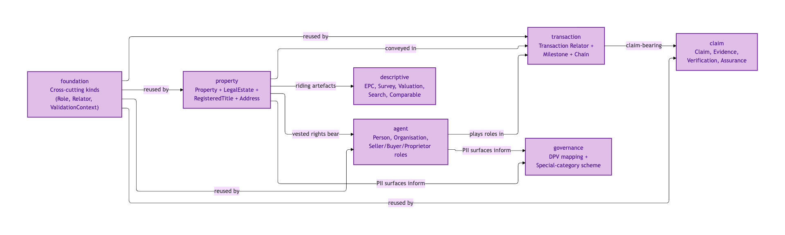
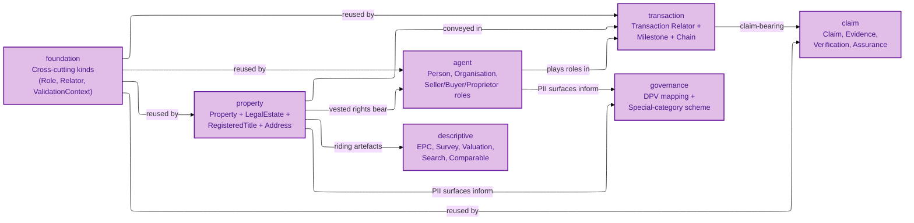
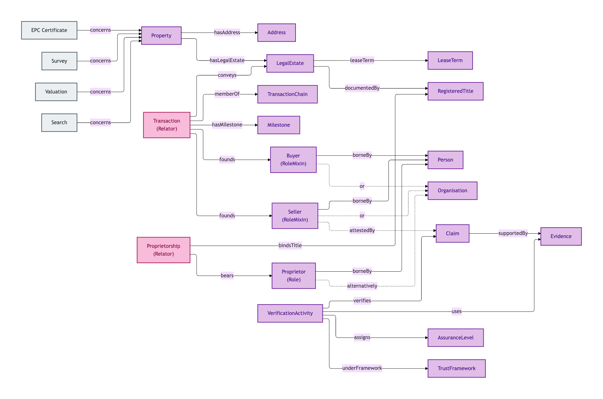
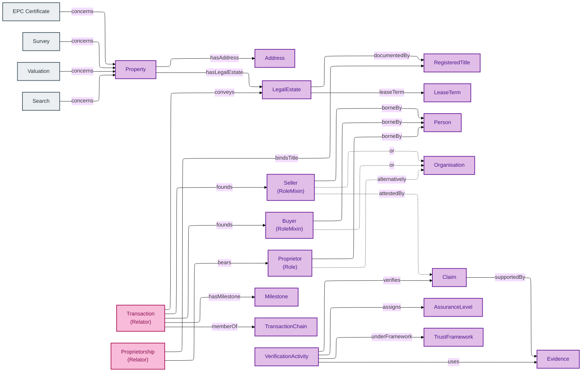

# OPDA Concept Tier

This is the **Concept-tier** view of OPDA's ontology — written for property-industry SMEs (surveyors, conveyancers, lenders, estate agents, government data leads, regulators). It explains **what each business object means** and **why it is identified the way it is**, without requiring you to read Turtle, JSON, or any other machine syntax.

If you have ever asked questions like:

- "When does a Property stop being the same Property?"
- "Is a Buyer one entity, or a different entity in every Transaction?"
- "What makes one Address record the same Address as another?"

then this tier is for you. Identity Criterion (IC) is the load-bearing concept: it is the answer to the question *"when are two records about the same thing?"* — and every entity in this tier states its IC in business language.

## See also: Modelling section

The [Bounded contexts (DDD)](/modelling/bounded-contexts) and [Business glossary](/modelling/business-glossary) pages in the Modelling section are complementary editorial registers: the bounded-contexts page explains the DDD framing and industry context map that motivates this module structure; the business-glossary page is the pre-ontology SKOS seed (54 OPDA business terms + 500 schema-derived concepts) from which this tier's entity definitions grew.

## Reading order

You can read this tier top-down (a guided tour) or jump straight to the entity you care about.

For a guided tour:

1. Start with **[foundation/](./foundation/README.md)** — the cross-cutting kinds (Role, RoleMixin, Relator, ValidationContext, DiagnosticExemplar, GeneratorRun) that the other modules reuse.
2. Read **[property/](./property/README.md)** — the physical Property, the LegalEstate vested in it, the RegisteredTitle that documents it, and the Address that locates it. This is the Identity-Criterion crux of OPDA.
3. Read **[agent/](./agent/README.md)** — Person, Organisation, Proprietor, and the transactional roles Seller / Buyer.
4. Read **[transaction/](./transaction/README.md)** — the Transaction Relator, its Milestones, and its position in a TransactionChain.
5. Read **[claim/](./claim/README.md)** — Claim, the three Evidence subtypes (Document / Electronic Record / Vouch), the VerificationActivity that produces a verified claim, and the AssuranceLevel + TrustFramework that scope its validity.
6. Read **[governance/](./governance/README.md)** — the DPV mapping records that link OPDA kinds to GDPR personal-data categories.
7. Read **[descriptive/](./descriptive/README.md)** — authority-issued artefacts (EPC Certificate, Search, Survey, Valuation, Comparable) that ride alongside a Property.

For a jump-in reader: see the [entity catalogue](#entity-catalogue) below.

## Module catalogue at a glance

The seven Concept-tier modules and their primary concerns:

Mermaid Source

## Master entity-relationship flow

How the central OPDA Kinds connect across modules — the load-bearing joins that an integrator must understand before going further:

Mermaid Source

## Entity catalogue

Complete index of OPDA Concept-tier entities. Each row links to the entity's narrative file in this tier; cross-tier traceability follows the convention `/docs/manual/concept/<module>/<entity>.md`.

### Foundation

Cross-cutting kinds reused across every module.

| Entity | Summary |
|---|---|
| [Diagnostic Exemplar](./foundation/diagnostic-exemplar.md) | Minimal worked-example data exposing one Identity-Criterion-bearing surface for Council validation |
| [Generator Run](./foundation/generator-run.md) | A single execution of the opda-gen pipeline that produced a specific set of emitted ontology files |
| [Relator](./foundation/relator.md) | A relational kind that mediates two or more parties and is founded by an external event |
| [Role](./foundation/role.md) | A role borne by a single underlying Kind (e.g. Proprietor borne by Person) |
| [Role Mixin](./foundation/role-mixin.md) | A role borne by *more than one* underlying Kind (e.g. Seller borne by Person or Organisation) |
| [Validation Context](./foundation/validation-context.md) | The named overlay profile (e.g. BASPI5) under which a record was validated |

### Property

The Identity-Criterion crux of OPDA: physical Property, the legal rights vested in it, the registry record documenting it, and the addresses locating it.

| Entity | Summary |
|---|---|
| [Address](./property/address.md) | An authority-issued locator (Royal Mail / OS / HMLR / INSPIRE) for a Property |
| [Lease Extension Event](./property/lease-extension-event.md) | A statutory lease-extension event that mutates a leasehold's term without breaking its identity |
| [Lease Term](./property/lease-term.md) | The time interval bounding a leasehold tenure |
| [Legal Estate](./property/legal-estate.md) | The bundle of legal rights vested in a Property (Freehold / Leasehold / Commonhold) |
| [Property](./property/property.md) | The physical residential property — a house, flat, bungalow, or maisonette |
| [Registered Title](./property/registered-title.md) | The HMLR title-register record documenting a Legal Estate |
| [UPRN Succession Event](./property/uprn-succession-event.md) | An administrative re-numbering of a Property's UPRN — identity persists across the event |

### Agent

People, organisations, and the roles they bear in a property transaction.

| Entity | Summary |
|---|---|
| [Buyer](./agent/buyer.md) | The role borne by the party acquiring a Property in a Transaction |
| [Name Change Event](./agent/name-change-event.md) | A reified record of a Person's name change — Person identity persists |
| [Organisation](./agent/organisation.md) | A corporate or unincorporated organisation party to a Transaction |
| [Person](./agent/person.md) | A natural person — the anchor for PII regimes |
| [Proprietor](./agent/proprietor.md) | The legal owner of a Property as named in a Registered Title |
| [Proprietorship](./agent/proprietorship.md) | The relator binding Proprietors to a Registered Title (joint tenancy or tenants in common) |
| [Seller](./agent/seller.md) | The role borne by the party disposing of a Property in a Transaction |

### Transaction

The Transaction Relator and its lifecycle structure.

| Entity | Summary |
|---|---|
| [Milestone](./transaction/milestone.md) | A point or interval in the Transaction lifecycle (instruction, offer accepted, exchange, completion, registration) |
| [Transaction](./transaction/transaction.md) | A residential-property transaction binding Sellers + Buyers + Legal Estate via a founding event |
| [Transaction Chain](./transaction/transaction-chain.md) | An aggregate of dependent Transactions linked by buyer-also-seller overlap |

### Claim

Verifiable claims, the evidence supporting them, the activity that verified them, and the trust framework + assurance level scoping their validity.

| Entity | Summary |
|---|---|
| [Assurance Level](./claim/assurance-level.md) | A quality grade on a Claim's verification (eIDAS Low / Substantial / High) |
| [Claim](./claim/claim.md) | A verifiable assertion supported by evidence |
| [Document](./claim/document.md) | A short-name alias for Document Evidence (used by worked examples) |
| [Document Evidence](./claim/document-evidence.md) | Paper or scanned artefacts issued by an authoritative source (e.g. grant of probate) |
| [Electronic Record](./claim/electronic-record.md) | A short-name alias for Electronic Record Evidence (used by worked examples) |
| [Electronic Record Evidence](./claim/electronic-record-evidence.md) | API-retrieved structured records from an authoritative source (e.g. HMRC tax-record API) |
| [Evidence](./claim/evidence.md) | The generic evidence supertype — three subtypes: Document, Electronic Record, Vouch |
| [Trust Framework](./claim/trust-framework.md) | A governance regime that scopes claim validity (e.g. the UK Property Data Trust Framework) |
| [Verification Activity](./claim/verification-activity.md) | The activity that produces a verified claim from evidence |
| [Vouch](./claim/vouch.md) | A short-name alias for Vouch Evidence (used by worked examples) |
| [Vouch Evidence](./claim/vouch-evidence.md) | A formal attestation by a regulated professional (e.g. SRA-licensed solicitor) |

### Governance

The DPV (Data Privacy Vocabulary) mapping records that link OPDA Kinds to GDPR personal-data categories.

| Entity | Summary |
|---|---|
| [DPV Mapping Record](./governance/dpv-mapping-record.md) | A mapping from an OPDA Kind to its baseline personal-data category |
| [Special Category Scheme](./governance/special-category-scheme.md) | GDPR Article 10 / DPA 2018 special-category personal-data scheme |

### Descriptive

Authority-issued artefacts that ride alongside a Property in a Transaction.

| Entity | Summary |
|---|---|
| [Comparable](./descriptive/comparable.md) | A comparable-sale or comparable-rental record supporting a Valuation |
| [EPC Certificate](./descriptive/epc-certificate.md) | A DESNZ-governed Energy Performance Certificate for a Property |
| [Search](./descriptive/search.md) | A local-authority or environmental search result (CON29R, LLC1, etc.) |
| [Survey](./descriptive/survey.md) | A professional property survey report |
| [Valuation](./descriptive/valuation.md) | A RICS-regulated professional or automated-model property valuation |

## What is *not* in this tier

- **Attribute lists, cardinalities, data types** — these live in the [Logical tier](../logical/) for engineers integrating against the model.
- **Deployment topology, named graphs, derived profiles, content negotiation** — these live in the Physical-Database tier for triplestore operators and SPARQL consumers.
- **OWL / SHACL / SKOS / Turtle syntax** — these live in the Physical-Ontology tier for ontology engineers and regulators auditing the shapes.
- **UFO / DOLCE / Substance Kind / RoleMixin terminology** — these are deliberately absent at this tier; they appear in the Logical tier where engineers need the formal grounding.

When this tier needs to point at typed detail, it links forward to the corresponding Logical-tier file with the convention `[Logical tier →]` pointing at `../../logical/<MODULE>/<ENTITY>.md` (replace `<MODULE>` / `<ENTITY>` with the actual module + entity slug).

## Provenance

This documentation is generated from the 8 emitted module TTLs at `source/03-standards/ontology/` (`foundation.ttl`, `opda-classes.ttl`, `opda-{property,agent,transaction,claim,governance,descriptive}.ttl`). Each entity's Identity Criterion and Hard Cases are lifted verbatim from `rdfs:comment` on the OWL class — the A9 per-kind discipline ([ADR-0007](/modelling/adr/adr-0007)) was designed so the emitted ontology carries this narrative material directly.

The ODR audit trail (`docs/ontology/odr/`) is **not** a source for this documentation — it is the Council deliberation record that ratified each modelling decision. ODR links in `## Source ODR` sections are *link targets only*; the ODR text itself is not re-paraphrased here.
