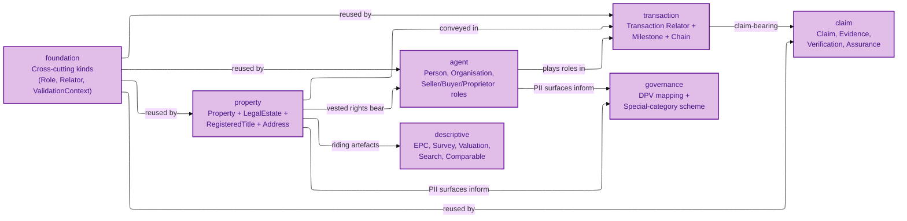
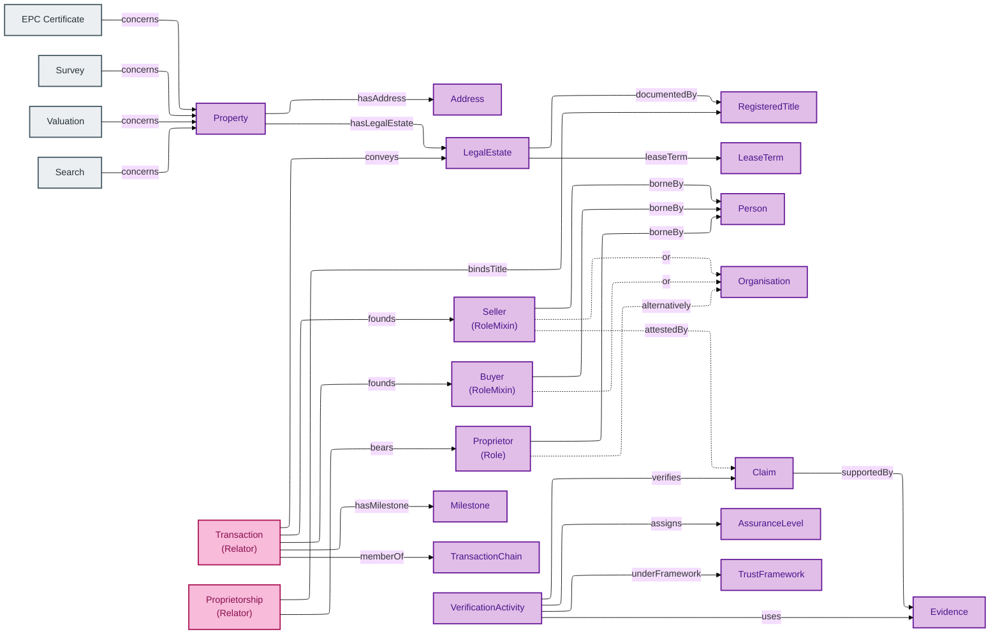

# OPDA Concept Tier

This is the **Concept-tier** view of OPDA's ontology — written for property-industry SMEs (surveyors, conveyancers, lenders, estate agents, government data leads, regulators). It explains **what each business object means** and **why it is identified the way it is**, without requiring you to read Turtle, JSON, or any other machine syntax.

If you have ever asked questions like:

- "When does a Property stop being the same Property?"
- "Is a Buyer one entity, or a different entity in every Transaction?"
- "What makes one Address record the same Address as another?"

then this tier is for you. Identity Criterion (IC) is the load-bearing concept: it is the answer to the question *"when are two records about the same thing?"* — and every entity in this tier states its IC in business language.

## Reading order

You can read this tier top-down (a guided tour) or jump straight to the entity you care about.

For a guided tour:

1. Start with **[foundation/](./foundation/README.md)** — the cross-cutting kinds (Role, RoleMixin, Relator, ValidationContext, DiagnosticExemplar, GeneratorRun) that the other modules reuse.
2. Read **[property/](./property/README.md)** — the physical Property, the LegalEstate vested in it, the RegisteredTitle that documents it, and the Address that locates it. This is the Identity-Criterion crux of OPDA.
3. Read **[agent/](./agent/README.md)** — Person, Organisation, Proprietor, and the transactional roles Seller / Buyer.
4. Read **[transaction/](./transaction/README.md)** — the Transaction Relator, its Milestones, and its position in a TransactionChain.
5. Read **[claim/](./claim/README.md)** — Claim, the three Evidence subtypes (Document / Electronic Record / Vouch), the VerificationActivity that produces a verified claim, and the AssuranceLevel + TrustFramework that scope its validity.
6. Read **[governance/](./governance/README.md)** — the DPV mapping records that link OPDA kinds to GDPR personal-data categories.
7. Read **[descriptive/](./descriptive/README.md)** — authority-issued artefacts (EPC Certificate, Search, Survey, Valuation, Comparable) that ride alongside a Property.

For a jump-in reader: see **[index.md](./index.md)** for the full entity catalogue.

## Module catalogue at a glance

The seven Concept-tier modules and their primary concerns:

Mermaid Source

## Master entity-relationship flow

How the central OPDA Kinds connect across modules — the load-bearing joins that an integrator must understand before going further:

Mermaid Source

## What is *not* in this tier

- **Attribute lists, cardinalities, data types** — these live in the [Logical tier](../logical/) for engineers integrating against the model.
- **Deployment topology, named graphs, derived profiles, content negotiation** — these live in the Physical-Database tier for triplestore operators and SPARQL consumers.
- **OWL / SHACL / SKOS / Turtle syntax** — these live in the Physical-Ontology tier for ontology engineers and regulators auditing the shapes.
- **UFO / DOLCE / Substance Kind / RoleMixin terminology** — these are deliberately absent at this tier; they appear in the Logical tier where engineers need the formal grounding.

When this tier needs to point at typed detail, it links forward to the corresponding Logical-tier file with the convention `[Logical tier →]` pointing at `../../logical/<MODULE>/<ENTITY>.md` (replace `<MODULE>` / `<ENTITY>` with the actual module + entity slug).

## Provenance

This documentation is generated from the 8 emitted module TTLs at `source/03-standards/ontology/` (`foundation.ttl`, `opda-classes.ttl`, `opda-{property,agent,transaction,claim,governance,descriptive}.ttl`). Each entity's Identity Criterion and Hard Cases are lifted verbatim from `rdfs:comment` on the OWL class — the A9 per-kind discipline ([ADR-0007](../../adr/ADR-0007-ontology-generator-specification.md)) was designed so the emitted ontology carries this narrative material directly.

The ODR audit trail (`docs/ontology/odr/`) is **not** a source for this documentation — it is the Council deliberation record that ratified each modelling decision. ODR links in `## Source ODR` sections are *link targets only*; the ODR text itself is not re-paraphrased here.
