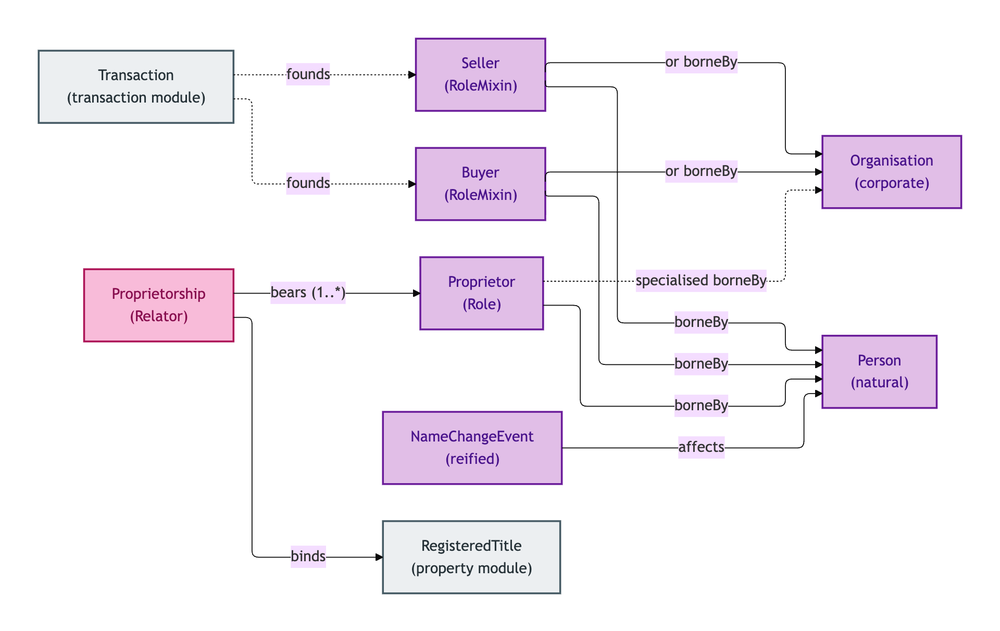
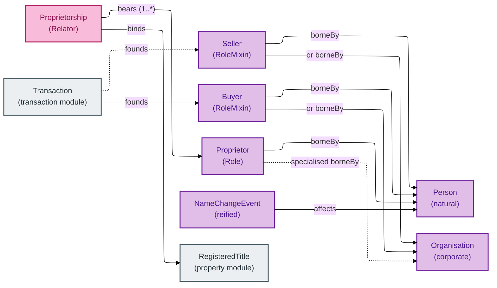
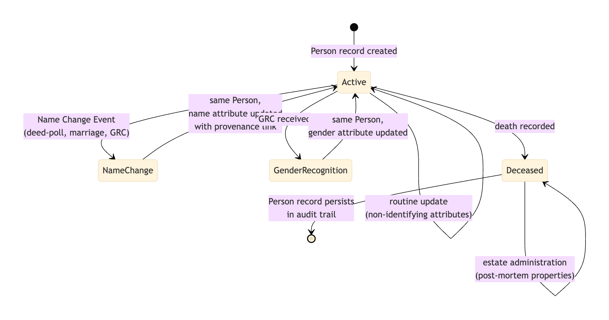

# Agent

The Agent module covers the people and organisations party to a property transaction, and the roles they bear within those transactions.

The crucial distinction is between the **party** (Person, Organisation) — whose identity persists across all the transactions and titles they appear in — and the **role** (Seller, Buyer, Proprietor) — which is anchored to a specific context (Transaction, Title) and *borrows identity from its bearer*. A Person who is Seller in one Transaction and Buyer in another is *the same Person*; the two roles are two distinct Role instances on that Person.

The module also contains **Proprietorship** — the Relator that binds Proprietors to a Registered Title — and **Name Change Event**, which lets the model track a Person's name change without forking the Person into two records.

## Entities

- [Buyer](./buyer.md) — the role borne by the party acquiring a Property in a Transaction
- [Name Change Event](./name-change-event.md) — a reified record of a Person's name change
- [Organisation](./organisation.md) — a corporate or unincorporated organisation party to a Transaction
- [Person](./person.md) — a natural person
- [Proprietor](./proprietor.md) — the legal owner of a Property as named in a Registered Title
- [Proprietorship](./proprietorship.md) — the relator binding Proprietors to a Registered Title
- [Seller](./seller.md) — the role borne by the party disposing of a Property in a Transaction

## Module-internal relationships

How the two party Kinds (Person, Organisation) bear the three transactional roles (Seller, Buyer, Proprietor) via the Proprietorship Relator and the Transaction Relator:

Mermaid Source

## Lifecycle: Person identifier succession

How a Person's identity persists across name changes and gender-recognition events without forking the record:

```mermaid
%%{init: {"theme": "base"}}%%
stateDiagram-v2
    accTitle: Person identifier succession lifecycle
    accDescr: A single Person record persists across name and gender attribute updates via reified Name Change Events; death does not erase the record, it persists as a ceased-entity with post-mortem properties.

    [*] --> Active : Person record created

    Active --> Active : routine update<br/>(non-identifying attributes)

    Active --> NameChange : Name Change Event<br/>(deed-poll, marriage, GRC)
    NameChange --> Active : same Person,<br/>name attribute updated<br/>with provenance link

    Active --> GenderRecognition : GRC received
    GenderRecognition --> Active : same Person,<br/>gender attribute updated

    Active --> Deceased : death recorded
    Deceased --> Deceased : estate administration<br/>(post-mortem properties)
    Deceased --> [*] : Person record persists<br/>in audit trail
```

Mermaid Source

