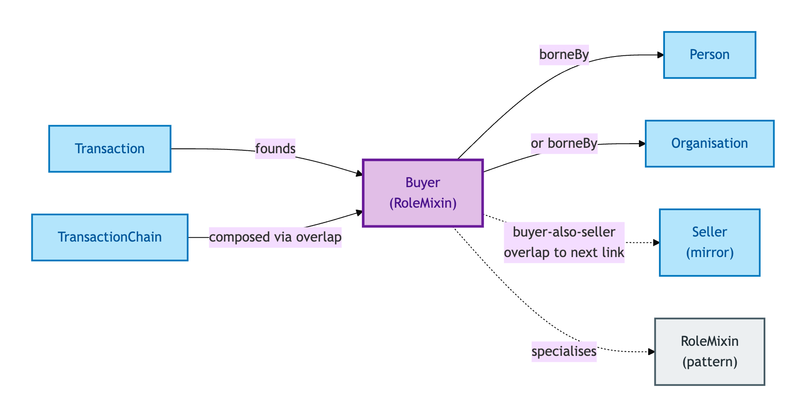
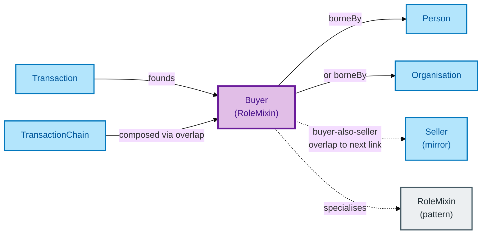

# Buyer

A Buyer is the role borne by the party acquiring a Property in a Transaction. Buyer is a Role Mixin: it can be borne by a Person *or* an Organisation, and it gets its identity from the (Transaction, bearer) pair.

## Why it matters

Buyer mirrors [Seller](./seller.md): both are Role Mixins founded by the same Transaction. In a chain of transactions, the Buyer of one link is typically the Seller of the next; the Role Mixin pattern handles both perspectives uniformly without splitting into kind-specific role classes.

If you are an integrator working with buyer-side data — affordability claims, lender-attribution, identity-verification claims — this is the entity that links those records back to the underlying Person or Organisation.

## Hard cases

- **Chain-overlap.** The Buyer in one Transaction is the Seller in the next. Two distinct Role-Mixin instances on one Person — different Transactions, different role-specific properties.
- **Joint Buyers.** Two co-purchasers acting together. Two Buyer Role-Mixin instances on the same Transaction, both founded by the same Transaction Relator.
- **A buying Organisation that doesn't exist yet.** A Special Purpose Vehicle (SPV) created for the purchase. The Organisation must exist as a record before the Buyer Role-Mixin can bind to it; the IC won't accept a Buyer with no bearer.

## Identity Criterion

A Buyer Role-Mixin instance is identified by its **(Transaction, bearer) tuple** — the Transaction context plus the Person or Organisation bearing the role. The Role Mixin NEVER supplies its own identity. See the [Logical tier →](../../logical/agent/buyer.md) for the typed structure.

## Related Kinds

- [Role Mixin](../foundation/role-mixin.md) — Buyer is the canonical OPDA Role Mixin alongside Seller
- [Seller](./seller.md) — the mirror Role Mixin in the same Transaction
- [Person](./person.md) — a typical bearer of the Buyer role
- [Organisation](./organisation.md) — the alternative bearer
- [Transaction](../transaction/transaction.md) — the Relator within which the Buyer Role Mixin is borne
- [Transaction Chain](../transaction/transaction-chain.md) — chains are built from buyer-also-seller participant overlap

### Related-Kinds graph

Mermaid Source

## Source ODR

[ODR-0006 — Agents and roles §Q2](../../../ontology/odr/ODR-0006-agents-and-roles.md)
