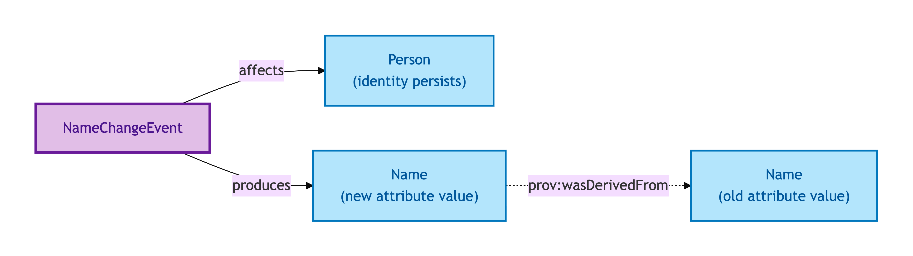
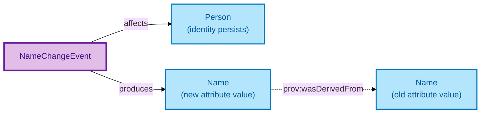

# Name Change Event

A Name Change Event is the reified record of a Person's name change — by deed-poll, by marriage, by gender recognition, or by other lawful means.

## Why it matters

A name change is a *change of attribute on the same individual* — it is **not** the creation of a new Person. A model that creates two Person records (one per name) breaks every downstream identity chain (mortgages, charges, rights) that depends on Person persistence. OPDA explicitly forbids that pattern: per ODR-0006 §Q1, one Person persists through a name change, with a provenance chain on the name attribute via a Name Change Event.

If you are an integrator who has ever conflated "different name" with "different person", this is the entity that records the change without forking the record.

## Hard cases

- **Marriage / civil partnership name change.** A spouse takes a new surname. One Person, one Name Change Event, one provenance link from the new name to the old.
- **Gender recognition.** A Gender Recognition Certificate updates both name and gender. The Name Change Event handles the name; the gender change is handled by a separate attribute-change record per the same pattern.
- **Owl:sameAs anti-pattern.** A naive model declares `owl:sameAs` between the old-name Person and the new-name Person. This is explicitly forbidden — it propagates every context's properties onto every other under inference (per ODR-0006 Anti-pattern). The Name Change Event is the correct pattern.

## Identity Criterion

Two records refer to the same Name Change Event if they describe the same **administrative change activity** on the same Person — same change-instrument (deed-poll, marriage record, GRC), same effective date. See the [Logical tier →](../../logical/agent/name-change-event.md) for the typed structure.

## Related Kinds

- [Person](./person.md) — Name Change Events affect a Person's name without breaking Person identity

### Related-Kinds graph

Mermaid Source

## Source ODR

[ODR-0006 — Agents and roles §Q1](/modelling/odr/odr-0006)
