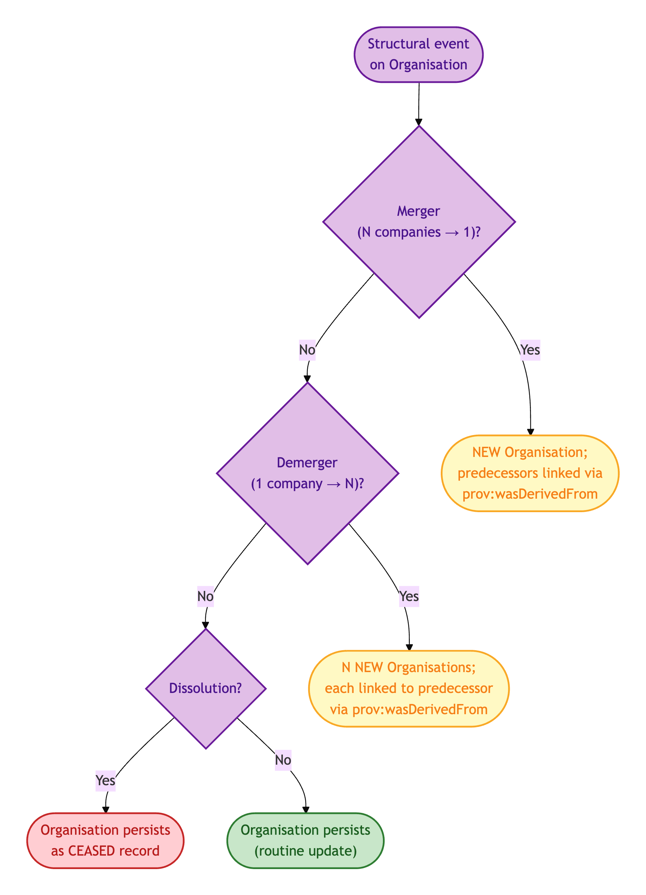
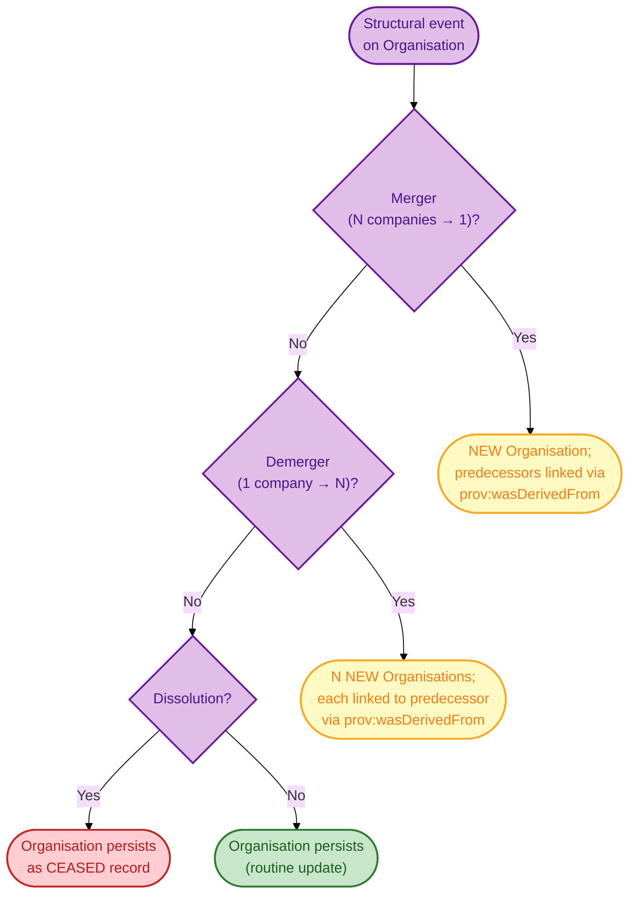
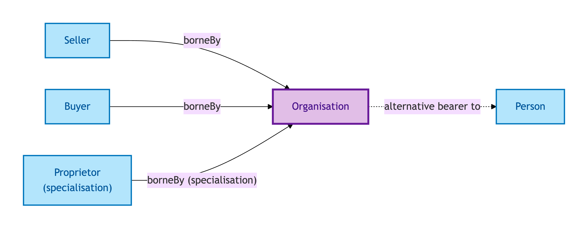
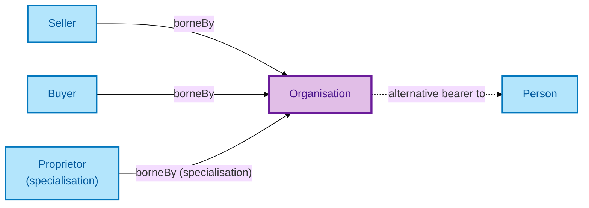

# Organisation

An Organisation is a corporate or unincorporated body party to a property transaction — a limited company, an LLP, a charity, a trust, a public body. Organisations can be Sellers, Buyers, Proprietors, and Conveyancers.

## Why it matters

A non-trivial share of UK residential transactions involves an Organisation on at least one side — buy-to-let landlords as limited companies, housing associations, family trusts, executors of estates, charities receiving bequests. The model must treat an Organisation as a first-class party (with its own multi-identifier IC) and let the same transactional roles (Seller / Buyer / Proprietor) be borne by either kind of party. This is why those roles are Role Mixins (cross-Kind), not plain Roles.

If you are an integrator implementing AML/KYC for corporate parties, this is the entity whose IC governs your dedup.

## Hard cases

- **Merger.** Two companies merge into one. Per Kendall's S005 Q4 framing, the merger produces a *new* Organisation individual with a `prov:wasDerivedFrom` chain to the predecessors — not a continuation of either predecessor.
- **Demerger.** One company demerges into two. Two new Organisations, each with a derivation chain to the predecessor.
- **Dissolution.** An Organisation dissolves. The record persists as a ceased-entity record; it does not vanish from the audit trail.
- **Multi-jurisdiction identifiers.** One Organisation carries a UK Companies House Registration Number (CRN), a Legal Entity Identifier (LEI), and potentially other jurisdiction-issued IDs. The IC accommodates multiple identifiers for one Kind — FIBO LegalEntity pattern.

## Identity Criterion

Two records refer to the same Organisation if they describe the same legal entity via **a FIBO LegalEntity-style multi-identifier match** (CRN, LEI, jurisdiction-specific IDs). A merger or demerger produces a *new* Organisation linked via provenance chain — never collapsed onto either predecessor. See the [Logical tier →](../../logical/agent/organisation.md) for the typed structure.

### IC walk-through: merger / demerger / dissolution

Per S005 Q4, neither merger nor demerger continues an existing Organisation — both produce *new* Organisations linked by provenance:

Mermaid Source

## Related Kinds

- [Person](./person.md) — the other party Kind that can bear transactional roles
- [Proprietor](./proprietor.md) — the Role an Organisation can bear (under a named specialisation) when registered as owner
- [Seller](./seller.md) — the Role Mixin an Organisation can bear when disposing of a Property
- [Buyer](./buyer.md) — the Role Mixin an Organisation can bear when acquiring a Property

### Related-Kinds graph

Mermaid Source

## Source ODR

[ODR-0006 — Agents and roles §Q6](/modelling/odr/odr-0006)
