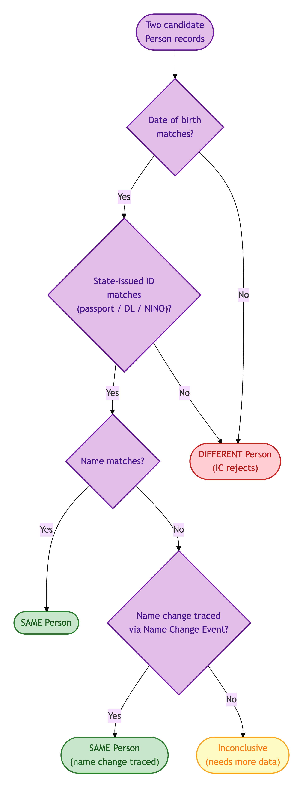
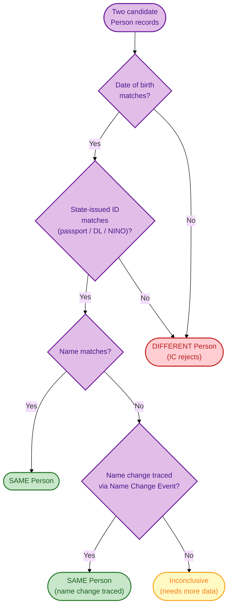
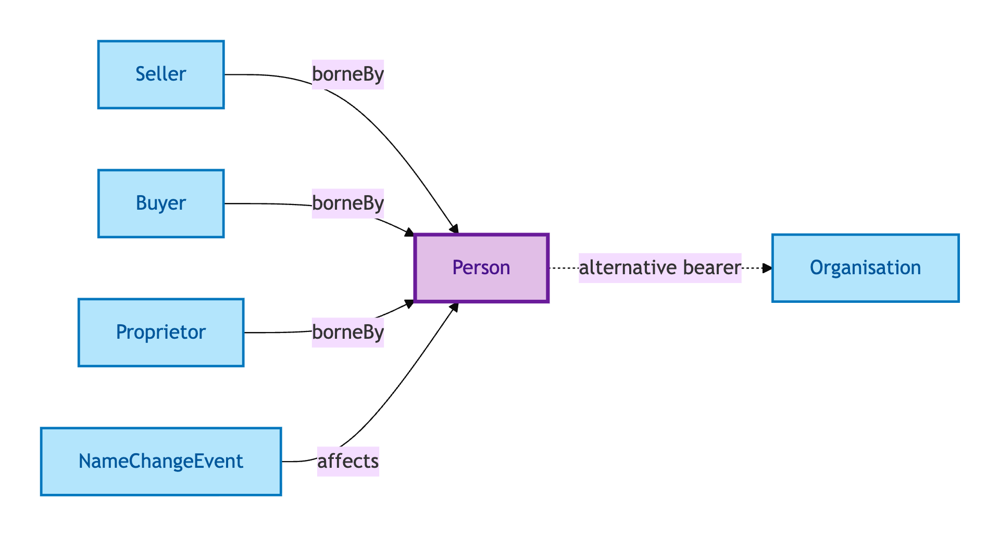
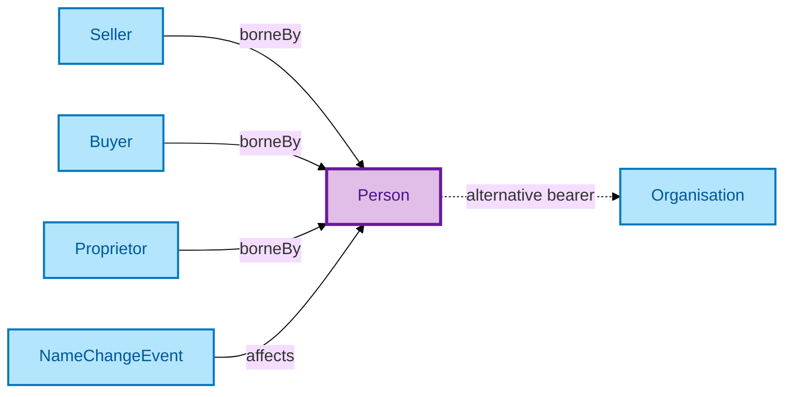

# Person

A Person is a natural person — an individual human being. Person is the anchor for PII (Personally Identifiable Information) regimes in OPDA: it is where GDPR Article 5–10 lawful-basis discipline lands.

## Why it matters

Person identity must persist across every transaction, every title, every role the individual appears in. A naive design that creates a new Person record whenever the data feed changes (a renamed Person; a Person who appears under a slightly different state-issued ID; a Person who has died and whose estate is being administered) shatters the audit trail. OPDA explicitly uses a **multi-identifier persistence** approach — drawn from FIBO — so a single Person can be carried through name changes, register-of-electors updates, and gender-recognition events without forking.

If you are a data protection officer, an integrator implementing AML/KYC, or a conveyancer reconciling identity across documents, this is the entity whose IC matters most.

## Hard cases

- **Name change.** A Person changes their name (deed-poll, marriage, gender recognition). The Person identity *persists*; the name change is a reified [Name Change Event](./name-change-event.md), not a new Person record.
- **Gender recognition.** A Gender Recognition Certificate updates the Person's recorded gender. Same individual, with a provenance-tracked attribute change.
- **Death.** The Person ceases as a living individual but persists as a record-entity bearing post-mortem properties (estate administration, probate). The IC does not erase the Person at death.

## Identity Criterion

Two records refer to the same Person if they describe the same individual via **a FIBO-style multi-identifier match** — date of birth, state-issued ID (passport, driving licence, NI number), and name (with name changes traced via reified Events). The IC is deliberately tolerant of single-identifier mismatches (a name change on its own does not break the match) but intolerant of date-of-birth + state-ID mismatch. See the [Logical tier →](../../logical/agent/person.md) for the typed structure.

### IC walk-through: multi-identifier match

How the IC tolerates single-identifier mismatches while still rejecting incompatible records:

Mermaid Source

## Related Kinds

- [Organisation](./organisation.md) — the other party Kind that can bear transactional roles
- [Proprietor](./proprietor.md) — the Role a Person bears when registered as legal owner of a Property
- [Seller](./seller.md) — the Role Mixin a Person (or Organisation) bears when disposing of a Property
- [Buyer](./buyer.md) — the Role Mixin a Person (or Organisation) bears when acquiring a Property
- [Name Change Event](./name-change-event.md) — records a Person's name change

### Related-Kinds graph

Mermaid Source

## Source ODR

[ODR-0006 — Agents and roles §Q1](../../../ontology/odr/ODR-0006-agents-and-roles.md)
