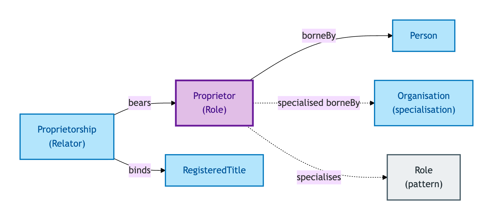
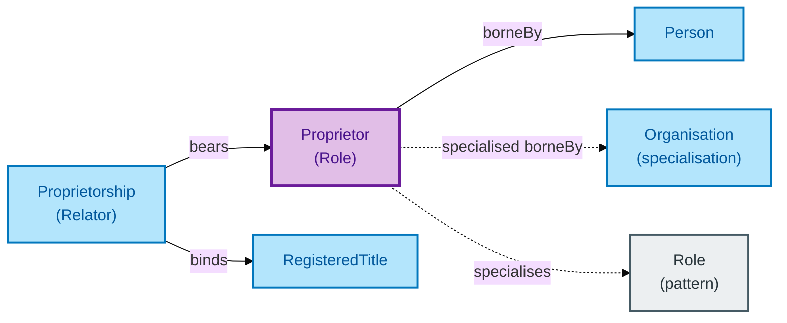

# Proprietor

A Proprietor is the **legal owner** of a Property as named in a Registered Title. Proprietor is a Role: it is borne by a Person (or, under a named specialisation, by an Organisation) and gets its identity from that bearer.

## Why it matters

Proprietorship is the registry's authoritative record of legal ownership — it is the *who owns this* answer to which mortgages, charges, and rights attach. OPDA models Proprietor as a Role (not a separate party Kind) precisely because the Proprietor is not a *different individual* from the Person they are — the Person *plays the role of* Proprietor on a specific Title.

If you are a conveyancer or registrar working with proprietorship records, this is the entity that lets you attach role-specific properties (capacity, evidenced authority, ownership-share metadata) without forking the underlying Person record.

## Hard cases

- **A Person who is Proprietor on two Titles.** Two Proprietor Role instances on one Person — different Titles, different role-specific properties.
- **Two Proprietors on one Title.** Two Proprietor Role instances bound to the same Title via a single Proprietorship Relator. The joint-vs-tenants-in-common discriminator lives on the Proprietorship, not on the Proprietors.
- **Proprietor keyed in error.** A downstream system invents `proprietor_id` independent of the Person. The IC says: this is wrong. A Proprietor has no identity *qua* Proprietor; identity is the Person's.

## Identity Criterion

A Proprietor Role-instance is identified by its **(Proprietorship, bearer) tuple** — the Proprietorship binding plus the Person (or Organisation) bearing the role. The Role NEVER supplies its own identity. See the [Logical tier →](../../logical/agent/proprietor.md) for the typed structure.

## Related Kinds

- [Role](../foundation/role.md) — Proprietor is the canonical OPDA Role
- [Person](./person.md) — the typical bearer of a Proprietor role
- [Organisation](./organisation.md) — the alternative bearer (under a named specialisation)
- [Proprietorship](./proprietorship.md) — the Relator binding Proprietors to a Registered Title
- [Registered Title](../property/registered-title.md) — the registry-side context for a Proprietorship

### Related-Kinds graph

Mermaid Source

## Source ODR

[ODR-0006 — Agents and roles §Q2](/modelling/odr/odr-0006)
