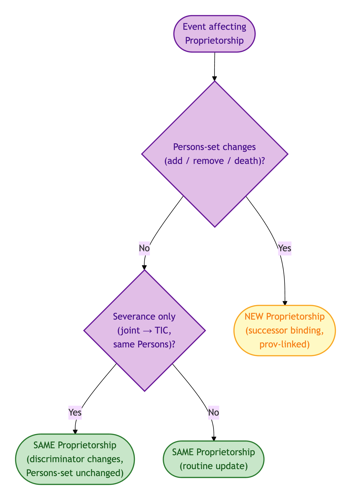
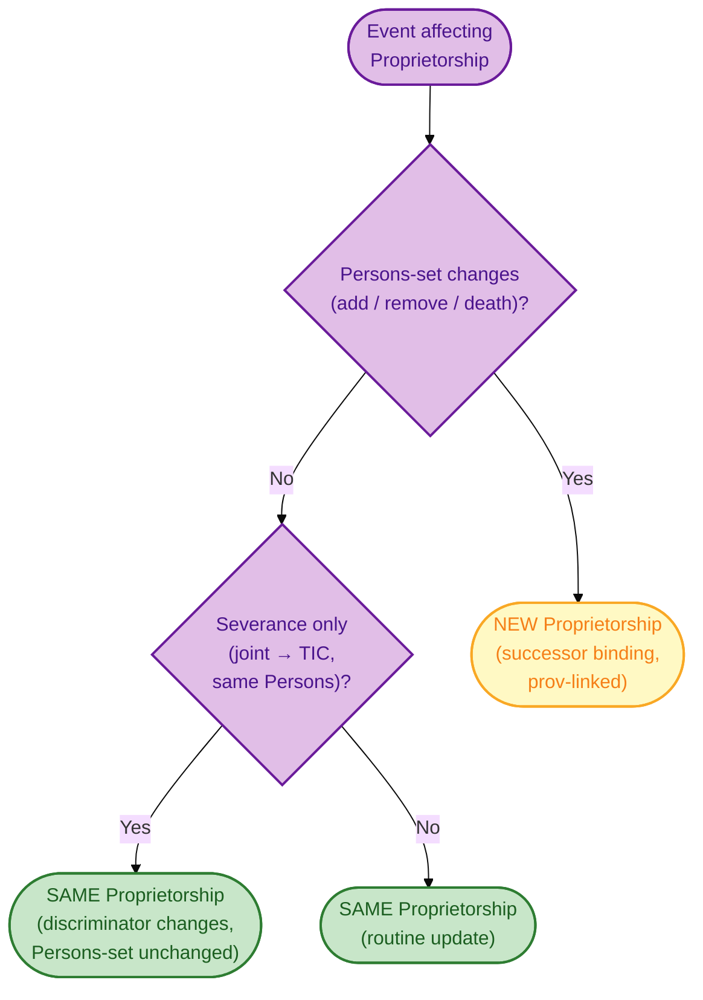
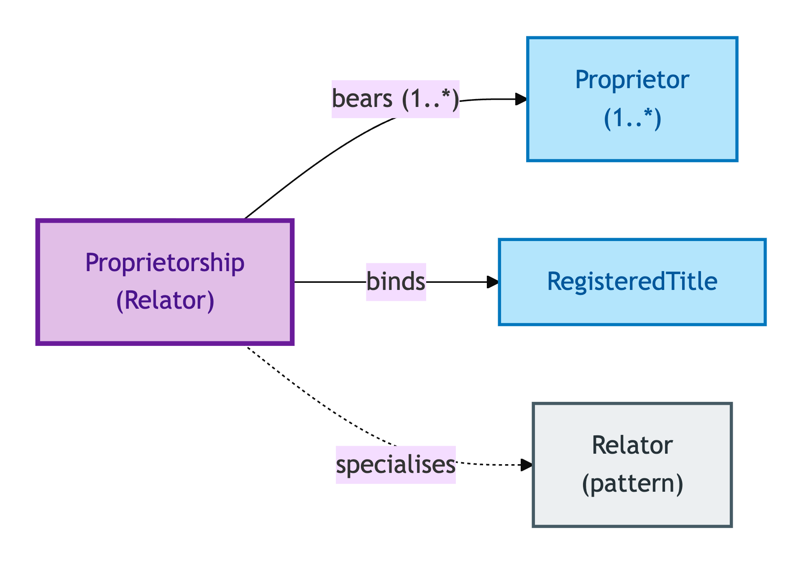
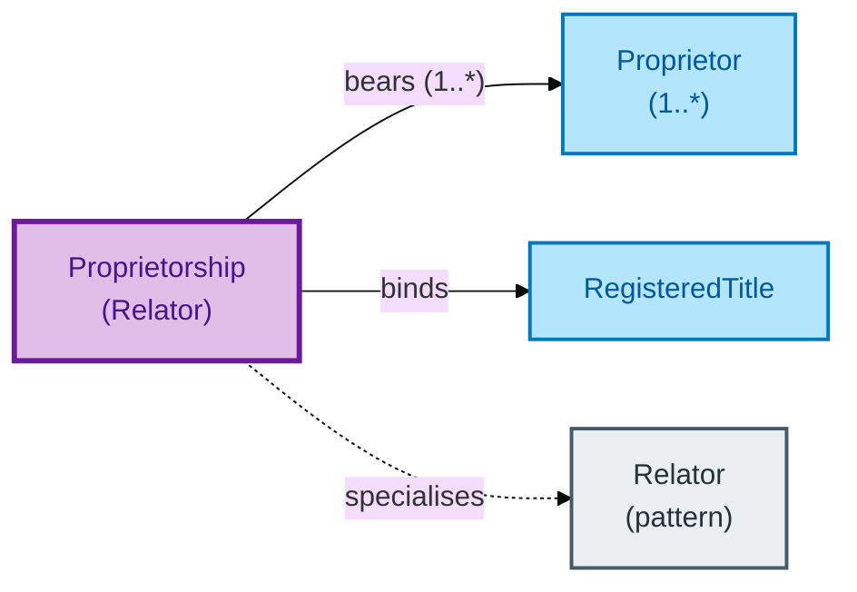

# Proprietorship

A Proprietorship is the **binding** that links one or more Proprietors to a Registered Title. It is a Relator: it carries its own properties (joint tenancy vs tenants in common; ownership shares; registration date) that don't belong to any single Proprietor.

## Why it matters

The joint-vs-tenants-in-common question is a property *of the binding*, not of any individual Proprietor. Two co-owners of a Property might be joint tenants today and tenants in common tomorrow (severance changes the binding, not the owners). OPDA puts that discriminator on the Proprietorship Relator precisely so it can be modified, queried, and validated without rewriting either Proprietor's record.

If you are a conveyancer working with joint ownership or HMLR Practice Guide 24 distinctions, this is the entity whose IC matters.

## Hard cases

- **Severance of joint tenancy.** The owners stay the same; the binding type changes from joint tenancy to tenants in common. The Proprietorship's IC accommodates the change without forking either Proprietor or the Title.
- **Addition of a Proprietor.** A second owner is added to the Title. The Proprietorship's IC tracks the (Title, Persons-set) — the set has changed, so this is a *new* Proprietorship binding (with provenance to the predecessor), not a mutation of the existing one.
- **Death of a joint tenant.** Joint tenancy passes by survivorship to the remaining tenant(s). The Proprietorship's IC reflects the new (Title, Persons-set); a Proprietorship with a single remaining tenant is a successor binding.

## Identity Criterion

Two records refer to the same Proprietorship if they describe the same **(Title, Persons-set) tuple** at the same point in the registry record's lineage. A change in the set of Persons — addition, removal, death — produces a successor Proprietorship, linked by a provenance chain to its predecessor. See the [Logical tier →](../../logical/agent/proprietorship.md) for the typed structure.

### IC walk-through: severance vs Persons-set change

The discriminator (joint tenancy vs tenants in common) is a property of the binding, not of any Proprietor; a Persons-set change produces a successor binding:

Mermaid Source

## Related Kinds

- [Relator](../foundation/relator.md) — Proprietorship is the canonical OPDA Relator (alongside Transaction)
- [Proprietor](./proprietor.md) — the Roles bound by a Proprietorship
- [Registered Title](../property/registered-title.md) — the registry-side context

### Related-Kinds graph

Mermaid Source

## Source ODR

[ODR-0006 — Agents and roles §Q3](../../../ontology/odr/ODR-0006-agents-and-roles.md)
