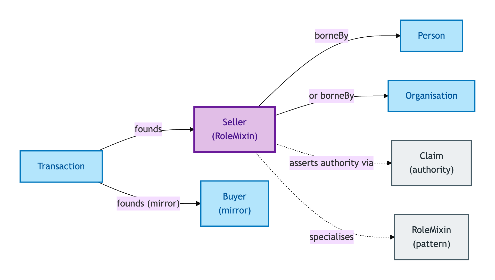
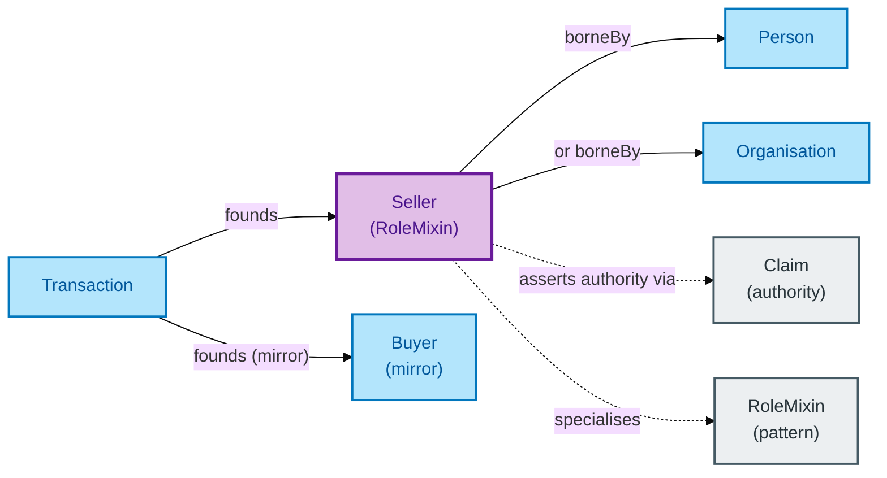

# Seller

A Seller is the role borne by the party disposing of a Property in a Transaction. Seller is a Role Mixin: it can be borne by a Person *or* an Organisation, and it gets its identity from the (Transaction, bearer) pair.

## Why it matters

Sellers in residential property are routinely individuals, but also frequently corporate landlords, executors, trustees, or housing associations. OPDA models Seller as a Role Mixin so one role-concept covers all the legitimate bearers without forcing a single party Kind, and so the role-specific properties (asserted capacity, evidenced authority) can attach uniformly regardless of bearer.

If you are an integrator working with seller-side data — capacity statements, conveyancer attribution, evidence chains — this is the entity whose IC governs how those records link back to the underlying Person or Organisation.

## Hard cases

- **A Person who is Seller in two Transactions.** Two Seller Role-instances on one Person — different Transactions, different role-specific properties. The Person identity persists.
- **An Organisation as Seller.** A limited company disposing of a buy-to-let unit. The Seller Role Mixin is borne by the Organisation; downstream role-specific fields (capacity, evidenced authority) work identically.
- **Mixed-bearer chain.** A transaction chain where one link's Seller is a Person and the next link's Seller is an Organisation. The Role Mixin handles the variation without splitting into `PersonSeller` and `OrganisationSeller`.
- **The Seller of one Transaction is the Buyer of the next.** In a chain, this is the *typical* case: each link's Buyer becomes the next link's Seller. Two distinct Role Mixin instances on one Person — different Transactions.

## Identity Criterion

A Seller Role-Mixin instance is identified by its **(Transaction, bearer) tuple** — the Transaction context plus the Person or Organisation bearing the role. The Role Mixin NEVER supplies its own identity. See the [Logical tier →](../../logical/agent/seller.md) for the typed structure.

## Related Kinds

- [Role Mixin](../foundation/role-mixin.md) — Seller is the canonical OPDA Role Mixin alongside Buyer
- [Buyer](./buyer.md) — the mirror Role Mixin in the same Transaction
- [Person](./person.md) — a typical bearer of the Seller role
- [Organisation](./organisation.md) — the alternative bearer
- [Transaction](../transaction/transaction.md) — the Relator within which the Seller Role Mixin is borne
- [Claim](../claim/claim.md) — a Seller's evidenced authority links to a Claim of authority (e.g. probate, power of attorney)

### Related-Kinds graph

Mermaid Source

## Source ODR

[ODR-0006 — Agents and roles §Q2](../../../ontology/odr/ODR-0006-agents-and-roles.md)
