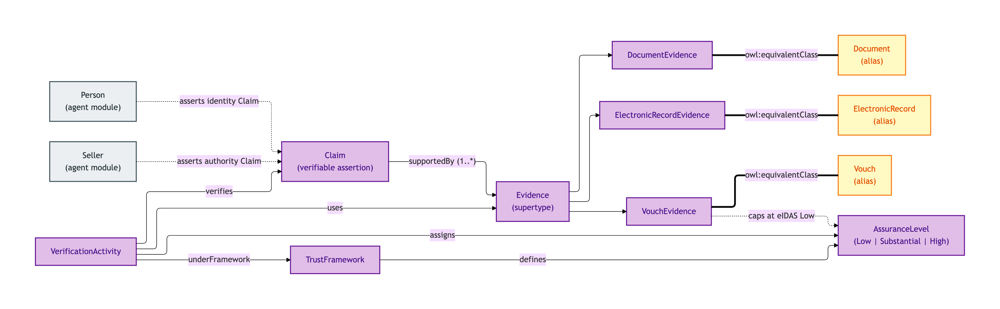
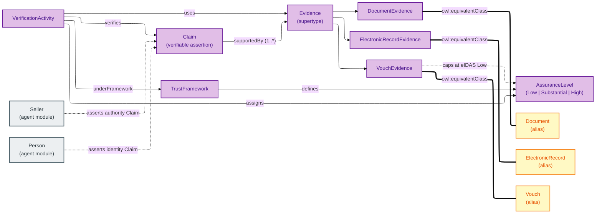
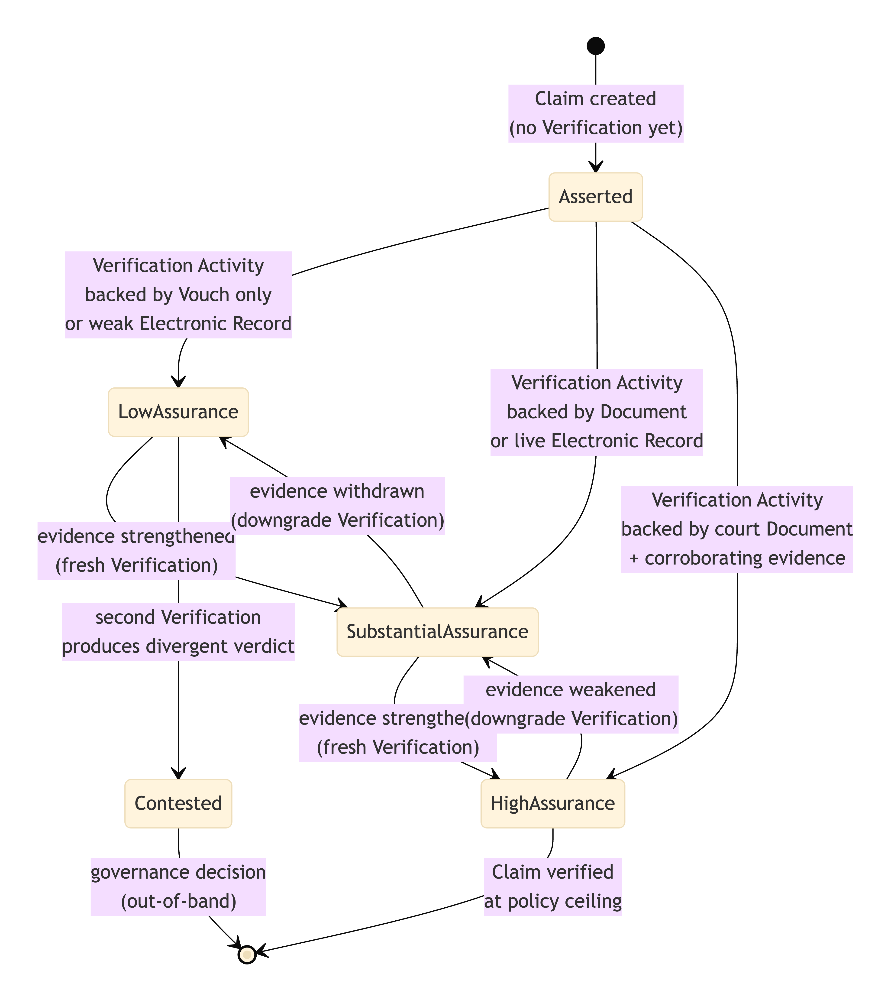

# Claim

The Claim module covers verifiable assertions about a Property, a Transaction, or any party in them — and the evidence, verification, and trust framework that scope each Claim's validity.

The core triangle is **Claim → Evidence → Verification Activity**, with each Verification carrying an Assurance Level (eIDAS Low / Substantial / High) and citing the Trust Framework under which it was performed.

Evidence comes in three subtypes that are deliberately *not* collapsed:

- **Document Evidence** — paper or scanned artefacts issued by an authoritative source (e.g. grant of probate);
- **Electronic Record Evidence** — API-retrieved structured records from an authoritative source (e.g. HMRC tax-record API);
- **Vouch Evidence** — formal attestations by a regulated professional (e.g. SRA-licensed solicitor).

The three short-name aliases (Document, Electronic Record, Vouch) exist for ergonomic compatibility with worked-example data; they are equivalent to the long-name forms.

## Entities

- [Claim](./claim.md) — a verifiable assertion supported by evidence
- [Document](./document.md) — short-name alias for Document Evidence
- [Document Evidence](./document-evidence.md) — paper or scanned authoritative artefact
- [Electronic Record](./electronic-record.md) — short-name alias for Electronic Record Evidence
- [Electronic Record Evidence](./electronic-record-evidence.md) — API-retrieved authoritative record
- [Evidence](./evidence.md) — the generic evidence supertype
- [Trust Framework](./trust-framework.md) — governance regime that scopes claim validity
- [Verification Activity](./verification-activity.md) — the activity that produces a verified claim
- [Vouch](./vouch.md) — short-name alias for Vouch Evidence
- [Vouch Evidence](./vouch-evidence.md) — formal attestation by a regulated professional

## Module-internal relationships

The Claim → Evidence → Verification triangle, the three Evidence subtypes (with their short-name aliases), and the Trust Framework + Assurance Level scoping:

Mermaid Source

## Lifecycle: Claim verification chain (assurance levels)

How a Claim is promoted (or downgraded) through the eIDAS assurance tiers depending on the Evidence chain backing it:

```mermaid
%%{init: {"theme": "base"}}%%
stateDiagram-v2
    accTitle: Claim verification chain lifecycle
    accDescr: A Claim starts as an unverified assertion, is promoted via Verification Activity to Low, Substantial, or High assurance depending on its Evidence chain; Vouch-only Evidence caps at Low; downgrade is possible if Evidence is withdrawn.

    [*] --> Asserted : Claim created<br/>(no Verification yet)

    Asserted --> LowAssurance : Verification Activity<br/>backed by Vouch only<br/>or weak Electronic Record
    Asserted --> SubstantialAssurance : Verification Activity<br/>backed by Document<br/>or live Electronic Record
    Asserted --> HighAssurance : Verification Activity<br/>backed by court Document<br/>+ corroborating evidence

    LowAssurance --> SubstantialAssurance : evidence strengthened<br/>(fresh Verification)
    SubstantialAssurance --> HighAssurance : evidence strengthened<br/>(fresh Verification)

    HighAssurance --> SubstantialAssurance : evidence weakened<br/>(downgrade Verification)
    SubstantialAssurance --> LowAssurance : evidence withdrawn<br/>(downgrade Verification)
    LowAssurance --> Contested : second Verification<br/>produces divergent verdict

    Contested --> [*] : governance decision<br/>(out-of-band)
    HighAssurance --> [*] : Claim verified<br/>at policy ceiling
```

Mermaid Source

