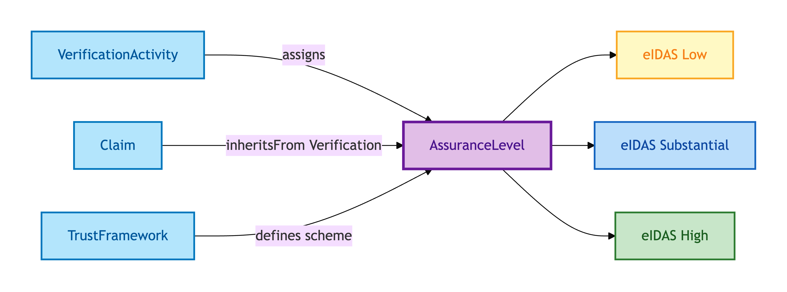
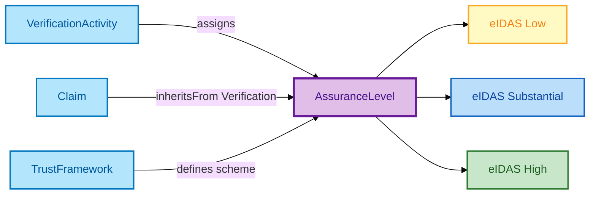

# Assurance Level

An Assurance Level is the **quality grade** on a Claim's verification — Low, Substantial, or High, per the eIDAS framework adopted by OPDA.

## Why it matters

Not all verifications are equal. A self-asserted Claim has lower assurance than a Vouch; a Vouch has lower assurance than an Electronic Record retrieved live from HMRC; an Electronic Record has lower assurance than a court-issued Document. The Assurance Level surfaces that hierarchy in a controlled vocabulary so downstream consumers can apply policy ("require Substantial for AML purposes") without reinventing the grading.

If you are a lender, AML officer, or compliance auditor with a minimum-assurance policy, this is the entity that your policy references.

## Hard cases

- **Vouch ceiling.** Vouch Evidence caps at Low regardless of voucher quality. The Assurance Level cannot exceed the cap even if the Verification Activity is otherwise impeccable.
- **Downgrade on evidence-chain weakening.** A Claim's strongest Evidence is withdrawn (e.g. probate revoked); only weaker Evidence remains. A fresh Verification Activity produces a lower Assurance Level; the previous higher Level persists in the audit trail.
- **Combined evidence promotion.** A Vouch + an Electronic Record together may justify Substantial where either alone would not. The promotion is governed by the Trust Framework's combination rules.

## Identity Criterion

Each Assurance Level is identified by its **scheme member URI** — e.g. `eidas:Low`, `eidas:Substantial`, `eidas:High`. The values are a closed enumeration. See the [Logical tier →](../../logical/claim/assurance-level.md) for the typed structure and the enumeration scheme.

## Related Kinds

- [Verification Activity](./verification-activity.md) — assigns an Assurance Level to a verified Claim
- [Claim](./claim.md) — inherits its Assurance Level from the Verification Activity that produced its verified form
- [Trust Framework](./trust-framework.md) — defines the assurance-level scheme

### Related-Kinds graph

Mermaid Source

## Source ODR

[ODR-0009 — Claims, evidence, provenance §Q3](../../../ontology/odr/ODR-0009-claims-evidence-provenance.md)
