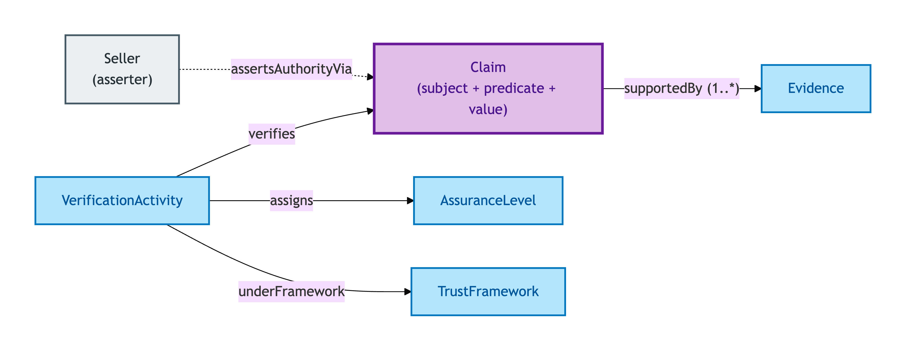
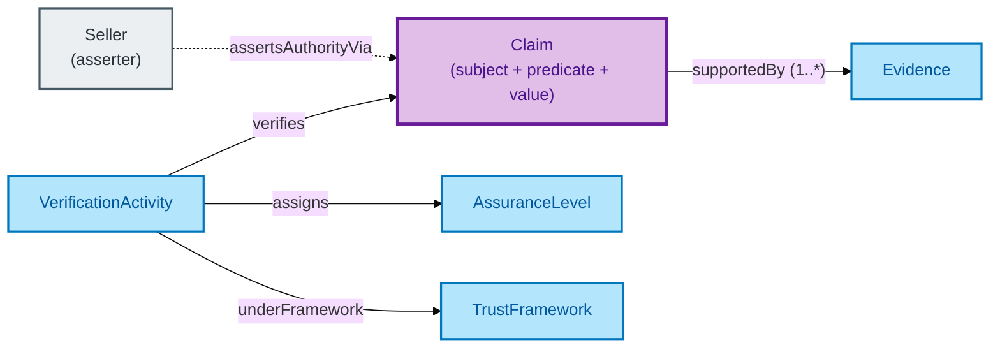

# Claim

A Claim is a **verifiable assertion** — about a Property, about a Transaction, about a party — supported by evidence and given a trust grade through a Verification Activity.

## Why it matters

Property transactions are claim-heavy: a Seller claims authority to sell; a Buyer claims affordability; a Lender claims compliance with AML rules. Every such assertion needs to carry its evidence and its verification trail so a downstream party (or a regulator) can ask "what was claimed, on what evidence, verified by whom, at what assurance level?".

If you are a conveyancer, a lender's compliance officer, or a regulator auditing a transaction's evidentiary trail, this is the entity you read.

## Hard cases

- **Contested assertion.** Multiple Verification Activities produce divergent verdicts on the same Claim (one says verified, another says not). The IC accommodates both as evidence facts — the resolution is a downstream governance decision, not a modelling collapse.
- **Multi-method verification.** A single Claim is verified by both an Electronic Record (HMRC API) and a Vouch (SRA-licensed solicitor's attestation). The two evidences coexist; the Verification Activity records both methods.
- **Assurance-level downgrade.** A Claim's evidence chain weakens (e.g. the original Document is withdrawn, only a Vouch remains). The Assurance Level on the current Verification drops to eIDAS Low; the previous higher-assurance Verification persists in the chain for audit.

## Identity Criterion

A Claim is identified by its **subject + predicate + value** triple within a defined Trust Framework context — what is claimed, about what, by what mechanism, under what governance regime. Two records refer to the same Claim only if all three coincide *and* sit in the same Trust Framework. See the [Logical tier →](../../logical/claim/claim.md) for the typed structure (provenance derivation chain, digest, evidence join).

## Related Kinds

- [Evidence](./evidence.md) — Claims are supported by Evidence
- [Verification Activity](./verification-activity.md) — produces a verified Claim from Evidence
- [Assurance Level](./assurance-level.md) — quality grade on the Verification
- [Trust Framework](./trust-framework.md) — governance regime scoping the Claim's validity
- [Seller](../agent/seller.md) — a Seller's evidenced authority links to a Claim of authority

### Related-Kinds graph

Mermaid Source

## Source ODR

[ODR-0009 — Claims, evidence, provenance §Q1](../../../ontology/odr/ODR-0009-claims-evidence-provenance.md)
