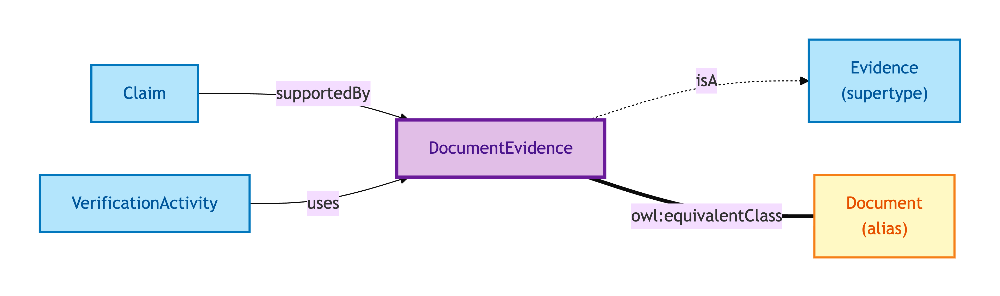
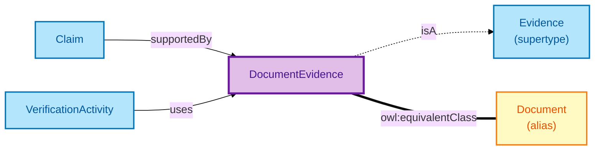

# Document Evidence

A Document Evidence is a paper or scanned artefact issued by an authoritative source — for example, a grant of probate issued by HM Courts and Tribunals Service.

## Why it matters

Document Evidence is the workhorse of conveyancing: probate grants, lasting powers of attorney, statutory declarations, court orders. Court-issued documents earn an eIDAS Substantial assurance tier when properly verified. OPDA models Document Evidence as a distinct Evidence subtype so its issuance chain, document-id, and original-vs-copy status are first-class — not flattened into a generic "evidence blob".

If you are a conveyancer or compliance officer working with paper evidence (or scans of paper), this is the entity that captures the issuance trail.

## Hard cases

- **Scanned copy vs original.** A scan of a paper Document is still Document Evidence — the IC discriminates by *issuance authority*, not by physical vs digital form.
- **Document revoked post-issuance.** Probate is granted then revoked. The Document Evidence record persists with a revocation annotation; any Verification Activity that relied on it inherits the status change.
- **Document with no authoritative source.** A self-prepared declaration with no court or registrar issuance. The IC says: this is not Document Evidence — it is at best Vouch Evidence (attestation by the declaring party).

## Identity Criterion

A Document Evidence record is identified by its **(issuing authority, document-id)** pair — for example, (HMCTS, probate-grant-reference). Two records refer to the same Document only if both components match. See the [Logical tier →](../../logical/claim/document-evidence.md) for the typed structure.

## Related Kinds

- [Evidence](./evidence.md) — Document Evidence is one of three Evidence subtypes
- [Document](./document.md) — short-name alias used by worked examples (same OWL identity)
- [Claim](./claim.md) — Claims supported by Document Evidence
- [Verification Activity](./verification-activity.md) — verifies a Claim using Document Evidence

### Related-Kinds graph

Mermaid Source

## Source ODR

[ODR-0009 — Claims, evidence, provenance §Q1](../../../ontology/odr/ODR-0009-claims-evidence-provenance.md)
