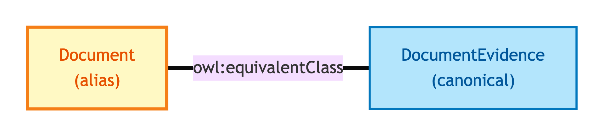
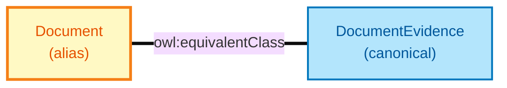

# Document

Document is the **short-name alias** for [Document Evidence](./document-evidence.md). The two names refer to the same OWL identity — Document exists so worked-example data (the diagnostic exemplar set) can use the short form without losing alignment with the long-name canonical form that downstream shapes and annotations target.

## Why it matters

OPDA's exemplar set uses short names (Document, Electronic Record, Vouch) for compactness; OPDA's SHACL shapes and DPV annotations target the long names (Document Evidence, Electronic Record Evidence, Vouch Evidence). The aliases let both styles coexist without forking the model. If you read an exemplar and see `:Document`, treat it as identical to `:DocumentEvidence`.

If you are reading worked-example data, this is what you see; if you are reading shapes or annotations, you see Document Evidence. They are the same thing.

## Hard cases

- **Mixed use within one consumer.** A consumer that processes both exemplars (short names) and shapes (long names). The OWL equivalence binding lets both surface in the same query without conflict.
- **Future rename.** Were the model ever to retire the short name, the alias binding would be removed and exemplars updated to the long name. The IC is the same throughout.

## Identity Criterion

See [Document Evidence](./document-evidence.md) — Document inherits the same IC by OWL equivalence binding. See the [Logical tier →](../../logical/claim/document.md) for the typed structure.

## Related Kinds

- [Document Evidence](./document-evidence.md) — the canonical long-name form

### Related-Kinds graph

Mermaid Source

## Source ODR

[ODR-0009 — Claims, evidence, provenance §Q1](../../../ontology/odr/ODR-0009-claims-evidence-provenance.md)
