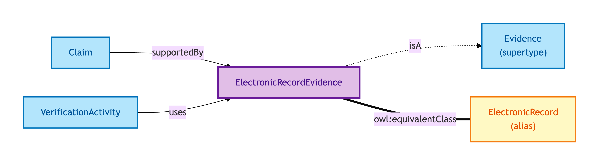
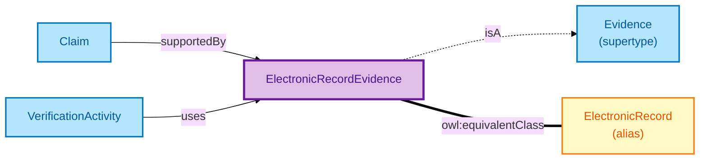

# Electronic Record Evidence

An Electronic Record Evidence is a structured record retrieved by API from an authoritative source — for example, a tax record from HMRC's API or a registration record from Companies House.

## Why it matters

API-retrieved records carry a different verification mechanic than paper documents: they are typically real-time (retrieved at the moment of verification), they carry cryptographic-grade transport security, and they may be re-fetched to confirm continued validity. OPDA gives Electronic Record Evidence its own Evidence subtype so its API-endpoint, retrieval timestamp, and authority-attestation can be modelled as first-class facets.

If you are integrating with HMRC, Companies House, HMLR data APIs, or similar authoritative sources, this is the Evidence subtype your records become.

## Hard cases

- **API response cached vs live.** A cached response from yesterday is not a live retrieval — the IC discriminates by *retrieval timestamp* and refresh-policy.
- **Authority record updated after retrieval.** The Electronic Record at retrieval time and the same Electronic Record now may differ. The Evidence record is the *retrieval snapshot*; a fresh retrieval is a fresh Evidence record.
- **API endpoint deprecated.** The authority retires the endpoint. Past Evidence records persist as retrieval snapshots; future verifications cannot use the deprecated endpoint.

## Identity Criterion

An Electronic Record Evidence record is identified by its **(API endpoint URL, retrieval timestamp, record-id)** triple — endpoint + when + what. Two records refer to the same Evidence only if all three coincide. See the [Logical tier →](../../logical/claim/electronic-record-evidence.md) for the typed structure.

## Related Kinds

- [Evidence](./evidence.md) — Electronic Record Evidence is one of three Evidence subtypes
- [Electronic Record](./electronic-record.md) — short-name alias used by worked examples
- [Claim](./claim.md) — Claims supported by Electronic Record Evidence
- [Verification Activity](./verification-activity.md) — verifies a Claim using Electronic Record Evidence

### Related-Kinds graph

Mermaid Source

## Source ODR

[ODR-0009 — Claims, evidence, provenance §Q1](../../../ontology/odr/ODR-0009-claims-evidence-provenance.md)
