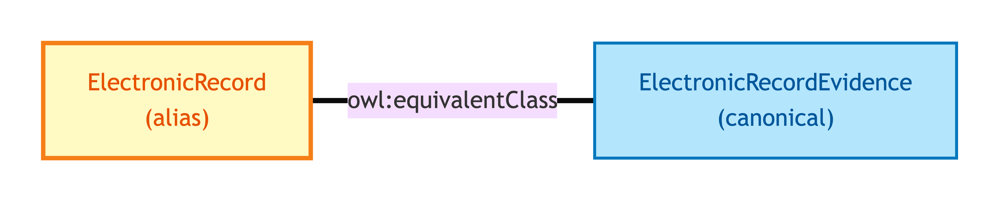
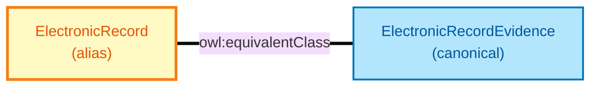

# Electronic Record

Electronic Record is the **short-name alias** for [Electronic Record Evidence](./electronic-record-evidence.md). The two names refer to the same OWL identity — Electronic Record exists so worked-example data (the diagnostic exemplar set) can use the short form without losing alignment with the long-name canonical form that downstream shapes and annotations target.

## Why it matters

OPDA's exemplar set uses short names (Document, Electronic Record, Vouch) for compactness; OPDA's SHACL shapes and DPV annotations target the long names (Document Evidence, Electronic Record Evidence, Vouch Evidence). If you read an exemplar and see `:ElectronicRecord`, treat it as identical to `:ElectronicRecordEvidence`.

## Hard cases

- **Mixed use within one consumer.** Same situation as for [Document](./document.md) — the OWL equivalence binding lets short and long names coexist.

## Identity Criterion

See [Electronic Record Evidence](./electronic-record-evidence.md) — Electronic Record inherits the same IC by OWL equivalence binding. See the [Logical tier →](../../logical/claim/electronic-record.md) for the typed structure.

## Related Kinds

- [Electronic Record Evidence](./electronic-record-evidence.md) — the canonical long-name form

### Related-Kinds graph

Mermaid Source

## Source ODR

[ODR-0009 — Claims, evidence, provenance §Q1](/modelling/odr/odr-0009)
