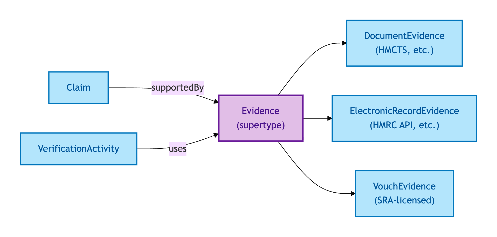
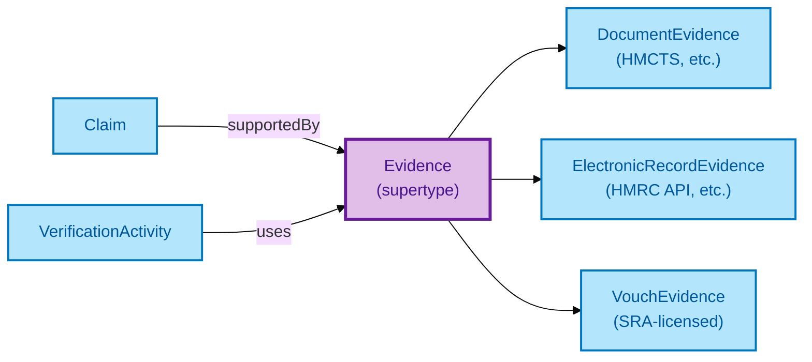

# Evidence

Evidence is the supporting artefact behind a Claim. OPDA recognises three deliberately-distinct kinds of evidence — Document, Electronic Record, and Vouch — and explicitly does *not* collapse them, because they carry different lifecycles, different verification mechanics, and different assurance ceilings.

## Why it matters

The three subtypes correspond to the OIDC4IDA and eIDAS evidence categories. A Document Evidence (e.g. grant of probate) lives on paper or in a scan with a HMCTS issuance chain; an Electronic Record Evidence lives in a structured API response from an authoritative source; a Vouch Evidence is a regulated professional's attestation. They are *qualitatively different* — and treating them uniformly hides the data downstream consumers need to make verification decisions.

If you are an integrator surfacing evidence to a verification activity, this is the supertype whose subtype dispatch you need.

## Hard cases

- **Subtype confusion.** A scanned paper Document recorded as an Electronic Record. The IC discriminates by *source provenance*, not by digital format — a scanned paper artefact is still Document Evidence.
- **Mixed evidence chain.** One Claim supported by a Document, an Electronic Record, and a Vouch in combination. The three coexist as distinct Evidence instances; no collapse.
- **Evidence withdrawn.** A Document is invalidated post-hoc (e.g. probate revoked). The Evidence record persists with a withdrawal annotation; downstream Verification Activities that relied on it inherit a status change.

## Identity Criterion

An Evidence record is identified by its **(subtype, source-authority record-id)** pair. Two records refer to the same Evidence only if both components match. See the [Logical tier →](../../logical/claim/evidence.md) for the typed structure and the subtype-dispatching SHACL shape.

## Related Kinds

- [Document Evidence](./document-evidence.md) — paper or scanned authoritative artefact
- [Electronic Record Evidence](./electronic-record-evidence.md) — API-retrieved authoritative record
- [Vouch Evidence](./vouch-evidence.md) — regulated professional's attestation
- [Claim](./claim.md) — Claims are supported by Evidence
- [Verification Activity](./verification-activity.md) — verifies a Claim using Evidence

### Related-Kinds graph

Mermaid Source

## Source ODR

[ODR-0009 — Claims, evidence, provenance §Q1](/modelling/odr/odr-0009)
