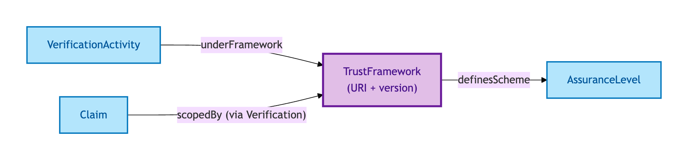
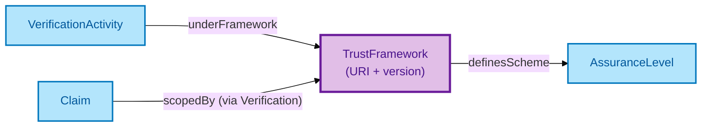

# Trust Framework

A Trust Framework is a **governance regime** that scopes claim validity — for example, the UK Property Data Trust Framework. A Verification Activity cites its Trust Framework so consumers know under which governance the Claim was verified.

## Why it matters

A Claim verified under one Trust Framework may not be valid under another. Cross-framework reuse requires either an explicit equivalence binding (rare, governance-heavy) or fresh verification under the receiving framework. OPDA models the Trust Framework explicitly so the scoping of every Verification is auditable — no Claim is "just verified", every Claim is "verified under <named framework>".

If you are interoperating with overseas property data, or reviewing whether a Claim verified under one Trust Framework can be relied on under another, this is the entity that makes the scoping explicit.

## Hard cases

- **Cross-framework Claim.** A Claim verified under Framework A is presented under Framework B. The IC says: the verification is *under A*; under B it is either re-verified or treated as unverified. The framework is not optional metadata.
- **Framework versioning.** A Trust Framework v1 and v2 may carry different rules. The Verification Activity cites a specific version; v1 verifications do not automatically carry forward to v2.
- **Authoritative within scope.** Per Session 003c Item 3, the OPDA Trust Framework is authoritative within its own scope — verifications outside scope are not OPDA-authoritative regardless of evidence quality.

## Identity Criterion

A Trust Framework is identified by its **(framework URI, version)** pair. Two records refer to the same Trust Framework only if both components match. See the [Logical tier →](../../logical/claim/trust-framework.md) for the typed structure.

## Related Kinds

- [Verification Activity](./verification-activity.md) — cites a Trust Framework
- [Claim](./claim.md) — scoped by a Trust Framework via its Verification
- [Assurance Level](./assurance-level.md) — scheme defined by the Trust Framework

### Related-Kinds graph

Mermaid Source

## Source ODR

[ODR-0009 — Claims, evidence, provenance §Q5](/modelling/odr/odr-0009)
