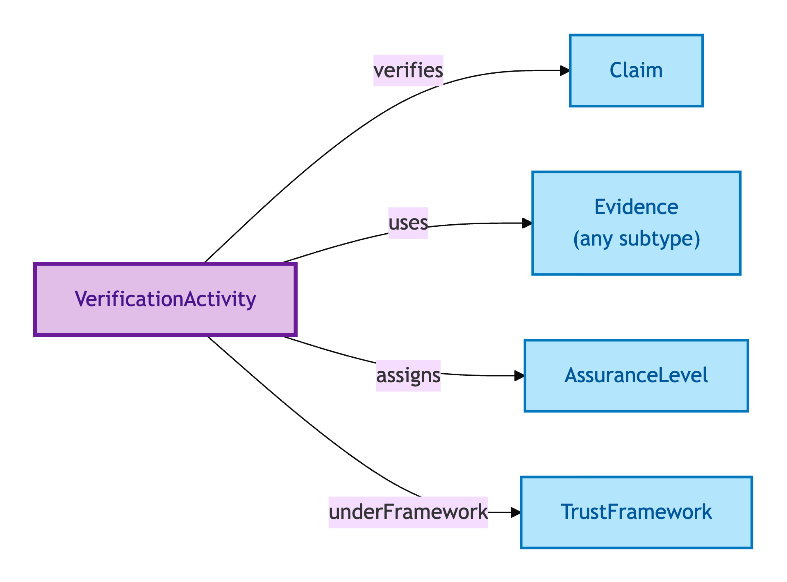
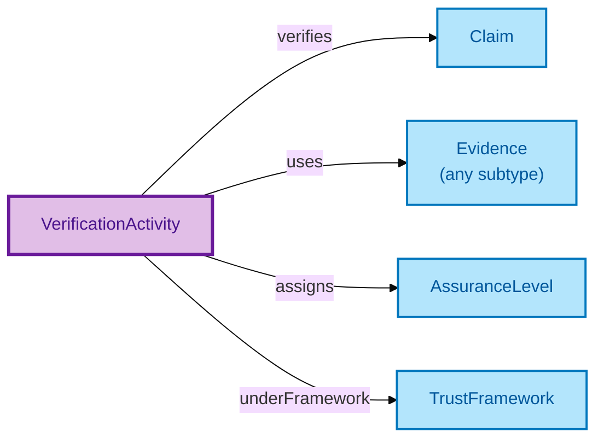

# Verification Activity

A Verification Activity is the **activity that produces a verified Claim from Evidence**. It records the verifier, the verification method, the completion timestamp, and the resulting Assurance Level.

## Why it matters

A Claim on its own is just an assertion; a Claim that has gone through a Verification Activity is a *verified* Claim — with a known verifier, a known method, and a known assurance grade. The Verification Activity is the entity that closes the audit loop: who verified, how, when, and to what standard.

If you are a compliance officer or auditor following the evidentiary trail, this is the entity that connects the dots.

## Hard cases

- **Multiple verifications of one Claim.** Different verifiers, different methods, possibly divergent verdicts. Each is its own Verification Activity; the model does not collapse them.
- **Verification method discarded.** A naive design records "verified=true" and loses the method. The model deliberately uses a qualified-attribution pattern so the validation_method / verification_method facets cannot be discarded.
- **Verification that ends without a verdict.** A verifier starts but does not complete. The Activity record persists in an incomplete state; the Claim is not promoted to verified until the Activity ends with a verdict.

## Identity Criterion

A Verification Activity is identified by its **(Claim, verifier, completion timestamp)** triple — what was verified, by whom, when. See the [Logical tier →](../../logical/claim/verification-activity.md) for the typed structure (PROV-O qualified attribution, validation/verification method capture).

## Related Kinds

- [Claim](./claim.md) — the Claim being verified
- [Evidence](./evidence.md) — the Evidence the Activity uses
- [Assurance Level](./assurance-level.md) — the grade the Activity assigns
- [Trust Framework](./trust-framework.md) — the governance regime the Activity conforms to

### Related-Kinds graph

Mermaid Source

## Source ODR

[ODR-0009 — Claims, evidence, provenance §Q1](/modelling/odr/odr-0009)
