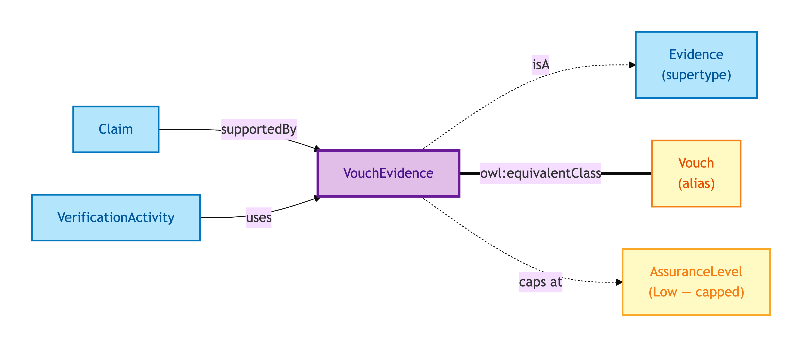
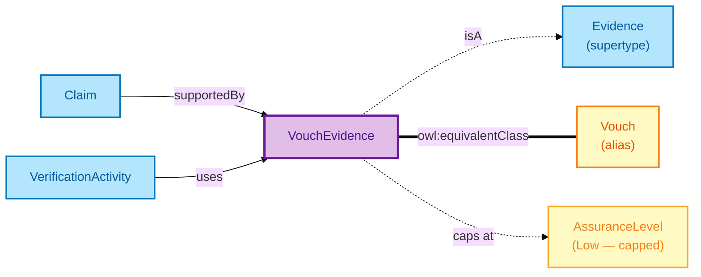

# Vouch Evidence

A Vouch Evidence is a **formal attestation** by a regulated professional — for example, an SRA-licensed solicitor vouching for a client's identity, or a regulated accountant vouching for source-of-funds.

## Why it matters

Vouches are the everyday lubricant of conveyancing where documentary evidence is unavailable, lost, or impractical to produce. They are *qualitatively weaker* than Document or Electronic Record evidence: an attestation depends on the voucher's professional standing, not on an authoritative authority's issuance chain. OPDA caps Vouch Evidence at eIDAS Low Assurance — regardless of the voucher's quality — because the attestation pattern itself has a lower ceiling than authority-issued evidence.

If you are a compliance officer working with vouched evidence and worried about the assurance ceiling, this is the entity that makes the cap explicit.

## Hard cases

- **High-quality voucher, low-assurance ceiling.** A King's Counsel vouches for a fact. The Vouch is still Low Assurance — the ceiling is on the *pattern*, not the voucher. To exceed the ceiling, you need a corroborating Document or Electronic Record.
- **Multiple corroborating Vouches.** Two solicitors vouch for the same fact. The combined Vouch evidence remains Low Assurance under eIDAS — corroboration doesn't promote tier.
- **Vouch by an unregulated party.** A neighbour vouches for a residence claim. This is not Vouch Evidence under the eIDAS / OIDC4IDA category — it is at best an unauthenticated assertion.

## Identity Criterion

A Vouch Evidence record is identified by its **(voucher agent, attestation date, attested fact)** triple. Two records refer to the same Vouch only if all three coincide. See the [Logical tier →](../../logical/claim/vouch-evidence.md) for the typed structure (attribution to a regulated Agent, professional-licence reference).

## Related Kinds

- [Evidence](./evidence.md) — Vouch Evidence is one of three Evidence subtypes
- [Vouch](./vouch.md) — short-name alias used by worked examples
- [Claim](./claim.md) — Claims supported by Vouch Evidence
- [Verification Activity](./verification-activity.md) — verifies a Claim using Vouch Evidence
- [Assurance Level](./assurance-level.md) — Vouch Evidence caps at eIDAS Low

### Related-Kinds graph

Mermaid Source

## Source ODR

[ODR-0009 — Claims, evidence, provenance §Q1](../../../ontology/odr/ODR-0009-claims-evidence-provenance.md)
