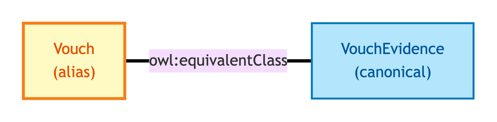
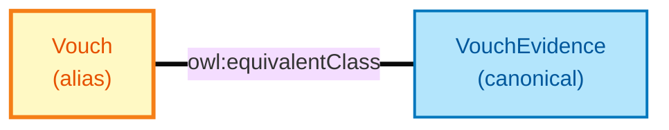

# Vouch

Vouch is the **short-name alias** for [Vouch Evidence](./vouch-evidence.md). The two names refer to the same OWL identity — Vouch exists so worked-example data (the diagnostic exemplar set) can use the short form without losing alignment with the long-name canonical form that downstream shapes and annotations target.

## Why it matters

Same rationale as [Document](./document.md) and [Electronic Record](./electronic-record.md) — exemplars use short names; shapes and annotations target long names; OWL equivalence makes both equivalent.

## Hard cases

- **Mixed use within one consumer.** Same situation as for the other aliases — OWL equivalence binding handles it.

## Identity Criterion

See [Vouch Evidence](./vouch-evidence.md) — Vouch inherits the same IC by OWL equivalence binding. See the [Logical tier →](../../logical/claim/vouch.md) for the typed structure.

## Related Kinds

- [Vouch Evidence](./vouch-evidence.md) — the canonical long-name form

### Related-Kinds graph

Mermaid Source

## Source ODR

[ODR-0009 — Claims, evidence, provenance §Q1](../../../ontology/odr/ODR-0009-claims-evidence-provenance.md)
