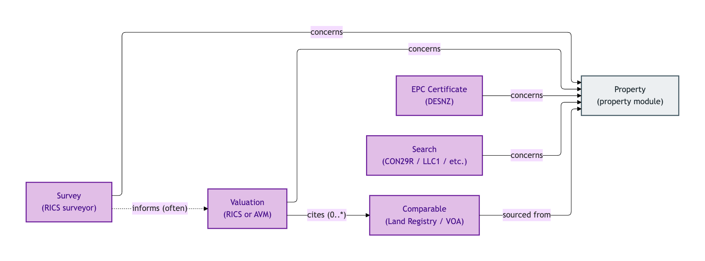
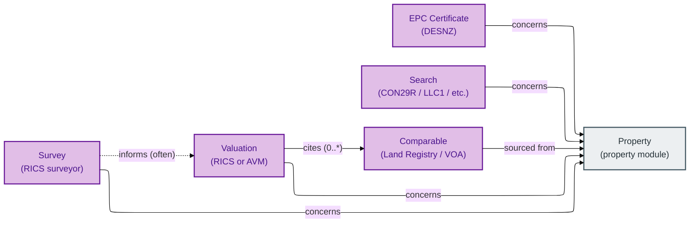
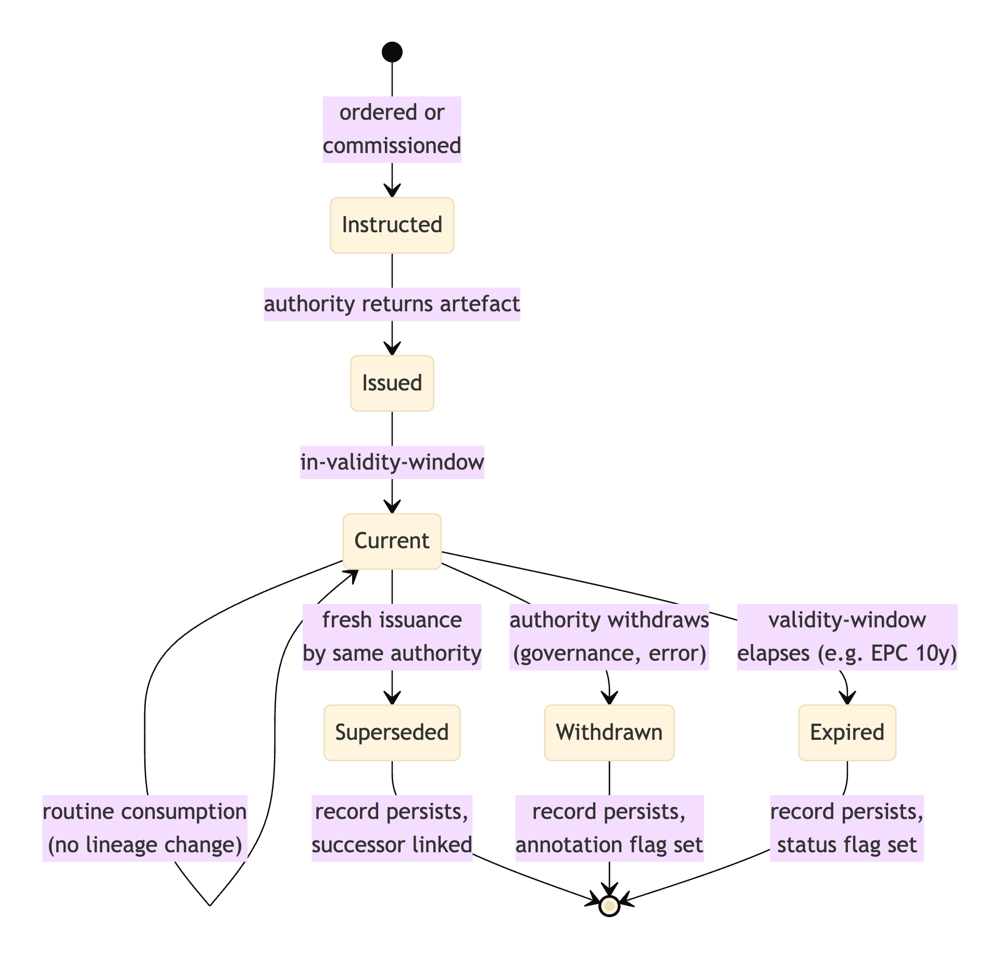
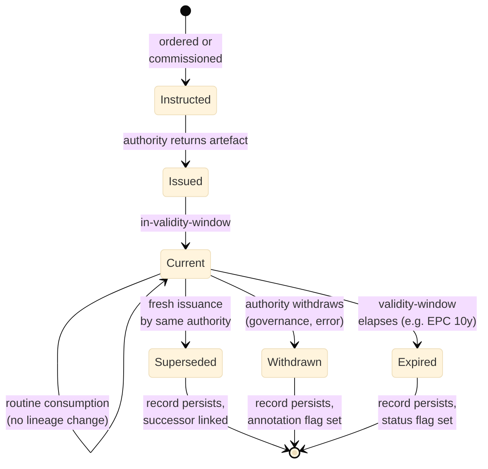

# Descriptive

The Descriptive module covers the authority-issued artefacts that ride alongside a Property in a transaction: surveys, valuations, EPC certificates, searches, and the comparables that support a valuation.

Each of these was *promoted from a flat attribute bag to a first-class Kind* by the Council's S008 Q4 three-criterion test: authority-issued provenance chain; distinct lifecycle (issued / superseded / withdrawn); distinct PII regime or distinct downstream consumer treatment. Anything that fails any one criterion stays as a flat attribute on the Property; anything that satisfies all three lives here.

## Entities

- [Comparable](./comparable.md) — comparable-sale or comparable-rental supporting a Valuation
- [EPC Certificate](./epc-certificate.md) — DESNZ-governed Energy Performance Certificate
- [Search](./search.md) — local-authority or environmental search result
- [Survey](./survey.md) — professional property survey report
- [Valuation](./valuation.md) — RICS-regulated or automated-model property valuation

## Module-internal relationships

The five descriptive Kinds, each riding alongside a Property with its own authority chain and lifecycle; Valuation cites Comparables; Survey often informs Valuation:

Mermaid Source

## Lifecycle: Descriptive-artefact issued-superseded-withdrawn

The shared lifecycle pattern across all five descriptive Kinds — each authority issues, may supersede on re-issue, may withdraw:

Mermaid Source

