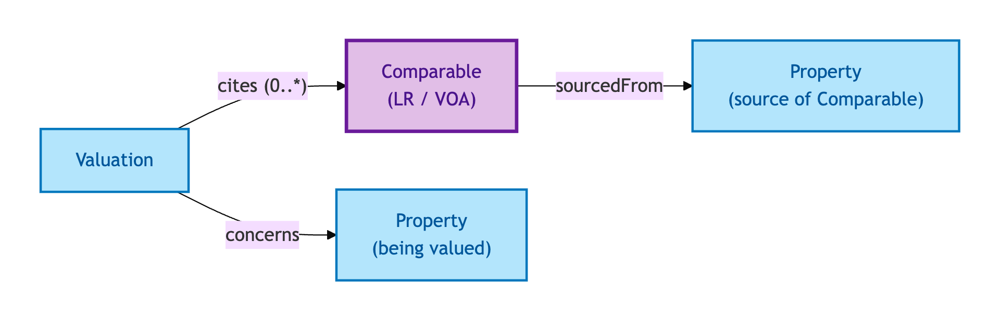
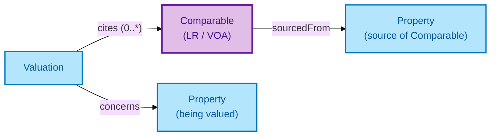

# Comparable

A Comparable is a **comparable-sale or comparable-rental record** supporting a Valuation — typically sourced from Land Registry Price Paid Data or VOA records.

## Why it matters

Valuations rest on comparables. A Valuation that names no comparables is opaque; a Valuation that names its comparables is auditable. OPDA models Comparable as a first-class Kind so the link from a Valuation to its supporting evidence is queryable, and so the comparables themselves can carry their own provenance (Land Registry record-id, VOA record-id) and lifecycle.

If you are a valuer or auditor following the evidence chain behind a Valuation, this is the entity that closes the loop.

> **Editorial note.** The hard cases below are interpretive — derived from the
> S008 Q4 three-criterion test recorded in the source TTL's `rdfs:comment`,
> not lifted verbatim. Council ratification of a definitive hard-case
> enumeration for this descriptive Kind is pending.

## Hard cases

- **Stale comparable.** A Land Registry record from years prior used in a current Valuation. The Comparable persists; its age is a property of the record that consumers can weight.
- **Comparable in a different sub-market.** A Comparable from a different street, building type, or condition class. The model carries the Comparable but exposes its differentiating attributes for the consumer to assess relevance.
- **Withdrawn or amended source record.** Land Registry updates a Price Paid Data record. The Comparable can be refreshed (new record version) or retained as a snapshot — the IC discriminates by record-id + retrieval date.

## Identity Criterion

A Comparable is identified by its **(source-authority, record-id, retrieval date)** triple. Two records refer to the same Comparable only if all three coincide. See the [Logical tier →](../../logical/descriptive/comparable.md) for the typed structure.

## Related Kinds

- [Valuation](./valuation.md) — Valuations cite Comparables as supporting evidence
- [Property](../property/property.md) — Comparables are related to (but distinct from) the Property being valued

### Related-Kinds graph

Mermaid Source

## Source ODR

[ODR-0008 — Property descriptive attributes §Q4a](../../../ontology/odr/ODR-0008-property-descriptive-attributes.md)
