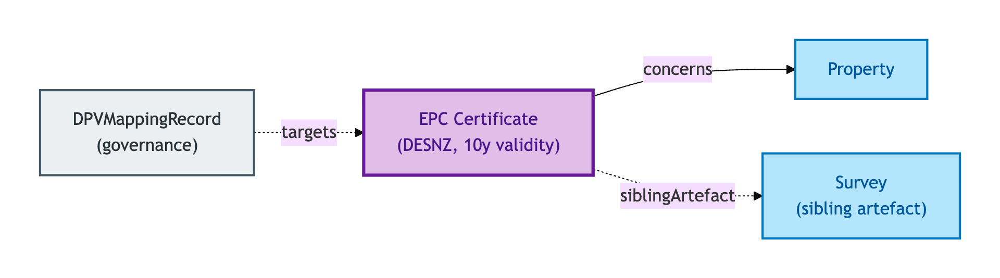
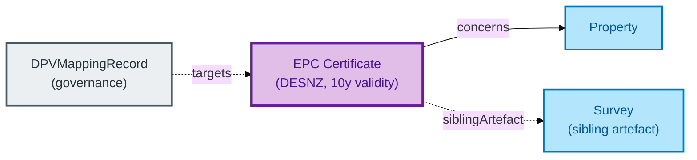

# EPC Certificate

An EPC Certificate is an **Energy Performance Certificate** — a DESNZ-governed authority-retrieved artefact recording a Property's energy-efficiency rating.

## Why it matters

EPCs are statutorily required for most residential transactions, have a 10-year validity, and feed into mortgage decisions, regulatory compliance reports, and the property's marketing material. OPDA models the EPC as a first-class Kind because it has its own authority-retrieved provenance chain (DESNZ central register), its own lifecycle (10-year validity; supersession on re-assessment), and its own PII regime (address + owner-identifiable per ODR-0018).

If you are a conveyancer, lender, or property-data integrator working with EPC data, this is the entity that captures the certificate's provenance and lifecycle.

> **Editorial note.** The hard cases below are interpretive — derived from the
> S008 Q4 three-criterion test recorded in the source TTL's `rdfs:comment`,
> not lifted verbatim. Council ratification of a definitive hard-case
> enumeration for this descriptive Kind is pending.

## Hard cases

- **Re-assessed EPC.** A new EPC supersedes the previous one mid-validity. The new EPC is its own record with a provenance link to the predecessor; the predecessor is marked as superseded but persists in the audit trail.
- **EPC nearing expiry.** Within the 10-year validity window the EPC is current; past the window it is expired. The lifecycle is a property of the EPC, not derived ad-hoc by consumers.
- **Property with no EPC.** Some property categories are exempt. The absence of an EPC record is itself meaningful — it does not mean "data missing", it means "EPC not required".

## Identity Criterion

An EPC Certificate is identified by its **(DESNZ register-id, certificate-number)** pair. Two records refer to the same EPC only if both components match. See the [Logical tier →](../../logical/descriptive/epc-certificate.md) for the typed structure.

## Related Kinds

- [Property](../property/property.md) — an EPC Certificate concerns a Property
- [Survey](./survey.md) — a sibling authority-issued artefact (different provenance, different lifecycle)

### Related-Kinds graph

Mermaid Source

## Source ODR

[ODR-0008 — Property descriptive attributes §Q4a](../../../ontology/odr/ODR-0008-property-descriptive-attributes.md)
