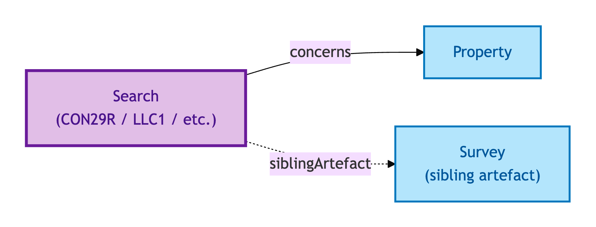
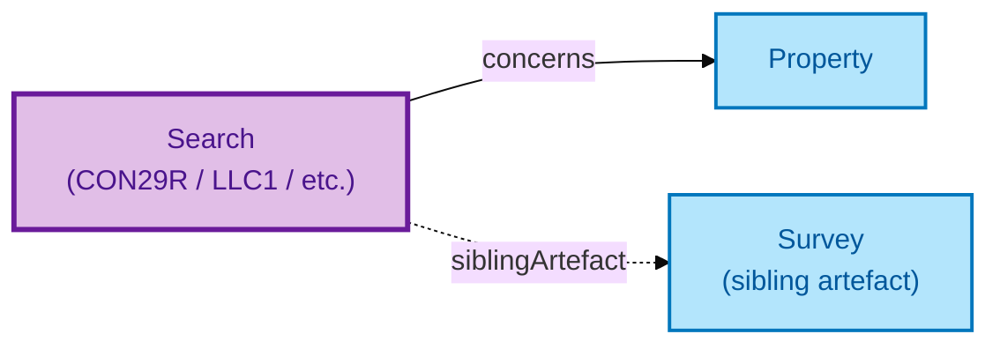

# Search

A Search is a **local-authority or environmental search result** — for example, a CON29R local-authority search, an LLC1 land-charges search, a flood search, or a coal-mining search.

## Why it matters

Conveyancing depends on searches that surface restrictions, charges, environmental risks, and planning history. Each search has its own issuing authority, its own delivery chain, and its own lifecycle (ordered / returned / superseded). OPDA models Search as a first-class Kind because it has all three S008 Q4 promotion criteria — local-authority issuance chain, distinct ordered/returned/superseded lifecycle, and it is not a flat datatype bag.

If you are a conveyancer working with search packages, this is the entity that captures the per-search provenance and lifecycle.

> **Editorial note.** The hard cases below are interpretive — derived from the
> S008 Q4 three-criterion test recorded in the source TTL's `rdfs:comment`,
> not lifted verbatim. Council ratification of a definitive hard-case
> enumeration for this descriptive Kind is pending.

## Hard cases

- **Same search re-ordered.** A CON29R that was stale at completion is re-ordered. The new Search is its own record; the predecessor persists with a superseded annotation.
- **Search-results-with-supplementary.** A primary search returns plus an authority's supplementary response. The IC treats the supplementary as a related record, not an in-place mutation.
- **Search delivered to a different recipient.** A Buyer's solicitor receives the search; the Seller's solicitor receives a copy. One Search, possibly with multiple delivery records — the IC is on the search itself, not on the delivery.

## Identity Criterion

A Search is identified by its **(issuing authority, search-type, search-reference)** triple. Two records refer to the same Search only if all three coincide. See the [Logical tier →](../../logical/descriptive/search.md) for the typed structure.

## Related Kinds

- [Property](../property/property.md) — a Search concerns a Property
- [Survey](./survey.md) — a sibling authority-issued artefact (different provenance, different lifecycle)

### Related-Kinds graph

Mermaid Source

## Source ODR

[ODR-0008 — Property descriptive attributes §Q4a](../../../ontology/odr/ODR-0008-property-descriptive-attributes.md)
