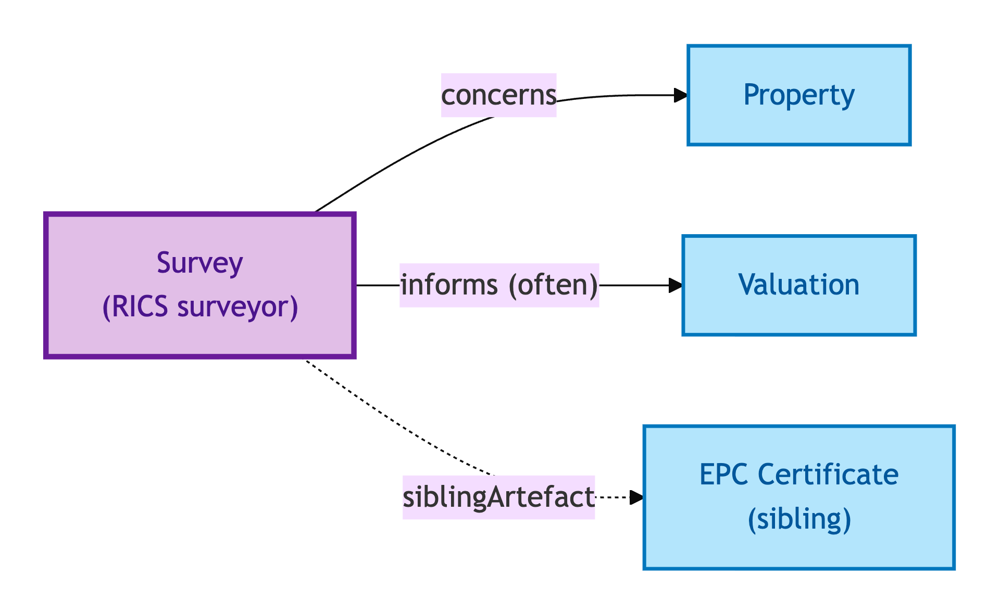
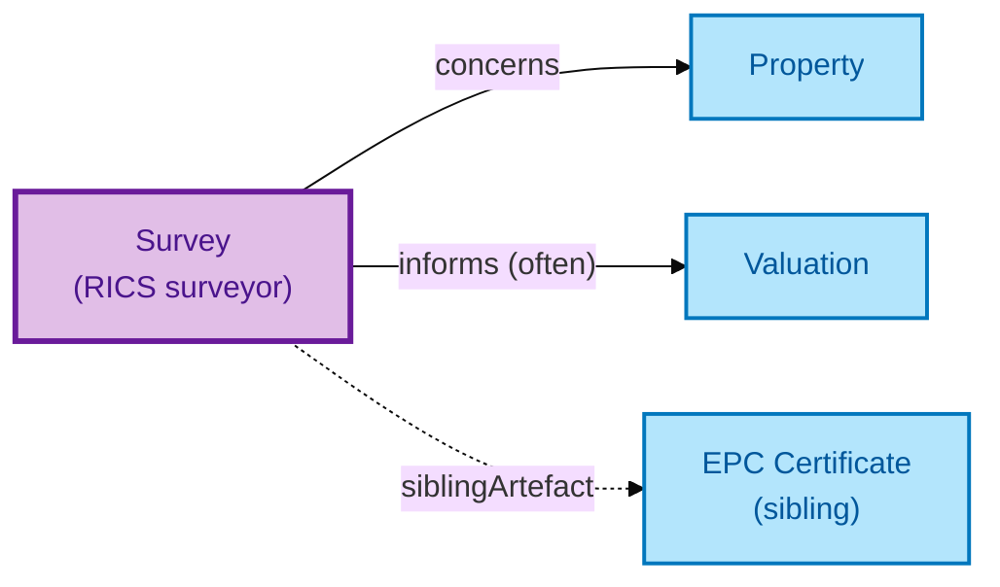

# Survey

A Survey is an **authority-retrieved professional survey report** for a Property — for example, a RICS HomeBuyer Report or a Building Survey.

## Why it matters

Surveys are commissioned, delivered, and sometimes superseded or withdrawn during a transaction. OPDA models the Survey as a first-class Kind because it has its own authority-issued provenance chain (professional issuer), its own lifecycle (issued / superseded / re-issued / withdrawn), and its own role in the evidence chain underpinning Valuations and lender decisions.

If you are a conveyancer, valuer, or lender working with surveys, this is the entity whose lifecycle you query.

## Hard cases

- **Re-survey.** A fresh Survey supersedes an earlier one. The new Survey is its own record with a provenance link to the predecessor; the predecessor persists with a superseded status.
- **Supersession after issue.** A Survey is issued, then superseded by a corrected version. The audit trail captures both — the original is not erased.
- **Withdrawal.** A surveyor withdraws a report (e.g. for legal reasons). The Survey record persists with a withdrawal annotation; downstream consumers see the withdrawal status.

## Identity Criterion

A Survey is identified by its **(issuing surveyor, survey-id, issue date)** triple. The IC tracks lineage through supersession and withdrawal — re-issuance produces a successor with a provenance link, not an in-place mutation. See the [Logical tier →](../../logical/descriptive/survey.md) for the typed structure.

## Related Kinds

- [Property](../property/property.md) — a Survey concerns a Property
- [Valuation](./valuation.md) — Valuations often rely on Survey content
- [EPC Certificate](./epc-certificate.md) — a sibling authority-issued artefact

### Related-Kinds graph

Mermaid Source

## Source ODR

[ODR-0008 — Property descriptive attributes §Q4a](../../../ontology/odr/ODR-0008-property-descriptive-attributes.md)
