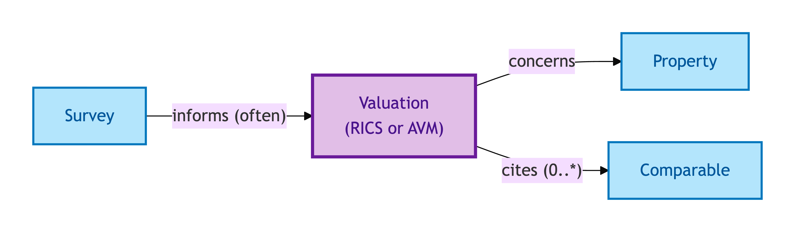
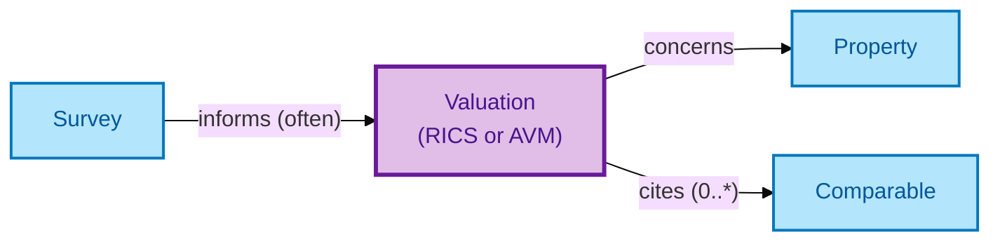

# Valuation

A Valuation is a **RICS-regulated professional valuation or an automated-model output** of a Property's market value. It is the basis for lender decisions, capital-gains calculations, and chain feasibility.

## Why it matters

Valuations are not facts about the Property — they are *judgements* about its value at a specific point in time, made by a specific valuer (or model) under a specific governance regime. OPDA models the Valuation as a first-class Kind because it has its own RICS-regulated provenance chain, its own lifecycle (instructed / delivered / superseded), and its own evidence chain to the Comparables that informed it.

If you are a valuer, lender, or audit-trail tooling integrator, this is the entity that captures the judgement and its supporting evidence.

> **Editorial note.** The hard cases below are interpretive — derived from the
> S008 Q4 three-criterion test recorded in the source TTL's `rdfs:comment`,
> not lifted verbatim. Council ratification of a definitive hard-case
> enumeration for this descriptive Kind is pending.

## Hard cases

- **Valuation superseded by a fresh instruction.** A lender re-orders a Valuation closer to completion. The new Valuation is its own record; the previous persists with a superseded annotation.
- **AVM vs RICS valuer.** An automated-valuation-model output is a different evidence chain than a RICS valuer's report. Both are Valuations; the IC discriminates by valuer-attribution.
- **Valuation revoked.** A Valuation is withdrawn (e.g. for governance issues). The Valuation record persists with a withdrawal annotation.

## Identity Criterion

A Valuation is identified by its **(valuer, Property, instruction date)** triple. Two records refer to the same Valuation only if all three coincide. See the [Logical tier →](../../logical/descriptive/valuation.md) for the typed structure (evidence chain to Comparables, RICS-regulated provenance).

## Related Kinds

- [Property](../property/property.md) — a Valuation concerns a Property
- [Comparable](./comparable.md) — supports a Valuation
- [Survey](./survey.md) — Surveys often inform Valuations

### Related-Kinds graph

Mermaid Source

## Source ODR

[ODR-0008 — Property descriptive attributes §Q4a](../../../ontology/odr/ODR-0008-property-descriptive-attributes.md)
