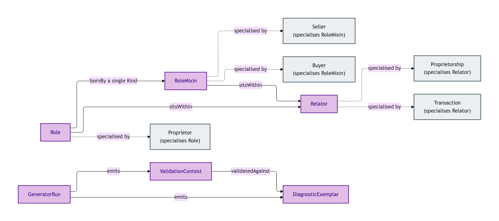
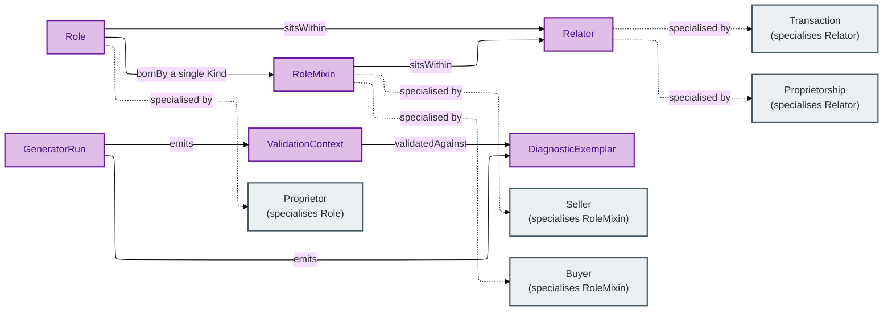

# Foundation

The Foundation module contains cross-cutting kinds reused across every other OPDA module. Some are infrastructural (Diagnostic Exemplar, Generator Run, Validation Context); others are abstract pattern-bearers (Role, Role Mixin, Relator) that downstream modules specialise.

Read this module first if you want to understand *why* OPDA distinguishes a `Proprietor` (Role) from a `Seller` (Role Mixin) from a `Proprietorship` (Relator), or *what* a Validation Context buys you when a profile says a field is "required (depending)".

## Entities

- [Diagnostic Exemplar](./diagnostic-exemplar.md) — minimal worked-example data exposing one Identity-Criterion-bearing surface for Council validation
- [Generator Run](./generator-run.md) — a single execution of the opda-gen pipeline that produced a specific set of emitted ontology files
- [Relator](./relator.md) — a relational kind that mediates two or more parties and is founded by an external event
- [Role](./role.md) — a role borne by a single underlying Kind
- [Role Mixin](./role-mixin.md) — a role borne by more than one underlying Kind
- [Validation Context](./validation-context.md) — the named overlay profile under which a record was validated

## Module-internal relationships

How the foundation Kinds connect to one another and to the downstream Kinds in other modules:

Mermaid Source

