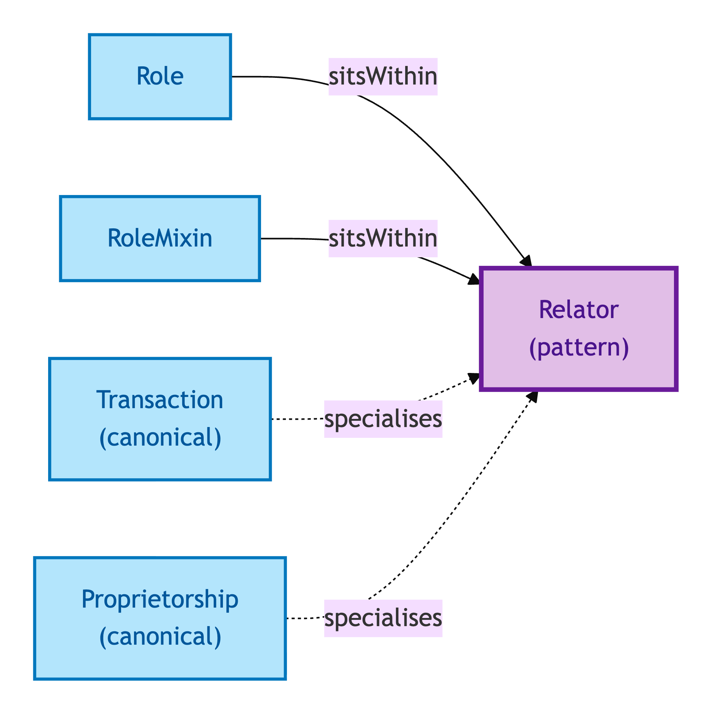
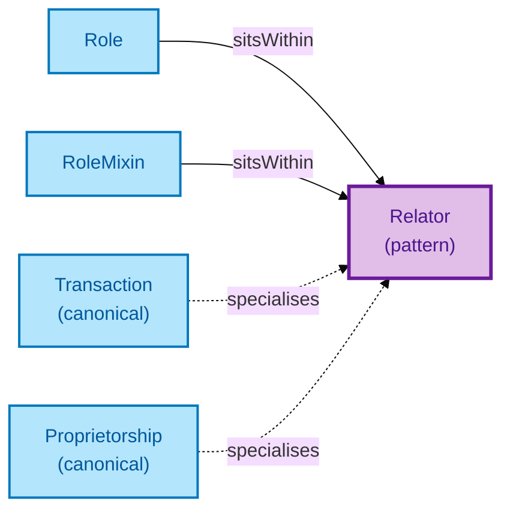

# Relator

A Relator is a relational kind: it stands between two or more parties and carries properties that don't belong to any single party. A Relator's existence is *founded* by an external event — without that founding event, the Relator does not exist.

## Why it matters

Some things in property data are best modelled as a relationship that has its own identity and its own properties. A Transaction is not a property of the Seller, nor a property of the Buyer — it is a *thing-in-its-own-right* that binds Seller, Buyer, and Legal Estate, and that bears its own properties (transaction-id, founding-event, status). A Proprietorship is not a property of the Person nor of the Title — it is a binding that carries its own joint-tenancy-vs-tenants-in-common discriminator.

If you have ever wanted to attach a property to "the relationship itself" rather than to either party, you wanted a Relator. The two OPDA Relators in scope are **Transaction** (binds Seller + Buyer + Legal Estate; founded by offer-acceptance) and **Proprietorship** (binds Proprietors to a Registered Title; founded by the registration activity).

## Hard cases

- **Party-substitution within a Transaction.** A Buyer drops out and another Buyer steps in. The Transaction Relator persists (founding event unchanged); only the bearer of the Buyer role changes.
- **Joint tenancy vs tenants in common.** The discriminator lives on the Proprietorship Relator, *not* on the Proprietor roles. Asking "which type is the Proprietor?" is the wrong question — it is the *binding* that is one or the other.
- **A Relator without its founding event.** Cannot exist. A Transaction without an offer-acceptance event is not a Transaction; a Proprietorship without a registration event is not a Proprietorship. The founding event is part of the IC.

## Identity Criterion

A Relator's identity is the **(mediated-parties, founding-event) tuple**. Two Relator records are the same Relator only if they bind the same parties through the same founding event. See the [Logical tier →](../../logical/foundation/relator.md) for the typed structure.

## Related Kinds

- [Role](./role.md) — Roles are borne by parties *within* a Relator's context
- [Role Mixin](./role-mixin.md) — Role Mixins are cross-Kind Roles borne by parties within a Relator's context
- [Transaction](../transaction/transaction.md) — the canonical OPDA Relator: binds Seller, Buyer, and Legal Estate
- [Proprietorship](../agent/proprietorship.md) — binds Proprietors to a Registered Title

### Related-Kinds graph

Mermaid Source

## Source ODR

[ODR-0006 — Agents and roles §Q3](/modelling/odr/odr-0006)
