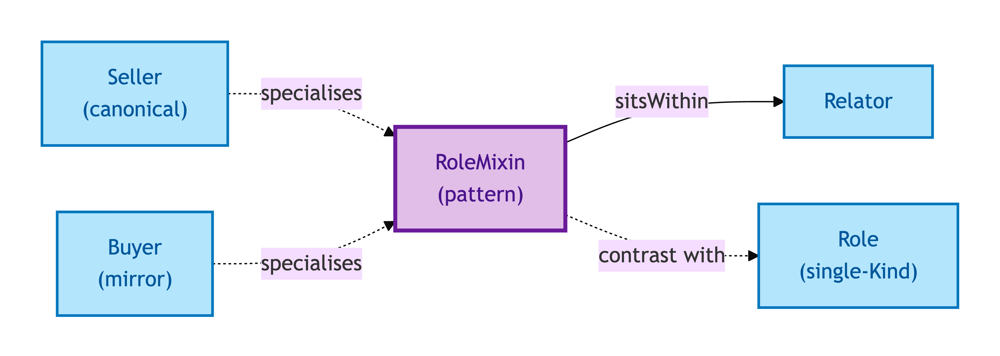
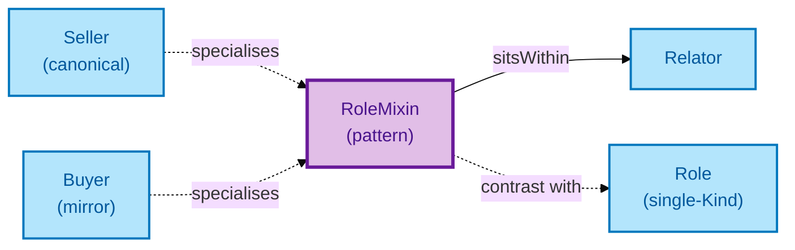

# Role Mixin

A Role Mixin is a part you play — but unlike a Role, it can be borne by **more than one Kind of party**. A Seller is a Role Mixin borne by either a Person or an Organisation; the model does not assume Sellers are always natural persons.

## Why it matters

Property transactions routinely involve sellers and buyers that are corporate vehicles (Limited Companies, LLPs), trusts, or individuals — sometimes mixed in the same chain. Role Mixin is the modelling pattern that lets one role *Seller* be borne by either kind of bearer without splitting into `PersonSeller` and `OrganisationSeller` everywhere downstream.

If you have ever needed to ask "who is the Seller, and what kind of Seller are they?" without enumerating every combination, this is the entity that buys you that flexibility.

## Hard cases

- **Mixed-bearer chain.** A transaction chain where one link's Seller is a Person and the next link's Seller is an Organisation. Both wear the Seller Role Mixin; downstream consumers can read the bearer kind to decide what's required next.
- **Specialised sub-Role.** A consumer needs to distinguish `PersonSeller` from `OrganisationSeller` for one specific use case. The model allows specialisation without forcing every consumer to use it.
- **Role Mixin keyed by bearer.** A downstream system tries to assign an ID to the Seller independent of the (Transaction, bearer) tuple. The IC says: the Seller's identity is parasitic on the Transaction it sits in plus the party bearing it — never give a Role Mixin its own ID.

## Identity Criterion

A Role Mixin instance is identified by its **(Relator-context, bearer) tuple** — the Transaction (or other Relator) it sits in, plus the Person or Organisation bearing the role. See the [Logical tier →](../../logical/foundation/role-mixin.md) for the typed structure.

## Related Kinds

- [Role](./role.md) — the sortal variant: a Role is borne by a single Kind
- [Relator](./relator.md) — Role Mixins sit *within* a Relator's context
- [Seller](../agent/seller.md) — the canonical OPDA Role Mixin (Person or Organisation → Seller in a Transaction context)
- [Buyer](../agent/buyer.md) — the mirror Role Mixin (Person or Organisation → Buyer in a Transaction context)

### Related-Kinds graph

Mermaid Source

## Source ODR

[ODR-0006 — Agents and roles §Q2](/modelling/odr/odr-0006)
