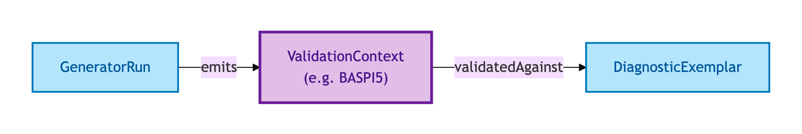
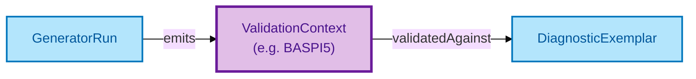

# Validation Context

A Validation Context names the **overlay profile** — for example, BASPI5 — under which a record was validated. It is the answer to "this field is required" with the qualifier "required *under which profile*".

## Why it matters

OPDA's base ontology is permissive by design: it expresses what *can* be said about a Property, a Transaction, a Claim. Different downstream contexts (BASPI5 for residential conveyancing, future profiles for commercial lettings or auctions) need different *required* fields, different enumerations, and different validation severities. Validation Context is the entity that lets one record be validated against many profiles without rewriting the base ontology.

If you are a SHACL engineer asking "where do the per-profile constraints attach?" or a downstream consumer asking "was this record BASPI5-valid?", you want the Validation Context.

## Hard cases

- **One record, multiple profiles.** A property pack may be valid under BASPI5 but invalid under a future stricter profile. The Validation Context lets both verdicts coexist on the same record without contradiction.
- **Profile versioning.** BASPI5 v1.0 and BASPI5 v1.1 may carry different constraints. Each profile version is its own Validation Context; a record's verdict is profile-version-specific.
- **Profile without context.** A constraint that says "this field is required *depending*" — without naming the depending-on — is unactionable. The IC requires every profile constraint to be anchored in a named, dereferenceable Validation Context.

## Identity Criterion

Each Validation Context is identified by its **profile URI** — for example, `https://opda.org.uk/pdtf/Baspi5ValidationContext`. Two records reference the same Context only if they cite the same URI. See the [Logical tier →](../../logical/foundation/validation-context.md) for the field-level shape (profile URI, required-set, overlaid-context, source, form version).

## Related Kinds

- [Diagnostic Exemplar](./diagnostic-exemplar.md) — exemplars are validated against a named Validation Context before the profile is ratified
- [Generator Run](./generator-run.md) — Validation Contexts are emitted by the same build pipeline, tagged with the Run that produced them

### Related-Kinds graph

Mermaid Source

## Source ODR

[ODR-0010 — Overlay profile mechanism §Q1](/modelling/odr/odr-0010)
