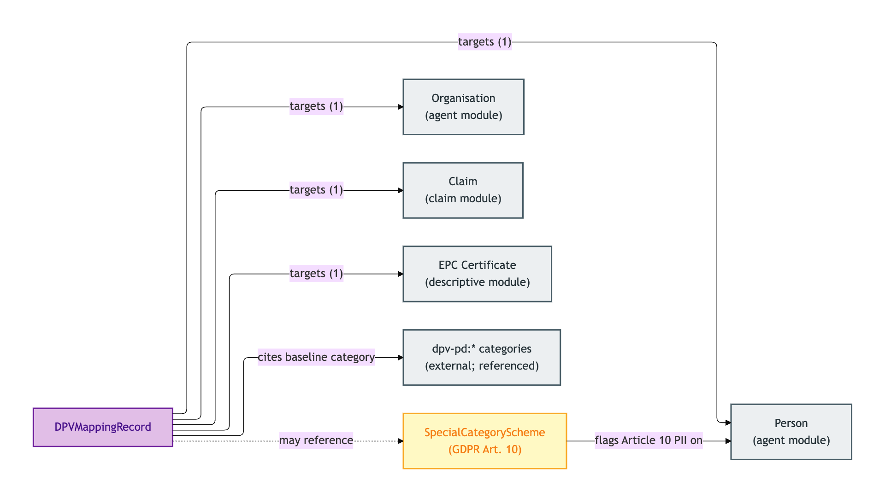
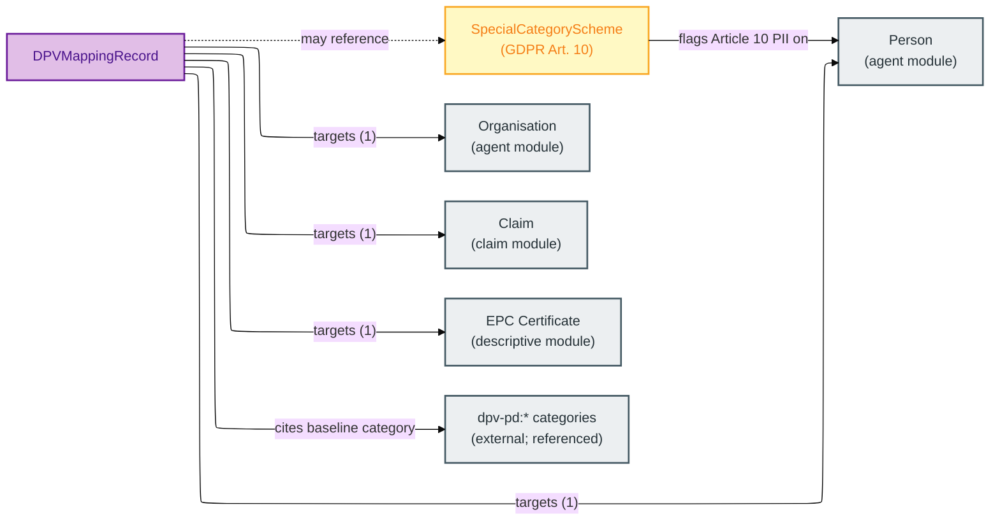

# Governance

The Governance module contains the records that link OPDA Kinds to data-protection categories — specifically, the DPV (Data Privacy Vocabulary) mapping records that pair each PII-bearing Kind with its baseline personal-data category under GDPR, and the Special Category Scheme for elevated-discipline categories under GDPR Article 10.

DPV is *referenced* but not *imported* by OPDA — the mapping records cite DPV URIs as link targets, leaving DPV's own governance to its own working group. This module is the authoring authority for those mappings; the actual co-annotation triples are emitted by ADR-0012 into the annotations graph.

## Entities

- [DPV Mapping Record](./dpv-mapping-record.md) — mapping from an OPDA Kind to its baseline personal-data category
- [Special Category Scheme](./special-category-scheme.md) — GDPR Article 10 / DPA 2018 special-category personal-data scheme

## Module-internal relationships

How the two governance Kinds link OPDA's PII-bearing Kinds out to the external DPV vocabulary and to GDPR Article 10 special-category controls:

Mermaid Source

