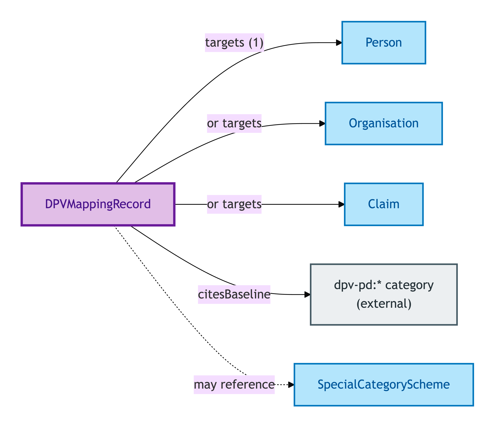
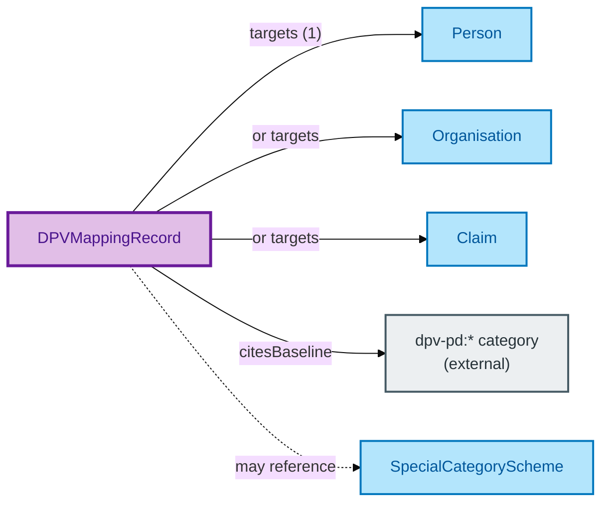

# DPV Mapping Record

A DPV Mapping Record is a **mapping** from an OPDA Kind class to its baseline personal-data category under the Data Privacy Vocabulary — for example, *Person* → *Name*, *Claim* → *OfficialID*. Variant-conditional refinements can be attached for kinds whose PII profile varies by context.

## Why it matters

Data-protection compliance — under GDPR, DPA 2018, and successors — depends on knowing *what kinds of personal data* a record carries. A naive design forces every consumer to re-derive that knowledge; OPDA centralises it as an authored mapping record. Each PII-bearing Kind has a baseline category; the DPV co-annotation triples that downstream tools consume are then emitted from these records.

If you are a data protection officer, a privacy engineer, or an audit-trail tooling integrator, this is the entity that tells you what category any OPDA record falls into.

## Hard cases

- **Kind with variant PII profiles.** A Claim's PII profile depends on what the Claim is about — an identity Claim carries an Official ID category; a property-condition Claim carries no PII. The Mapping Record carries the baseline plus optional variant-conditional refinements.
- **DPV reference without import.** OPDA cites DPV URIs but does not import the DPV ontology. The Mapping Record is the citation surface; downstream tools can dereference the DPV URI for the full DPV definition without OPDA carrying DPV's governance burden.
- **Mapping authority vs emission.** ODR-0012 is the authoring authority for these mappings; ADR-0012 emits the resulting DPV co-annotation triples into the annotations graph (three-graph separation per ODR-0011).

## Identity Criterion

A DPV Mapping Record is identified by its **target Kind** — the OPDA class whose instances bear the baseline category. There is at most one Mapping Record per Kind; updates produce a new Record with a provenance link to the predecessor. See the [Logical tier →](../../logical/governance/dpv-mapping-record.md) for the typed structure.

## Related Kinds

- [Person](../agent/person.md) — Person DPV Mapping baseline is `dpv-pd:Name`
- [Organisation](../agent/organisation.md) — Organisation DPV Mapping (baseline pending S012 ratification)
- [Claim](../claim/claim.md) — Claim DPV Mapping baseline is `dpv-pd:OfficialID`
- [Special Category Scheme](./special-category-scheme.md) — for Article 10 special-category PII

### Related-Kinds graph

Mermaid Source

## Source ODR

[ODR-0018 — DPV class-level co-annotation pattern §Rule 4](/modelling/odr/odr-0018)
