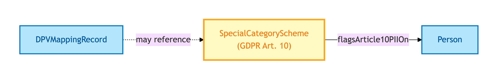
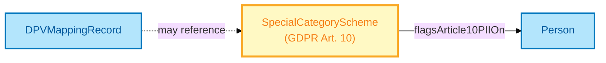

# Special Category Scheme

A Special Category Scheme is the **GDPR Article 10 / DPA 2018 special-category personal-data scheme** — flagging PII categories that carry elevated lawful-basis discipline (caution-or-conviction records; AML results; biometric data; race; religion; trade-union membership; health; sex life and orientation; political opinion; genetic data).

## Why it matters

Article 10 special-category PII is the highest-discipline tier in UK data protection. It is *not* something every system needs to handle, but it is something that, when present, demands extra-lawful-basis treatment. OPDA declares the Scheme at the class level so downstream shape libraries can target it via SHACL constraints, and so future member emission (the enumeration of which categories are in scope for OPDA) lands on a stable hook.

If you are a compliance engineer working with cautions, AML results, or other Article 10 data, this is the entity that anchors the validation discipline.

## Hard cases

- **Class declaration ahead of member enumeration.** Per S012 Q3, the Scheme is class-declared now; the actual member list (which specific categories OPDA scopes in) is emitted later when downstream demand materialises. The class hook is stable; the members are forward-loaded.
- **Cross-Kind applicability.** Special-category PII can be borne by any Kind that ingests Article 10 data — the Scheme is not tied to a single Kind. The SHACL shape `SpecialCategoryPIIWithoutLawfulBasisShape` (emitted in opda-agent-shapes.ttl) is the primary current consumer.

## Identity Criterion

The Special Category Scheme is identified by its **scheme URI** — `opda:SpecialCategoryScheme`. It is a SKOS concept scheme; members (when emitted) follow SKOS member identity. See the [Logical tier →](../../logical/governance/special-category-scheme.md) for the typed structure.

## Related Kinds

- [DPV Mapping Record](./dpv-mapping-record.md) — DPV mappings may reference Article 10 categories
- [Person](../agent/person.md) — the Kind most commonly carrying Article 10 PII

### Related-Kinds graph

Mermaid Source

## Source ODR

[GDPR Article 10](https://gdpr-info.eu/art-10-gdpr/) (external citation per the TTL `dct:source`)
