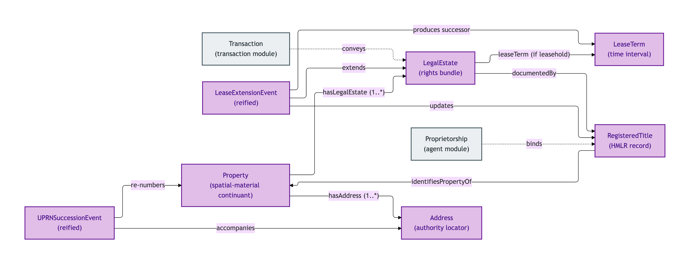
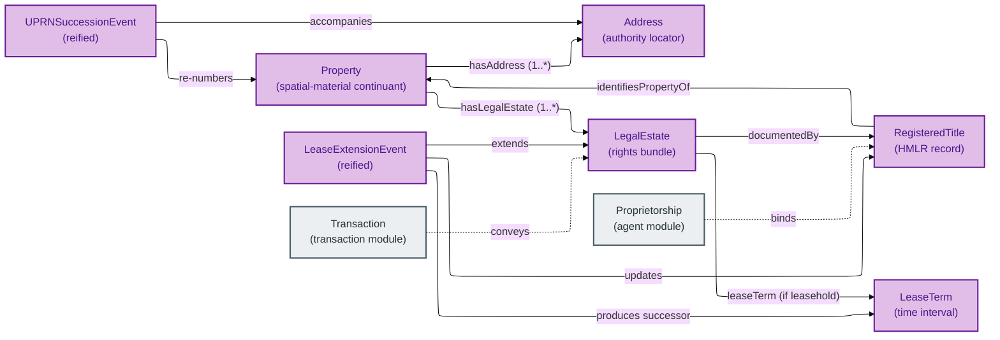
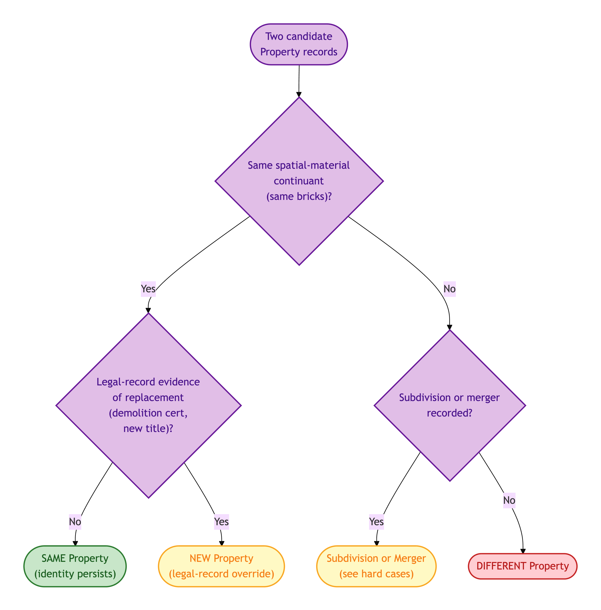
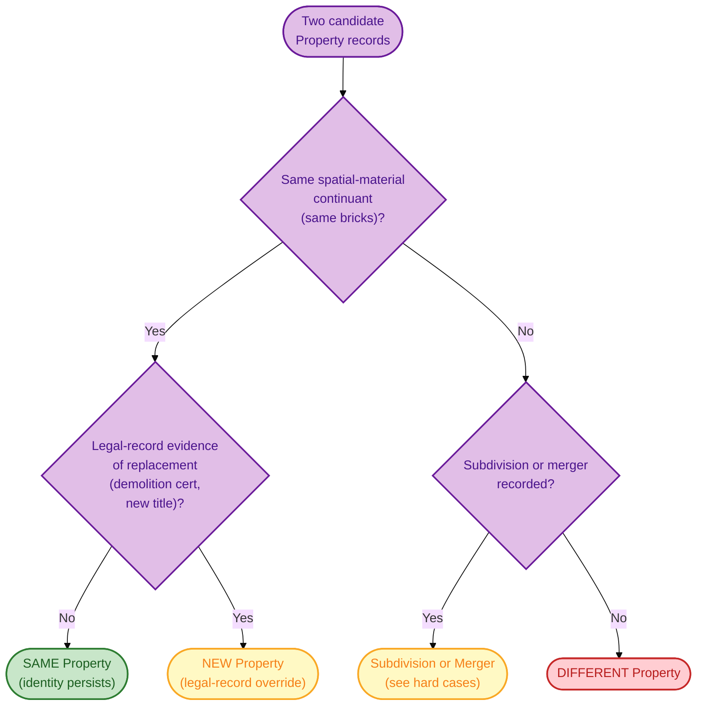
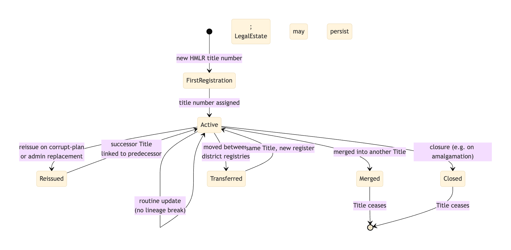

# Property

The Property module is the Identity-Criterion crux of OPDA. It distinguishes:

- the **physical Property** (a house, a flat — bricks and mortar);
- the **Legal Estate** vested in it (the rights bundle — Freehold, Leasehold, Commonhold);
- the **Registered Title** that documents the Legal Estate at HMLR;
- the **Address** that locates the Property (in any of several authority-issued forms: title, marketing, INSPIRE).

These four are routinely conflated in property data. OPDA keeps them separate because they have *different* Identity Criteria: a Property can persist while its Title is closed and reopened; a Title can persist through a Lease Extension that mutates (but does not break) the Legal Estate; an Address can change without the Property changing.

This module also contains two reified lifecycle events — **Lease Extension Event** and **UPRN Succession Event** — that record administrative changes which, importantly, do *not* break the underlying Property or Legal Estate identity.

## Entities

- [Address](./address.md) — an authority-issued locator for a Property
- [Lease Extension Event](./lease-extension-event.md) — a statutory lease-extension event that mutates a leasehold's term without breaking its identity
- [Lease Term](./lease-term.md) — the time interval bounding a leasehold tenure
- [Legal Estate](./legal-estate.md) — the bundle of legal rights vested in a Property
- [Property](./property.md) — the physical residential property
- [Registered Title](./registered-title.md) — the HMLR title-register record documenting a Legal Estate

## Module-internal relationships

The Property quartet (Property — LegalEstate — RegisteredTitle — Address) and the two reified identity-preserving lifecycle events:

Mermaid Source

## Lifecycle: Property identity-criterion decision flow

Walk the four mutually-exclusive outcomes for a candidate Property record:

Mermaid Source

## Lifecycle: Registered Title lineage

How a Registered Title's identity moves through registry events without taking the underlying Legal Estate with it:

```mermaid
%%{init: {"theme": "base"}}%%
stateDiagram-v2
    accTitle: Registered Title lifecycle
    accDescr: First registration opens a Title; closure ends a Title; merger and reissuance produce successor Titles with explicit predecessor lineage; the underlying Legal Estate may persist across all of these.

    [*] --> FirstRegistration : new HMLR title number

    FirstRegistration --> Active : title number assigned

    Active --> Active : routine update<br/>(no lineage break)
    Active --> Reissued : reissue on corrupt-plan<br/>or admin replacement
    Active --> Merged : merged into another Title
    Active --> Closed : closure (e.g. on amalgamation)
    Active --> Transferred : moved between<br/>district registries

    Reissued --> Active : successor Title<br/>linked to predecessor
    Transferred --> Active : same Title, new register

    Merged --> [*] : Title ceases;<br/>LegalEstate may persist
    Closed --> [*] : Title ceases;<br/>LegalEstate may persist
```

Mermaid Source

