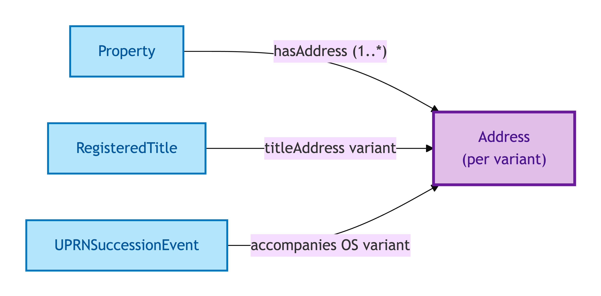
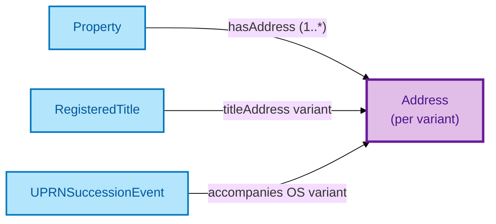

# Address

An Address is a socially-recognised locator for a Property, constructed by an issuing authority — Royal Mail (postal), OS AddressBase (UPRN), HMLR (title address), or INSPIRE (geospatial). The Address persists as a record-entity in that authority's stewardship.

## Why it matters

Most property data feeds carry several Addresses for the same Property: the marketing address used by the estate agent, the title address recorded by HMLR, the INSPIRE polygon centroid used by mapping consumers. These are not interchangeable — they are different records issued by different authorities and they evolve on different lifecycles. OPDA treats each as a first-class Address record, tagged by `addressVariant` (`title` / `marketing` / `inspire`), so downstream consumers can pick the authority they need.

If you are a data engineer who has spent time reconciling "the same address in five formats", this is the entity that makes the variation explicit rather than hiding it.

## Hard cases

- **Cosmetic re-format.** Royal Mail re-formats a postcode or normalises a road name. The Address identity persists — same authority, same lifecycle, same record-entity.
- **Authority-internal succession.** OS AddressBase retires a UPRN and re-issues it. The IC follows the authority's own succession chain — the new UPRN-bearing Address is a successor of the old, not a fresh unrelated Address.
- **Cross-variant identity-claim.** A marketing Address and a title Address that point to the same Property are *not* the same Address — they are two records, in two authority lifecycles, that happen to identify the same Property. The model never collapses them.
- **Property-side change.** The Property changes (subdivision, merger) but the Address lifecycle is on the authority side. An Address can outlive its Property; a Property can lose its Address. The two evolve independently.
- **INSPIRE-only locatedness.** A Property visible only through INSPIRE geospatial extent, with no postal or title address. The IC accommodates an Address that exists only in one authority's lifecycle.

## Identity Criterion

Two Address records refer to the same Address only if they share the same **authority + record-id pair** and are coherent under that authority's stewardship lifecycle. An Address is *not* identified by its string form — two cosmetically-different renderings of the same Royal Mail record are the same Address; two cosmetically-identical strings issued by different authorities are different Addresses. See the [Logical tier →](../../logical/property/address.md) for the typed structure.

## Related Kinds

- [Property](./property.md) — a Property may have multiple Address records (one per variant)
- [Registered Title](./registered-title.md) — the title Address variant is the one HMLR records

### Related-Kinds graph

Mermaid Source

## Source ODR

[ODR-0015 — Address and geography §2a](../../../ontology/odr/ODR-0015-address-and-geography.md)
