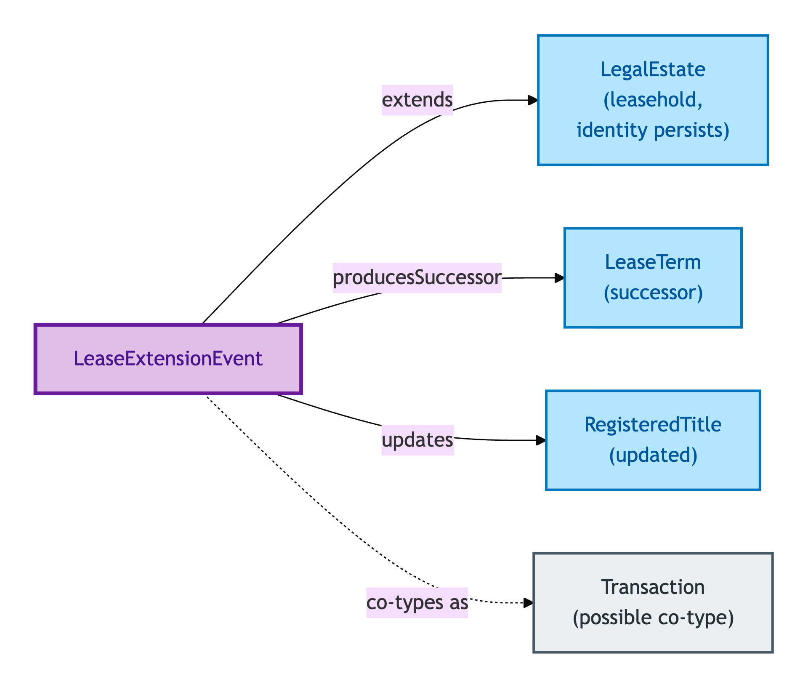
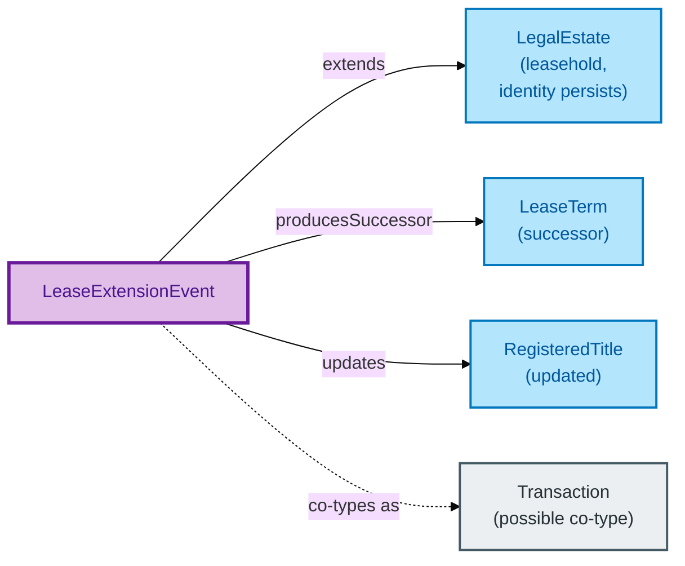

# Lease Extension Event

A Lease Extension Event is the reified record of a statutory lease extension — in England & Wales, typically under the Leasehold Reform, Housing and Urban Development Act 1993. It mutates the Lease Term of an existing leasehold without dissolving the leasehold itself.

## Why it matters

Lease extensions are common, consequential, and frequently mis-modelled. A naive design treats the extended lease as a *new* lease; OPDA explicitly does not, per ODR-0005 §3b Rule 1. The Legal Estate's identity **persists** through extension — the rights bundle is *modified*, not dissolved. The Lease Extension Event is the entity that lets you record the modification (new term, new ground-rent terms) while preserving the upstream leasehold's identity for every other consumer (mortgages, charges, sub-leases).

If you are a conveyancer or lender asking "the lease was extended — is it the same lease for our purposes?", this is the entity whose IC answers you (yes, it is).

## Hard cases

- **Lease extension treated as fresh grant.** The wrong model. The Legal Estate identity persists; the extension produces a successor Lease Term, not a successor Legal Estate.
- **Concurrent extension and assignment.** A lease is extended and assigned in the same conveyance. Two reified events; the order matters for provenance reconstruction.
- **Extension that updates the registry record.** Most extensions also update the Registered Title. The same physical event is reified once per perspective — Lease Extension Event (property lifecycle) and registry update (registry lifecycle).

## Identity Criterion

Two records refer to the same Lease Extension Event if they describe the same **registry-recorded extension event** — same date, same Legal Estate extended, same registry activity that recorded it. See the [Logical tier →](../../logical/property/lease-extension-event.md) for the typed structure (timestamps, party attributions, derived-from chain).

## Related Kinds

- [Legal Estate](./legal-estate.md) — Lease Extension Events mutate the Lease Term of a leasehold Legal Estate without breaking the estate's identity
- [Lease Term](./lease-term.md) — the Extension Event produces a successor Lease Term
- [Registered Title](./registered-title.md) — the same event typically updates the Title's registry record
- [Transaction](../transaction/transaction.md) — a Lease Extension Event may co-type as a Transaction (S007 Q1 Transaction-as-Relator dual typing)

### Related-Kinds graph

Mermaid Source

## Source ODR

[ODR-0005 — Property/Land identity crux §3b](/modelling/odr/odr-0005)
