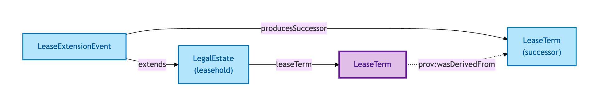
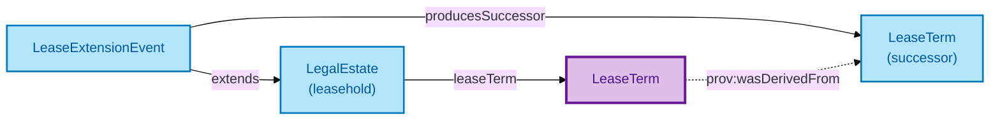

# Lease Term

A Lease Term is the **time interval bounding a leasehold tenure** — its beginning, its duration (or end), and any intervening modifications.

## Why it matters

Lease length is load-bearing for mortgage eligibility, valuation, and statutory rights. A Lease Term that is too short to mortgage; a Lease Term extended under the 1993 Act; a Lease Term coterminous with a parent lease — these are not minor metadata, they are facts about the leasehold that downstream decisions hinge on. OPDA models the Lease Term as a first-class interval so it can be queried, validated, and evolved (via Lease Extension Events) without conflating it with the Legal Estate or the Registered Title.

If you are a lender, valuer, or leaseholder asking "how long is left on this lease?", this is the entity that answers you.

## Hard cases

- **Lease extension.** A statutory or negotiated extension produces a successor Lease Term — a new interval, with a provenance link to the predecessor. The underlying leasehold Legal Estate persists; only the Term is succeeded.
- **End-by-duration vs end-by-date.** Some leases are specified as a duration ("999 years from grant date"); others as an end date. The model accommodates both ways of bounding the interval.
- **Coterminous leases.** A sub-lease whose Term ends with the head-lease Term — the IC carries enough structure to express the dependency without inferring it.

## Identity Criterion

Two records refer to the same Lease Term if they describe the same **time interval bound to the same leasehold Legal Estate**. A successor Lease Term (after extension) is a *different* Term linked to the same Legal Estate via a provenance chain. See the [Logical tier →](../../logical/property/lease-term.md) for the typed structure.

## Related Kinds

- [Legal Estate](./legal-estate.md) — a leasehold Legal Estate carries a Lease Term (the join predicate is `leaseTerm`)
- [Lease Extension Event](./lease-extension-event.md) — modifies a Lease Term, producing a successor

### Related-Kinds graph

Mermaid Source

## Source ODR

[ODR-0007 — Transactions and lifecycle §Q5 (Lease Term)](../../../ontology/odr/ODR-0007-transactions-and-lifecycle.md)
