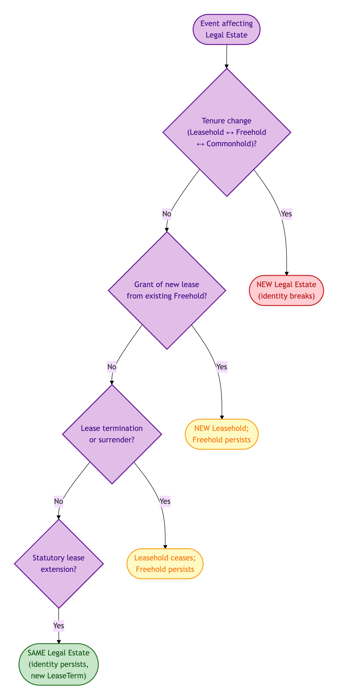
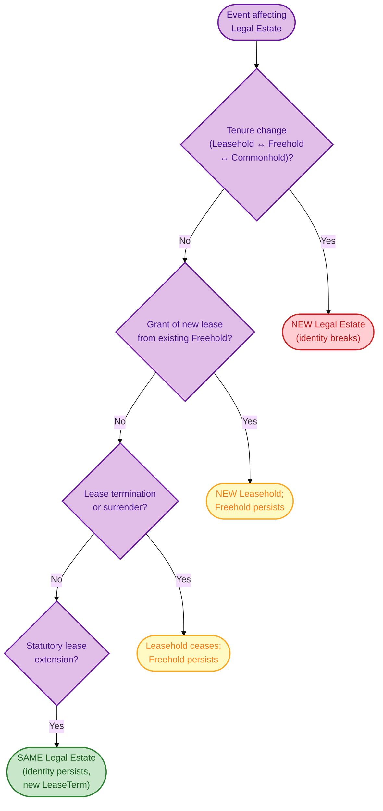
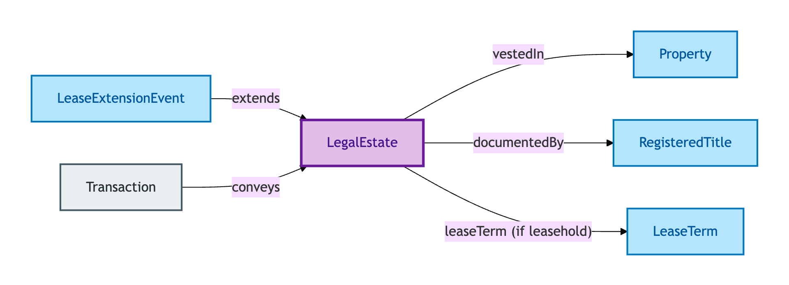
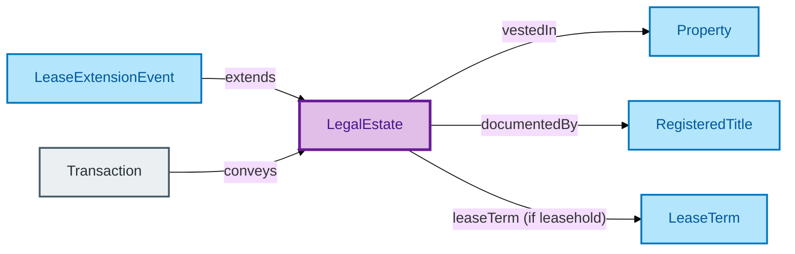

# Legal Estate

A Legal Estate is the **bundle of legal rights** vested in a Property — Freehold, Leasehold, Commonhold, or a managed variant. It is the answer to "what does one *own* when one owns this Property?".

## Why it matters

Owning a Property is not a single thing — it is owning a particular set of rights *over* the Property. A Freehold is one bundle; a Leasehold is a different bundle (with a time-bounded term and ground-rent obligations); a Commonhold is a third bundle. Legal Estate makes those bundles first-class so the model can say *which rights are vested* without conflating the rights with either the physical Property or the registry record that documents them.

If you are a conveyancer asking "the tenure changed — is it the same estate?" or "the lease was extended — is it the same lease?", this is the entity whose IC answers you.

## Hard cases

- **Tenure change.** A Leasehold is converted to Freehold. The rights bundle changes substantially — the Legal Estate identity does *not* persist across a tenure change; the new tenure is a new Legal Estate.
- **Lease grant.** A Freehold grants a new long lease. The Freehold persists (it is the reversioner's estate) and a *new* Leasehold Legal Estate is created. Two coexisting Legal Estates over the same Property.
- **Lease termination.** A long lease expires or is surrendered. The Leasehold Legal Estate ceases; the Freehold persists.
- **Commonhold conversion.** A Leasehold building is converted to Commonhold. The Leasehold ceases; new Commonhold Legal Estates come into existence (one per unit).
- **First registration of pre-existing common-law estate.** A long-existing unregistered Freehold enters the HMLR register. The Legal Estate identity precedes registration — registration documents an existing estate, it does not create one.
- **Lease extension.** A leaseholder exercises a statutory right to extend. Per ODR-0005 §3b Rule 1, Legal Estate identity *persists* through extension — the rights bundle is modified, not dissolved.

## Identity Criterion

Two records refer to the same Legal Estate if they describe the same **rights bundle** persisting through grant, transfer, registration, and discharge events. The IC distinguishes a Legal Estate from the coexisting Registered Title (which records it) and from the physical Property (in which it is vested) by the *extent of the rights* it bears. See the [Logical tier →](../../logical/property/legal-estate.md) for the typed structure.

### IC walk-through: tenure-change vs lease-grant vs extension

How the canonical Legal Estate hard cases resolve under the IC — the only event that breaks Legal Estate identity is a *tenure change*; grants create new coexisting estates; extensions persist:

Mermaid Source

## Related Kinds

- [Property](./property.md) — a Legal Estate is vested in a Property (one Property may carry multiple Legal Estates — Freehold + long Leasehold + sub-Leasehold)
- [Registered Title](./registered-title.md) — a Registered Title documents a Legal Estate
- [Lease Term](./lease-term.md) — a leasehold Legal Estate has a Lease Term
- [Lease Extension Event](./lease-extension-event.md) — mutates the Lease Term of a leasehold Legal Estate

### Related-Kinds graph

Mermaid Source

## Source ODR

[ODR-0005 — Property/Land identity crux §3b](../../../ontology/odr/ODR-0005-property-land-identity-crux.md)
