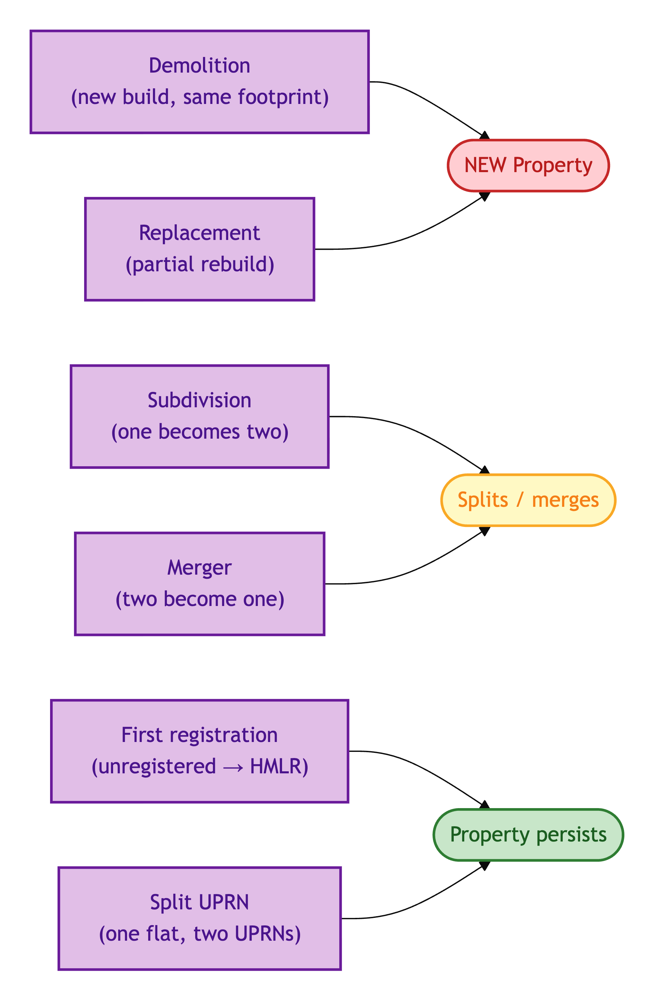
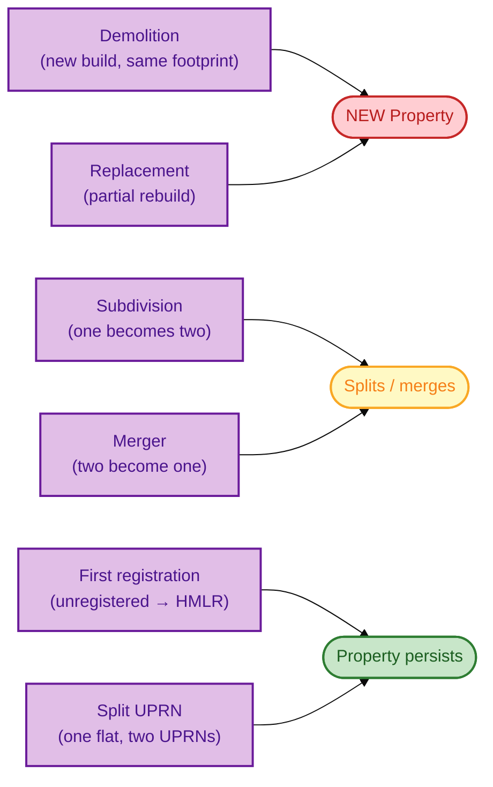
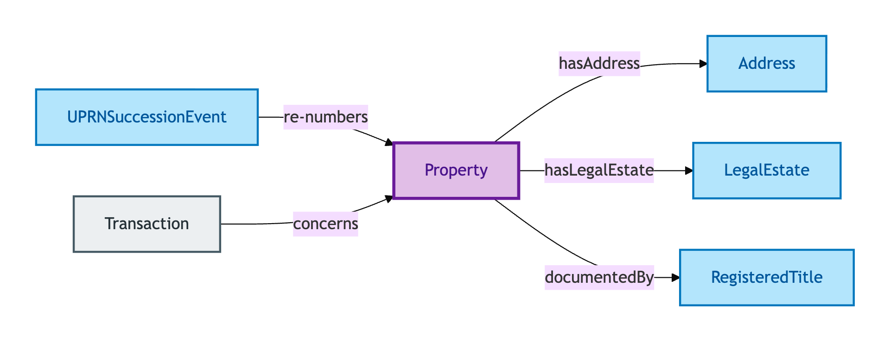
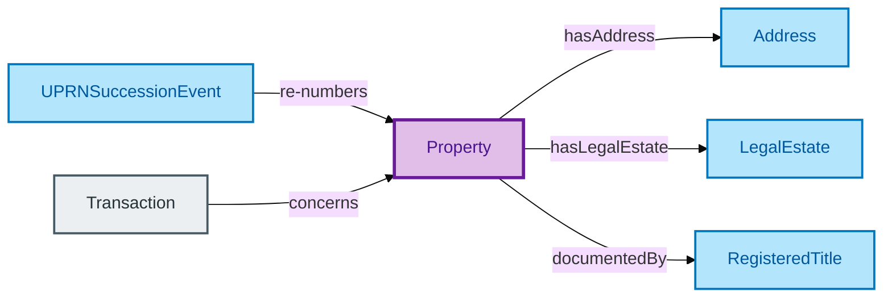

# Property

A Property is the physical residential property — the bricks-and-mortar object: a house, a flat, a bungalow, a maisonette.

## Why it matters

Property is the anchor of the entire OPDA model. Every Legal Estate is vested in a Property; every Registered Title documents a Property; every Transaction concerns a Property. If two records disagree on whether they describe the same Property, every downstream relationship inherits that disagreement.

OPDA's Property Identity Criterion is hybrid by design: it tracks **spatial-material continuity** (the bricks remain) but allows **legal-record discontinuity** to override (the registry record shows replacement, even if the bricks are the same). This is the conscious choice that lets OPDA handle real-world hard cases without forcing a one-rule-fits-all answer.

If you are a surveyor, conveyancer, or lender asking "is this the same Property after the works?", this is the entity whose IC answers you.

## Hard cases

- **Demolition.** A house is demolished and a new one built on the same footprint. Spatial continuity is broken; the new Property is a different Property even though the footprint is the same.
- **Subdivision.** One house is split into two flats. One Property becomes two — none of the three are identical to one another.
- **Merger.** Two adjoining flats are knocked into one. Two Properties become one — none of the three are identical to one another.
- **Replacement.** A house is partially demolished and rebuilt. Spatial-material continuity is contested; the legal-record-discontinuity override (registry evidence of a new title) is what tips the IC.
- **First registration.** A long-existing unregistered house enters the HMLR register for the first time. The Property's identity does not begin at first registration — the IC accommodates the absence of registry evidence prior to that point.
- **Flat with split UPRN.** One physical flat receives two UPRNs from OS AddressBase. The IC chooses: one Property bearing two address records, not two Properties.

## Identity Criterion

Two Property records refer to the same Property if they describe the same **spatial-material continuant** — the same bricks-and-mortar object — *unless* legal-record evidence (a registry replacement, a demolition certificate) overrides the spatial reading. The override is the IC's response to "the bricks look the same but the legal record says otherwise". See the [Logical tier →](../../logical/property/property.md) for the typed structure.

### IC walk-through: per hard case

How each named hard case resolves under the IC:

Mermaid Source

## Related Kinds

- [Address](./address.md) — a Property has one or more Addresses (title / marketing / INSPIRE variants)
- [Legal Estate](./legal-estate.md) — a Property has one or more Legal Estates vested in it
- [Registered Title](./registered-title.md) — a Property may be documented by one or more Registered Titles
- [Transaction](../transaction/transaction.md) — every Transaction concerns a Property

### Related-Kinds graph

Mermaid Source

## Source ODR

[ODR-0005 — Property/Land identity crux §2a](/modelling/odr/odr-0005)
