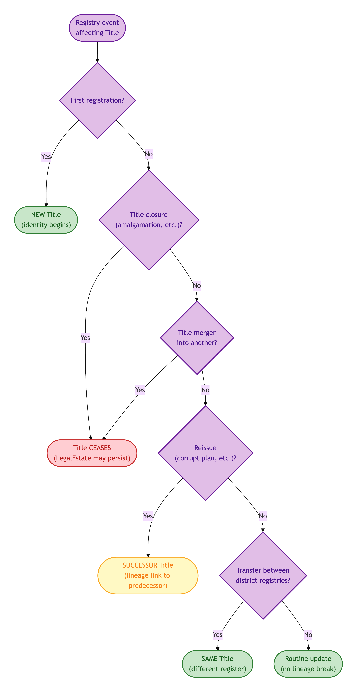
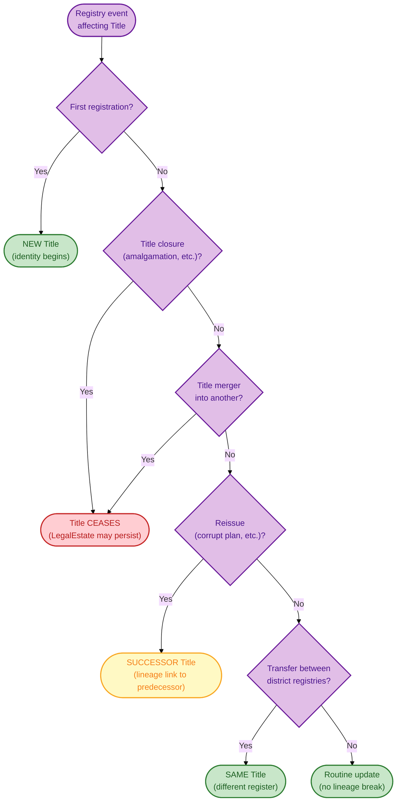
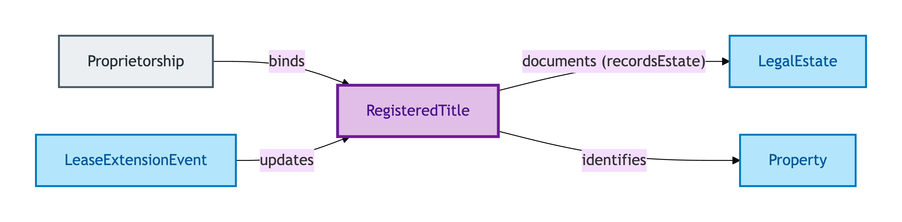
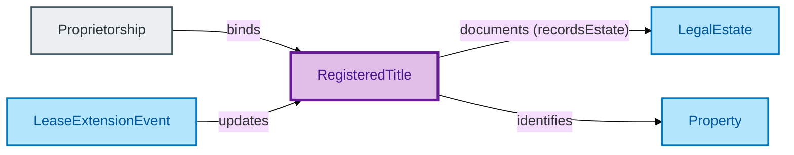

# Registered Title

A Registered Title is the **HMLR title-register record** documenting a Legal Estate. It is the registry's representation of the estate, not the estate itself.

## Why it matters

OPDA keeps the Registered Title separate from the Legal Estate it documents because the two evolve on different lifecycles. A Title can be closed and a successor opened while the underlying Legal Estate persists; a Legal Estate can exist before first registration and after closure of the documenting Title. Separating the two lets the model handle every registry lifecycle event (first registration, closure, merger, reissuance) as a registry-side change without dragging the Legal Estate's identity along with it.

If you are a conveyancer or lender investigating "the title number changed — is it the same property?", this is the entity whose IC answers you.

## Hard cases

- **First registration.** A long-existing unregistered estate is registered for the first time — a new Registered Title comes into existence. The Title's identity begins here, even though the Legal Estate it documents is older.
- **Title closure.** A Registered Title is closed (e.g. on amalgamation). The Title's identity ceases; the underlying Legal Estate may persist into a successor Title.
- **Title merger.** Two Registered Titles are merged into one — one Title ceases, the other absorbs (or a fresh successor opens, per registry practice). The IC tracks the lineage explicitly via reified registry events.
- **Transfer between registers.** A Title moves between district registries. The IC distinguishes administrative move (same Title, different register) from reissuance (new Title).
- **Title reissue on corrupt-plan replacement.** HMLR reissues a Title because the original plan was corrupt. The reissue is a successor — a new Title, with a lineage link to the predecessor.

## Identity Criterion

Two records refer to the same Registered Title if they describe the same **title-number lineage** — same HMLR title number, plus the chain of registry events documented against that number. Every lifecycle event (registration, closure, merger, reissuance) is captured as a reified registry activity with an explicit predecessor chain. See the [Logical tier →](../../logical/property/registered-title.md) for the typed structure.

### IC walk-through: registry-event decision flow

How each registry event resolves under the Title IC — same Title, successor Title, or ceased Title:

Mermaid Source

## Related Kinds

- [Legal Estate](./legal-estate.md) — a Registered Title documents a Legal Estate (the canonical join predicate is `recordsEstate`)
- [Property](./property.md) — a Registered Title identifies the Property in which the documented Legal Estate is vested
- [Proprietorship](../agent/proprietorship.md) — binds Proprietors to a Registered Title

### Related-Kinds graph

Mermaid Source

## Source ODR

[ODR-0005 — Property/Land identity crux §3c](/modelling/odr/odr-0005)
