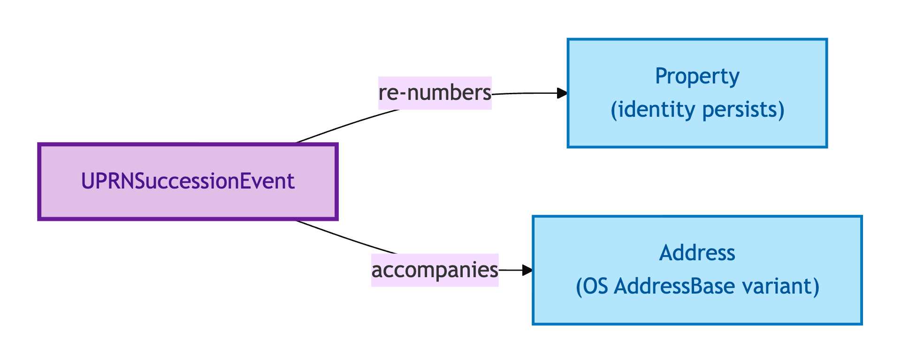
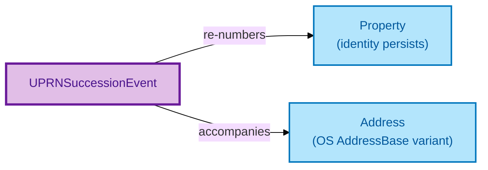

# UPRN Succession Event

A UPRN Succession Event is the reified record of an administrative re-numbering of a Property's UPRN (Unique Property Reference Number, assigned by OS AddressBase). The Property's identity **persists** through the succession.

## Why it matters

UPRNs change. OS AddressBase re-issues numbers on subdivision, merger, address-recasting, and routine administrative cleanup. A naive model treats every UPRN change as a new Property — losing the historical chain. OPDA explicitly does not: the UPRN is a *contingent administrative identifier* under PROV-O succession, not a load-bearing Identity Criterion (ODR-0005 §6a). The UPRN Succession Event is the entity that records the change, links predecessor to successor UPRN, and preserves the upstream Property's identity.

If you are an integrator who has lost data on UPRN changes, this is the entity that gives you the explicit audit trail.

## Hard cases

- **UPRN re-issued, Property unchanged.** The default case. The Property identity persists; the new UPRN is a successor of the old, linked by the Event.
- **UPRN re-issued on subdivision.** One Property becomes two — *two* fresh UPRNs, each with its own succession-link to the predecessor. The Property identity does *not* persist (subdivision is a Property identity-breaking event per the Property IC), but the UPRN chain is still recorded.
- **UPRN denormalisation in legacy feeds.** A legacy feed records only the previous UPRN as a string literal, with no Event. OPDA accommodates both: the literal pair (`previousUPRN`) is a denormalised convenience; the reified Event is authoritative.

## Identity Criterion

Two records refer to the same UPRN Succession Event if they describe the same **administrative re-numbering activity** on the same Property — same predecessor UPRN, same successor UPRN, same registry activity that recorded the change. See the [Logical tier →](../../logical/property/uprn-succession-event.md) for the typed structure.

## Related Kinds

- [Property](./property.md) — UPRN Succession Events affect a Property's UPRN without breaking Property identity
- [Address](./address.md) — UPRN changes typically accompany Address-record changes in OS AddressBase

### Related-Kinds graph

Mermaid Source

## Source ODR

[ODR-0005 — Property/Land identity crux §6a](/modelling/odr/odr-0005)
