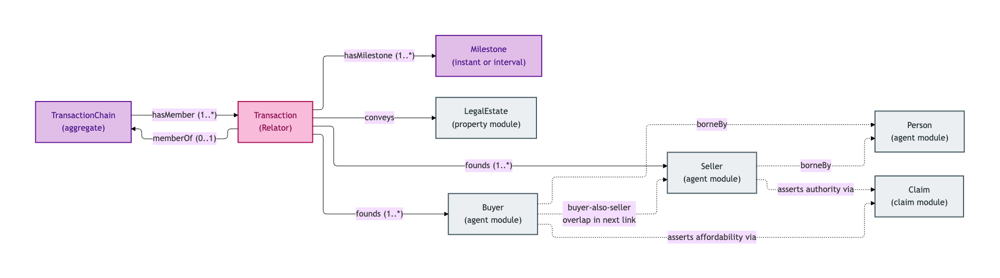
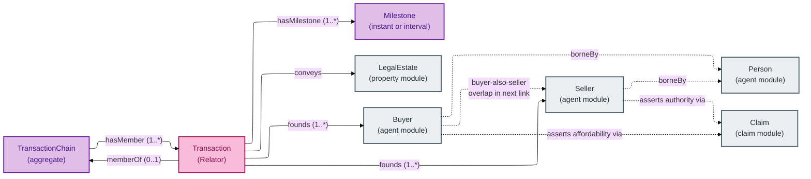
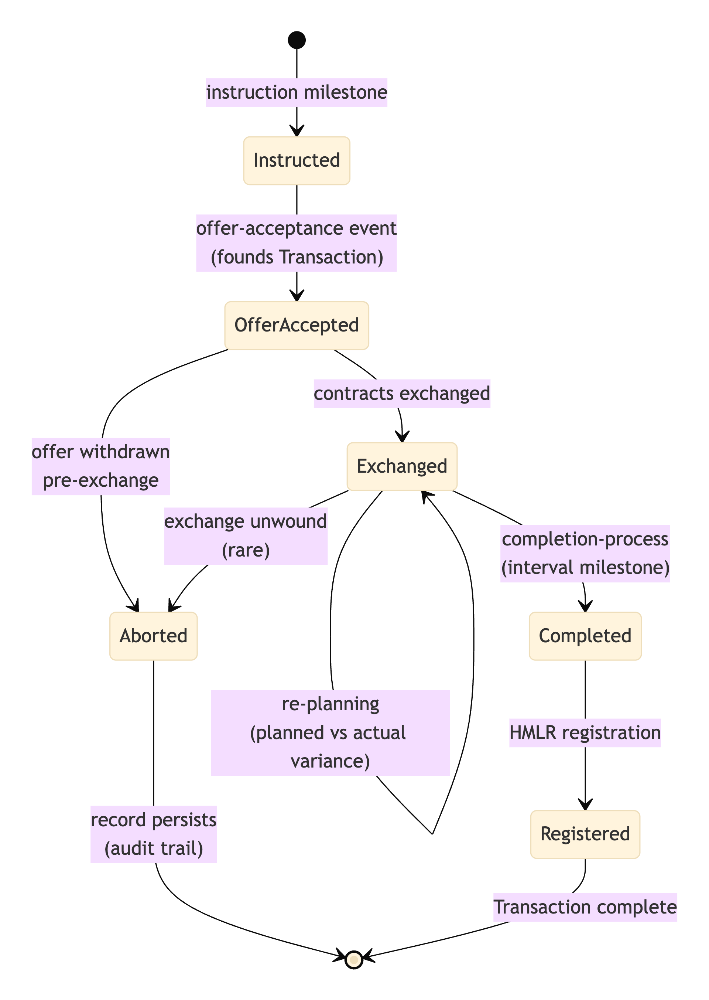
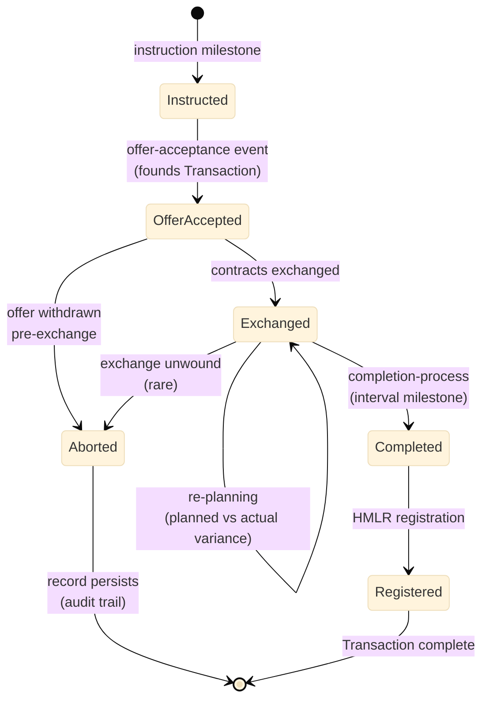
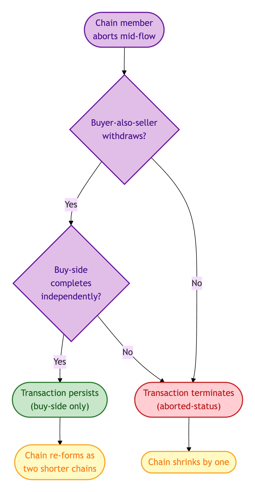
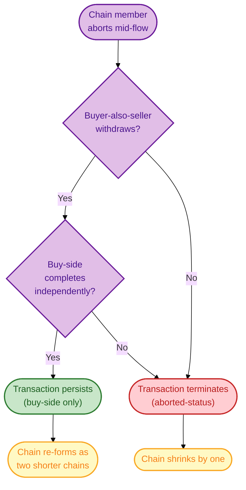

# Transaction

The Transaction module covers the Transaction Relator itself, the Milestones that mark its lifecycle, and the Transaction Chain that aggregates dependent Transactions.

A Transaction is *not* a property of any one party — it is a relational entity in its own right, founded by an event (typically offer acceptance), binding Seller(s) + Buyer(s) + the Legal Estate concerned. Its lifecycle is recorded as a sequence of Milestones (instruction, offer accepted, exchange, completion, registration), each with planned-vs-actual variance.

Transaction Chains are aggregates of dependent Transactions linked by the typical buyer-also-seller overlap that characterises UK residential chains.

## Entities

- [Milestone](./milestone.md) — a point or interval in the Transaction lifecycle
- [Transaction](./transaction.md) — a residential-property transaction binding Sellers + Buyers + Legal Estate
- [Transaction Chain](./transaction-chain.md) — an aggregate of dependent Transactions

## Module-internal relationships

How the Transaction Relator binds its founded Roles, accrues Milestones, and aggregates into Chains:

Mermaid Source

## Lifecycle: Transaction milestone state-transitions

The canonical milestone sequence through a UK residential transaction, with re-planning loops:

Mermaid Source

## Lifecycle: Transaction chain link-break decision

What happens to a TransactionChain when a member link aborts:

Mermaid Source

