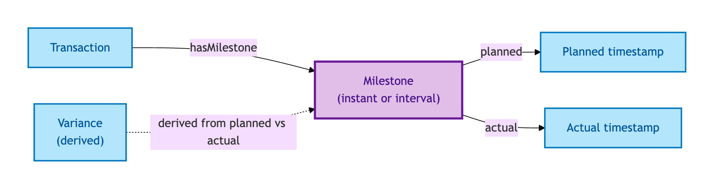
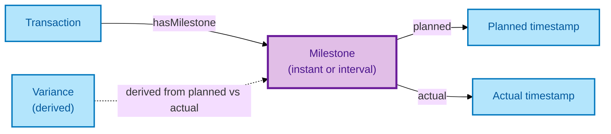

# Milestone

A Milestone is a point — or an interval — in a Transaction's lifecycle: instruction, offer accepted, exchange, completion, registration, and the processes between them.

## Why it matters

Milestones are how a Transaction's progress is observable. They carry timestamps (planned and actual), associated parties, and a variance gap that tells you whether a transaction is on track. Some Milestones are instants (offer accepted at 14:32 on this date); others are intervals (completion-process started at X, ended at Y). OPDA distinguishes both — instants and intervals — so consumers can ask "when did this happen?" and "how long did it take?" with the right answer in each case.

If you are running a transaction-management platform or feeding a regulator dashboard with on-time performance metrics, these are the entities you read.

## Hard cases

- **Instant vs interval Milestone.** Offer-acceptance is an instant (one timestamp); the completion-process is an interval (start + end). The model captures both shapes — naive timestamp-only modelling discards the interval data.
- **Planned vs actual variance.** Every Milestone has both a planned timestamp (on a companion Plan) and an actual timestamp (on the Activity). The variance feeds regulator-grade on-time performance reports.
- **Re-planned Milestone.** A delayed exchange triggers a re-planning. The planned timestamp updates; the actual timestamp does not exist yet. The variance is computed against the *current* plan.

## Identity Criterion

A Milestone is identified by its **(Transaction, Milestone-kind, occurrence)** triple — the Transaction it belongs to, the kind of Milestone (instruction, offer accepted, exchange, completion, registration, etc.), and the occurrence index if the Milestone can recur. See the [Logical tier →](../../logical/transaction/milestone.md) for the typed structure (instant vs interval distinction, planned/actual timestamps, variance derivation).

## Related Kinds

- [Transaction](./transaction.md) — Milestones belong to a Transaction

### Related-Kinds graph

Mermaid Source

## Source ODR

[ODR-0007 — Transactions and lifecycle §Q2](../../../ontology/odr/ODR-0007-transactions-and-lifecycle.md)
