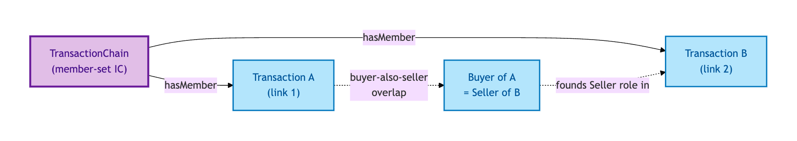
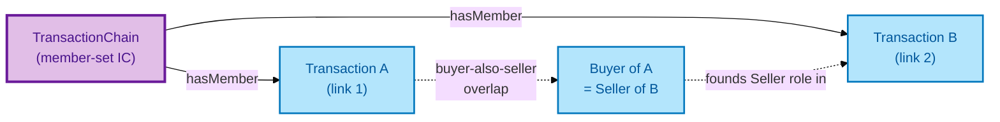

# Transaction Chain

A Transaction Chain is an aggregate of dependent Transactions linked by **buyer-also-seller overlap** — the buyer in one Transaction is the seller in the next, all the way up or down the chain.

## Why it matters

UK residential transactions routinely sit in chains; chain breakage is one of the biggest causes of fall-through. OPDA models Chains explicitly so a consumer can ask "what is the chain status?" (any link blocked → chain blocked), "where is the chain stuck?", and "how long is the chain?" without reconstructing the join every time.

If you are running a chain-aware transaction-management platform, a chain-status monitoring tool, or a regulator-facing reliability report, this is the entity you query.

## Hard cases

- **Chain-length cap.** Real-world chains cap at around 7 links (per Conveyancing Association data). The model enforces this as a constraint so impossibly long chains don't silently accumulate.
- **Mid-chain break.** One link aborts; the chain re-forms around the break — typically as two shorter independent chains. The Chain's IC tracks the re-formation explicitly via its member-set.
- **Two query directions.** Some consumers query Transaction → Chain (give me the chain for this transaction); others query Chain → Transactions (give me the members of this chain). The model emits both directions so neither query depends on inverse-property inference.

## Identity Criterion

A Transaction Chain is identified by its **member set** — the set of Transactions linked by buyer-also-seller overlap at a given point in time. Two records refer to the same Chain only if their member sets coincide. See the [Logical tier →](../../logical/transaction/transaction-chain.md) for the typed structure (dual mechanism: recursive predicate + aggregate).

## Related Kinds

- [Transaction](./transaction.md) — the members of a Chain
- [Buyer](../agent/buyer.md) — the role-overlap link from one Transaction to the next
- [Seller](../agent/seller.md) — the role-overlap link from the next Transaction to the previous

### Related-Kinds graph

Mermaid Source

## Source ODR

[ODR-0007 — Transactions and lifecycle §Q4](/modelling/odr/odr-0007)
